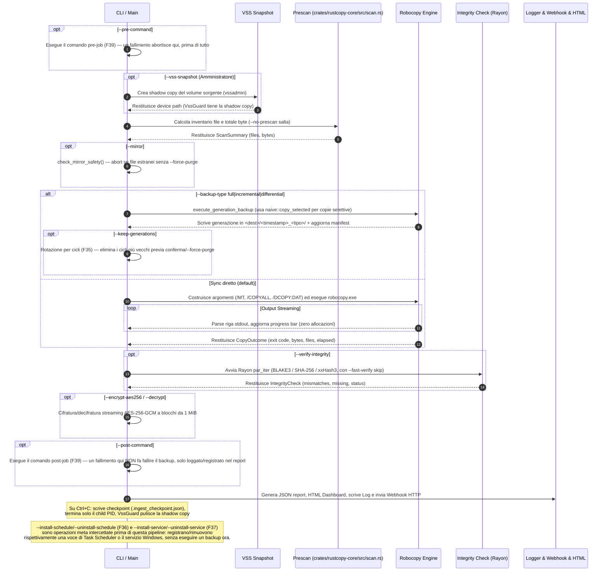

# Architettura di Sistema — robocopy-ingest-cli (v6.0.0)

Questo documento descrive in dettaglio l'**architettura interna, la pipeline di esecuzione, i pattern di progettazione ed i meccanismi di sicurezza e performance** implementati nella libreria `robocopy_ingest`.

---

## 0. Struttura del workspace (F52)

Dal 27 Agosto 2026 il repository è un **workspace Cargo** con due membri, non più un package singolo.
Il motivo è la milestone 7.0.0 (GUI Tauri): Tauri porta con sé una toolchain JS — npm/vite,
`tauri.conf.json`, icone, bundler — che non deve entrare nel crate della CLI. `notify-server` può
restare un binario feature-gated perché è puro Rust; una GUI no.

Dal 31 Agosto 2026 il terzo membro **esiste**: `crates/rustcopy-gui`, la console desktop (Tauri 2 +
Svelte 5 + Tailwind 4). Non esegue backup e ha un solo percorso di scrittura, `job_editor`, che
produce proposte di configurazione in file nuovi.

| Membro | Contiene | Produce |
|---|---|---|
| `crates/rustcopy-core` | Tutta la logica: scansione, motori di copia, integrità, crypto, VSS, generazioni, storico, report | La libreria **`robocopy_ingest`** |
| `crates/rustcopy-cli` | Solo gli entry point e la loro orchestrazione | I binari **`robocopy_ingest`** e **`notify-server`** |
| `crates/rustcopy-gui` | La console desktop: comandi Tauri come involucri sottili su `gui_api`/`job_editor`, più il frontend Svelte in `ui/` | Il binario **`rustcopy-gui`**, componente opzionale dell'installer |

**Il nome della libreria e quelli dei binari non sono cambiati.** Il package si chiama
`rustcopy-core` ma la sua `[lib]` resta `robocopy_ingest`, quindi ogni `use robocopy_ingest::…`
continua a valere; i binari mantengono i nomi che installer e script già usano. La
ristrutturazione non ha rinominato nulla di visibile a un utente o a uno script.

Due invarianti sono presidiate da altrettanti gate in `ci.yml`, entrambi nella forma `if … then …
fi` (mai `… | grep -q … && exit 1`, che fallisce quando l'albero è **pulito**):

- `cargo tree --locked -p rustcopy-cli | grep -qi axum` deve essere vuoto senza la feature
  `notify-server` (`AGENTS.md` regola 8).
- `cargo tree --locked -p rustcopy-cli | grep -qiE 'tauri|wry|tao'` deve essere sempre vuoto: la
  CLI non acquisisce mai una dipendenza dalla GUI, ed è ciò che garantisce che un backup
  schedulato esegua lo stesso codice con o senza GUI installata.

> **Nota sui percorsi negli altri documenti.** `ANALYSIS.md`, `ROADMAP.md`, `CLAUDE.md` e
> `AGENTS.md` citano i moduli come `src/nome.rs` in racconti di lavori passati. I nomi dei moduli
> non sono cambiati: `src/logging.rs` è oggi `crates/rustcopy-core/src/logging.rs`, e `src/main.rs`
> è `crates/rustcopy-cli/src/main.rs`. Quei riferimenti non sono stati riscritti di proposito —
> sono registrazioni di eventi passati, non descrizioni della struttura attuale, che è questa.

---

## 1. Diagramma Architetturale ad Alto Livello

```mermaid
graph TD
    User(["Utente / Script CLI / TOML Config"]) -->|Args / Flags| CLI["crates/rustcopy-core/src/cli.rs - Clap Parser & Validazione"]
    CLI --> Main["crates/rustcopy-cli/src/main.rs - Orchestratore Principale"]

    subgraph PipelineEngine ["Motore di ingestion"]
        Main -->|1. Prescan| Scan["crates/rustcopy-core/src/scan.rs - Scansione Walkdir & Sizing"]
        Main -->|2. Backup Engine| RobocopyEngine["crates/rustcopy-core/src/engine/robocopy.rs - Process Streaming Engine"]
        RobocopyEngine -->|Invoca| Exec["robocopy.exe - Native Windows Binary"]
        Exec -->|"Stdout+Stderr Stream OEM"| Dec["Decodifica CP850 dedicata (oem_codec.rs) & Zero-Alloc Parsing"]
    end

    subgraph IntegritySecurity ["Integrità e sicurezza"]
        Main -->|3. Integrity Check| RayonVerify["crates/rustcopy-core/src/integrity.rs - Rayon Parallel Hashing"]
        RayonVerify -->|"SHA-256 / BLAKE3 / xxHash3"| Hash["Motore di Hashing"]
        Main -->|4. Zero-Trust Crypto| Crypto["crates/rustcopy-core/src/crypto.rs - AES-256-GCM su file destinazione"]
    end

    subgraph MonitoringLogging ["Monitoraggio, logging e report"]
        Main -->|Async Logging| Log["crates/rustcopy-core/src/logging.rs - Bounded Channel Logger 10k MSGs"]
        Main -->|Report Output| JSONReport["crates/rustcopy-core/src/report.rs - JSON Report & Host Metadata"]
        Main -->|HTML Dashboard| HTMLReport["crates/rustcopy-core/src/html_report.rs - Standalone Dashboard HTML"]
        Main -->|HTTP Webhook| Notify["crates/rustcopy-core/src/notify.rs - Async HTTP Webhook Dispatcher"]
    end

    subgraph NotifyServerBox ["Binario separato, feature notify-server"]
        Main -->|"POST /notify"| NotifyServer["crates/rustcopy-cli/src/notify_server_bin.rs + crates/rustcopy-core/src/notify_server.rs - axum Router"]
        NotifyServer -->|dispatch| Sinks["crates/rustcopy-core/src/notify_sink.rs - LogSink / NtfySink / GenericWebhookSink"]
        NotifyServer -->|"--install-service / --uninstall-service"| NotifyServiceMod["crates/rustcopy-core/src/service.rs (generico) - servizio Windows dedicato #quot;RustcopyNotifyServer#quot; (F41)"]
    end

    subgraph DisasterRecovery ["Disaster recovery e continuità"]
        Main -->|"--restore-from"| Restore["crates/rustcopy-core/src/restore.rs - Reverse Restore Engine"]
        Main -->|"--resume-from"| Checkpoint["crates/rustcopy-core/src/checkpoint.rs - Checkpoint & Resume"]
    end

    subgraph BackupEnterprise ["Release 6.0.0"]
        Main -->|"--vss-snapshot"| VSS["crates/rustcopy-core/src/vss.rs - Volume Shadow Copy (vssadmin)"]
        Main -->|"--backup-type"| Generations["crates/rustcopy-core/src/generations.rs - Generazioni Full/Incrementale/Differenziale + Retention per cicli (F35)"]
        Generations -->|copia selettiva| NaiveEngine["crates/rustcopy-core/src/engine/naive.rs - copy_selected"]
        Main -->|"--pre-command / --post-command"| Hooks["crates/rustcopy-core/src/hooks.rs - Comandi pre/post job (F39)"]
        Main -->|"--install-schedule / --uninstall-schedule"| Schedule["crates/rustcopy-core/src/schedule.rs - Task Scheduler via schtasks.exe (F36)"]
        Main -->|"--install-service / --uninstall-service"| ServiceMod["crates/rustcopy-core/src/service.rs - Windows Service SCM, servizio idle #quot;RustcopyIngestService#quot; (F37)"]
    end

    subgraph Stubs ["Scaffolding (non implementato)"]
        T["crates/rustcopy-core/src/cloud.rs - Cloud Sync"]
    end

    A2["crates/rustcopy-core/src/cache.rs - State Cache (.ingest_cache)"]
    Main -->|"--fast-verify"| A2
```

---

## 2. Dettaglio dei Moduli e Responsabilità

| Modulo Sorgente | Responsabilità Architetturale | Tecnica / Pattern Utilizzato |
|---|---|---|
| `crates/rustcopy-cli/src/main.rs` | Orchestrazione asincrona e gestione dei segnali. | `tokio::select!` per cattura `Ctrl+C`; termina solo il PID del child `robocopy.exe` tracciato (non `taskkill /IM`); esegue `check_mirror_safety` (diff reale dest vs source) prima del trasferimento; scrive checkpoint su interruzione. |
| `crates/rustcopy-core/src/cli.rs` | Definition, parsing e validazione delle opzioni CLI. | Struct `clap` derivata con default `*`, flag `--force-purge` e merge automatico dai profili TOML. `--source`/`--dest` sono `Option<PathBuf>` con `required_unless_present = "restore_from"` (fix F24); accessor `Args::source()`/`Args::dest()` restituiscono `&Path`. |
| `crates/rustcopy-core/src/config.rs` | Caricamento e parsing delle configurazioni riutilizzabili. | Deserializzazione TOML tramite `serde`. Supporta `[[jobs]]` (array di `JobConfig`) con ereditarietà dai default di primo livello del file (`JobConfig::merged_over`). |
| `crates/rustcopy-core/src/engine/mod.rs` | Astrazione del motore di copia. | Trait `CopyEngine` per disaccoppiare Robocopy dalla copia Naive; `run_with_retries` con backoff esponenziale su exit code transienti. |
| `crates/rustcopy-core/src/engine/robocopy.rs` | Wrapper ad altissime prestazioni per `robocopy.exe`. | Streaming `read_until` binario, buffer riutilizzato, decodifica OEM via `crates/rustcopy-core/src/oem_codec.rs`, stdout e stderr entrambi drenati (su thread separati) invece di scartare stderr, PID del child pubblicato per il kill mirato su Ctrl+C. |
| `crates/rustcopy-core/src/engine/naive.rs` | Motore di copia baseline e copia selettiva per generazioni. | Copia ricorsiva single-thread con buffer 64 KiB. `copy_selected` accetta un elenco esplicito di file per le copie incrementali (generazioni), usato al posto di robocopy perché robocopy non accetta liste arbitrarie di percorsi. |
| `crates/rustcopy-core/src/oem_codec.rs` | Decodifica OEM/CP850. | Tabella CP850 hardcoded (0x80-0xFF) più controllo a runtime di `GetOEMCP()`; `encoding_rs` non implementa le code page DOS single-byte, quindi non viene usato per questo scopo. |
| `crates/rustcopy-core/src/integrity.rs` | Verifica di corrispondenza sorgente/destinazione. | Parallelizzazione multi-core con **Rayon** (`par_iter`), pre-check taglia file, **BLAKE3 / SHA-256 / xxHash3** e cap errore a 10k per OOM guard. Supporta `--fast-verify` via `IngestCache`. |
| `crates/rustcopy-core/src/logging.rs` | Logging asincrono su file per-file. | Canale asincrono `bounded_channel(10_000)` con strategia non bloccante (`try_send`); le righe scartate vengono contate. `--log-level`/`--quiet` per il filtro (default `info`, non più `debug`, D18), `--log-max-bytes`/`--log-max-backups` per la rotazione — sia all'avvio sia durante il run stesso (D18). |
| `crates/rustcopy-core/src/report.rs` | Generazione dello schema JSON completo. | Serializzazione `serde_json`, conteggio temporizzazioni di fase (`PhaseTiming`), metadati host (`HostMetadata`), `SCHEMA_VERSION = 2`. |
| `crates/rustcopy-core/src/html_report.rs` | Dashboard visiva HTML standalone. | Template HTML5 autonomo con CSS incorporato; ogni valore interpolato passa da `escape_html`. |
| `crates/rustcopy-core/src/notify.rs` | Invio notifiche Webhook di completamento. | `WebhookPayload` (con `schema_version`, `BackupStatus` tipizzato) inviato via `reqwest`+`rustls` a `--webhook-url`. Timeout 10s, errori reali propagati. |
| `crates/rustcopy-core/src/notify_sink.rs` | Canali di notifica per il notify-server. | Trait `NotificationSink` (stesso pattern di `CommandRunner`/`CopyEngine`); `LogSink`/`NtfySink`/`GenericWebhookSink`; config TOML (`NotifyServerConfig`). Sempre compilato (nessuna dipendenza da axum), testabile con un doppio scriptato. |
| `crates/rustcopy-core/src/notify_server.rs` + `crates/rustcopy-cli/src/notify_server_bin.rs` | Server HTTP di ricezione notifiche, con identità di servizio Windows propria. | Router axum (`GET /health`, `POST /notify`), autenticazione a token via header, bind loopback forzato senza token, `DefaultBodyLimit`, graceful shutdown (`serve_until_shutdown`/`serve_until_shutdown_or`). Feature-gated (`notify-server`): axum non entra nelle dipendenze del binario di backup. `--install-service`/`--uninstall-service` (F41) registrano `"RustcopyNotifyServer"` — servizio Windows **separato** da quello (idle) di `robocopy_ingest`. Il corpo del servizio ricostruisce `Args` dall'argv reale, esegue axum in un `tokio::runtime::Runtime` costruito sul thread del dispatcher SCM, e collega lo `Stop` di SCM allo shutdown graceful via `spawn_blocking` → `tokio::sync::oneshot`. |
| `crates/rustcopy-core/src/restore.rs` | Disaster Recovery e Ripristino guidato. | `build_restore_args` clona gli `Args` **realmente parsati per questa invocazione** (non li ricostruisce da zero) e sovrascrive solo i campi che devono provenire dal report. |
| `crates/rustcopy-core/src/checkpoint.rs` | Checkpoint di esecuzione e ripresa. | Scritto su `Ctrl+C` da `run()`. `--resume-from` ricostruisce l'invocazione interrotta con la stessa disciplina di `build_restore_args` (clone degli Args reali, non `try_parse_from`). Sfrutta lo skip automatico di robocopy per i file già a destinazione (niente `/Z`). |
| `crates/rustcopy-core/src/generations.rs` | Backup a generazioni Full/Incrementale/Differenziale + retention. | Ogni run scrive in `<dest>/<timestamp>_<tipo>/` e registra l'inventario completo della sorgente in `<dest>/.rustcopy_generations.json` (`GenerationManifest`). `changed_since` diffa size+mtime; `incremental` confronta contro `latest()`, `differential` contro `latest_full()`. `cycles()`/`generations_to_prune()`/`retain_generations()` (F35) implementano `--keep-generations`: rotazione per **ciclo** (un `full` + i suoi `incremental`/`differential` successivi), mai per singola generazione, per non orfanare una catena. **D12**: `GenerationManifest::path_for`/`load_or_default`/`save` accettano un `job_name: Option<&str>` — namespacizzato via `robocopy_ingest::namespaced_path` in un batch `[[jobs]]` (F33) così due job che condividono la stessa `dest` non mescolino le loro cronologie di generazioni in un unico manifest. **D19**: il formato su disco è NDJSON (una riga compatta per generazione); `append_generation` registra una nuova generazione con un append O(1) invece di riscrivere tutto, `save` resta per il solo pruning. **D20**: `load_latest_generation`/`load_latest_full_generation` leggono in streaming la sola generazione di riferimento, e `GenerationIndex` carica la cronologia senza gli inventari `files` per la retention — 580 MB → 145 MB (riferimento) e ~0 MB (retention) sul profilo reale da 1,34M file; `--backup-type full` non legge più nulla. `cycles()` e `GenerationIndex::generations_to_prune()` condividono un'unica `cycle_ranges()`. |
| `crates/rustcopy-core/src/hooks.rs` | Comandi pre/post job (F39). | `run_pre_command`/`run_post_command` via `cmd /C` (Windows) / `sh -c` (altrove). Un `--pre-command` fallito abortisce il job **prima** di copiare qualunque cosa; un `--post-command` fallito viene solo loggato/registrato in `IngestReport.post_command_error`, senza far fallire un backup già riuscito. |
| `crates/rustcopy-core/src/schedule.rs` | Scheduler leggero via Task Scheduler (F36). | Shella a `schtasks.exe` invece di un processo scheduler interno — stesso pattern di `vss.rs`/`vssadmin.exe`. `parse_schedule_spec` accetta `daily@HH:MM`/`hourly@N`/`weekly@DAY,...@HH:MM`. Il comando pianificato (`/TR`) è costruito dall'argv **reale** dell'invocazione (`strip_schedule_flags` toglie solo i flag di scheduling), non da una ricostruzione sintetica di `Args`. |
| `crates/rustcopy-core/src/vss.rs` | Snapshot Volume Shadow Copy. | Shell-out a `vssadmin create/delete shadow`. `VssGuard` (RAII `Drop` sincrono) garantisce la pulizia anche su `Ctrl+C`. Il device path della shadow copy viene usato come `effective_source` senza mutare `Args`. Richiede Amministratore. |
| `crates/rustcopy-core/src/cache.rs` | Cache di stato incrementale per `--fast-verify`. | `IngestCache` keyed su size+mtime **sorgente**, persistita in `<dest>/.ingest_cache`. Un file che fallisce la verifica non viene mai messo in cache. **D12**: `default_cache_path` accetta un `job_name: Option<&str>` — namespacizzato per lo stesso motivo del manifest generazioni. `--enable-dedup` (deduplica a livello di trasferimento) **non è implementato**. |
| `crates/rustcopy-core/src/cloud.rs` | **[NON IMPLEMENTATO]** Sincronizzazione Cloud diretta. | `sync_to_cloud` è un mock che ritorna sempre `Ok(100)`; `--cloud-sync-target` non ha effetto. |
| `crates/rustcopy-core/src/service.rs` | Integrazione **generica** e riutilizzabile al Service Control Manager di Windows (F37/F41). | `windows-service` crate (dipendenza `[target.'cfg(windows)'.dependencies]`). Espone `install_named`/`uninstall_named`/`start_dispatcher`/`register_and_wait_for_stop`/`ServiceStatusHandle`, parametrizzati per nome/display-name — nessuna dipendenza da axum. Usato da **due** identità di servizio indipendenti: `robocopy_ingest` (`"RustcopyIngestService"`, F37, resta **inattivo** — risponde solo a Stop/Interrogate, `install()`/`uninstall()`/`run_service_dispatcher()` restano wrapper a zero argomenti) e `notify-server` (`"RustcopyNotifyServer"`, F41, esegue davvero axum). Entrambi i `main()` non sono più `#[tokio::main]`: controllano l'argv grezzo per il marker interno `--run-as-service` prima di costruire il runtime tokio, perché `service_dispatcher::start` blocca il thread OS chiamante. |
| `crates/rustcopy-core/src/crypto.rs` | Cifratura/decifratura Zero-Trust. | **AES-256-GCM a blocchi da 1 MiB**, nonce fresco per blocco, header `RCE1` + record length-prefixed, file temporaneo sibling + rename atomico. `--decrypt <KEY>` è il simmetrico di `--encrypt-aes256`. |
| `crates/rustcopy-core/src/exit_code.rs` | Decodifica bitmask exit code robocopy. | Interpreta i codici di uscita di robocopy; `EXIT_INTEGRITY_FAILED = 4` distingue fallimento di integrità da fallimento di trasferimento. |
| `crates/rustcopy-core/src/errors.rs` | Enum `IngestError` con classificazione retry. | Errori tipizzati con `is_retryable()` per il backoff automatico. |
| `crates/rustcopy-core/src/progress.rs` | Progress bar monotonica con throughput. | Observer pattern per aggiornamenti in tempo reale dalla pipeline di trasferimento. |
| `crates/rustcopy-core/src/testkit.rs` | `ScriptedRunner` e test doubles cross-platform. | Implementa `CommandRunner` con output predefiniti per testare parser, retry e progress senza `robocopy.exe`. |
| `crates/rustcopy-core/src/lib.rs` | Radice del crate e helper trasversali. | Espone i moduli pubblici e ospita le funzioni condivise che non appartengono a un modulo specifico: `atomic_write` (scrittura temp-file + rename, D14), `namespaced_path` (namespacing per job in un batch `[[jobs]]`, D12) e `resolve_report_path_timestamp` (placeholder `{timestamp}` in `--report-path`, P1). |

---

## 3. Flusso della Pipeline di Ingestion

---

## 4. Gestione della Memoria & Prevenzione OOM su Datasets 1 TB+

Per garantire la stabilità su dataset da **milioni di file**:

1. **Buffer Stdout Riutilizzato**: La lettura dell'output di Robocopy riutilizza un unico `Vec<u8>` per tutte le righe, azzerando le allocazioni sull'heap per ogni file copiato.
2. **Logging Asincrono Bounded**: Il canale di trasmissione dei log verso il writer è limitato rigidamente a **10.000 messaggi**. Se il disco di log rallenta, i messaggi in eccesso vengono scartati (`try_send` non bloccante) invece di accumularsi senza limite; il conteggio degli scarti è tracciato ed esposto in `log_lines_dropped` nel report JSON, così l'audit trail perso è visibile invece che silenzioso.
3. **Cap Liste Discrepanze Report**: Nel caso in cui centinaia di migliaia di file risultino corrotti o mancanti, la lista nel report JSON viene troncata a **10.000 elementi** (`MAX_REPORTED_ERRORS`) impostando `truncated: true`.
4. **Cifratura a Blocchi**: `CryptoManager::encrypt_stream` / `decrypt_stream` operano in chunk da **1 MiB** con nonce fresco per blocco — la memoria di picco è O(dimensione blocco), non O(dimensione file).
5. **Letture Parziali del Manifest Generazioni (D20)**: `GenerationManifest::load_or_default` è riservata all'unico chiamante che riscrive davvero l'intero file (il pruning di `--keep-generations`). Chi serve la sola generazione di riferimento usa `load_latest_generation`/`load_latest_full_generation`, che scorrono l'NDJSON riga per riga in un buffer riusato tenendo solo l'offset della riga vincente; chi deve decidere cosa potare usa `GenerationIndex`, che scarta gli inventari `files`. Un `--backup-type full` non legge più nulla. Misurato su 4 generazioni di un profilo da 1,34M file: **580 MB → 145 MB** (riferimento) e **~0 MB** (retention).
6. **Inventario di Scan Condiviso, non Duplicato (D21)**: `ScanSummary::files` è un `Arc<[ScannedFile]>`. Ogni consumatore deve passare dati *posseduti* a `spawn_blocking` pur limitandosi a leggerli, e con un `Vec` questo costava una copia reale ad ogni passaggio — `verify` da solo ne teneva **quattro** vive contemporaneamente. Condividere costa un refcount: **580 MB → 145 MB** sullo stesso profilo. Il working set resta comunque materializzato per intero: `--no-prescan` è la via per non pagarlo affatto.

---

## 5. Matrice di Cross-Platform & Mock Testability

Nonostante `robocopy.exe` sia un binario esclusivamente Windows, l'intera suite di **464 test** (`cargo test --workspace --exclude rustcopy-gui`, la configurazione di base che gira in CI) viene eseguita ed è al 100% passante sia su Windows che su Linux (le due piattaforme coperte da `.github/workflows/ci.yml` — affiancato da `.github/workflows/security-audit.yml`, che esegue `rustsec/audit-check` contro il database advisory RustSec ad ogni modifica di `Cargo.toml`/`Cargo.lock` più un cron settimanale; macOS non fa parte della matrice CI, anche se nulla nel codice lo esclude a priori) grazie al trait `CommandRunner` ed al mock `ScriptedRunner` che simula perfettamente gli exit code ed i flussi stdout di Robocopy. Su Windows, i test aggiuntivi eseguono `robocopy.exe` realmente (dry-run, cifratura AES-256-GCM end-to-end, blocco del mirror-purge, webhook irraggiungibile, **ripristino completo end-to-end da perdita simulata di file — F24**, **backup cifrato → perdita → `--restore-from --decrypt` end-to-end — F25b**, **backup generazionale full → incrementale → differenziale — F34**, **ritenzione/rotazione delle generazioni per cicli — F35**, **comandi pre/post job — F39**, **installazione/rimozione reale di una voce Task Scheduler via `schtasks.exe` — F36**, **checkpoint e resume — F31**, **due job dello stesso batch `[[jobs]]` che condividono la stessa `dest` ottengono manifest generazioni e cache indipendenti — D12**, **le righe di log di ogni job in un batch `[[jobs]]`, incluse quelle emesse dentro `spawn_blocking` come l'invocazione di robocopy, sono taggate con il nome del job che le ha prodotte — D13**, **nessun file temporaneo residuo dopo la scrittura atomica del manifest generazioni/cache fast-verify — D14**, **un fallimento di copia in `--backup-type` restituisce l'exit code 1 (non 2) e scrive comunque un report — D15**). Con `cargo test --workspace --exclude rustcopy-gui --features rustcopy-cli/notify-server` (**479 test** totali) si aggiungono i test unitari sul router axum (su socket TCP reale) e test end-to-end che eseguono i binari `notify-server` e `robocopy_ingest` realmente compilati l'uno contro l'altro. `--install-service`/`--uninstall-service` su entrambi i binari (F37, F41) sono coperti solo dal fallimento pulito senza elevazione e dai conflitti clap — il vero round trip `CreateService`/`StartService`/`DeleteService` contro il Service Control Manager richiede elevazione ad Amministratore reale e **non è automatizzato**, stesso limite dichiarato per `--vss-snapshot` (F30); vedi `CLAUDE.md` e `ROADMAP.md` (righe F37/F41) per il dettaglio.

---

## 6. Pattern Architetturali Trasversali

Due pattern introdotti dall'audit del 6 Agosto 2026 (D13/D14), non legati a una singola feature ma a
regole seguite ovunque nel codice:

- **Propagazione dello span `tracing` attraverso `spawn_blocking` (D13)**: `tokio::task::spawn_blocking`
  esegue la sua chiusura su un thread del pool bloccante di Tokio, che **non** eredita automaticamente
  lo span `tracing` attivo sul task chiamante — un problema concreto in un batch `[[jobs]]` (F33),
  dove ogni job viene eseguito dentro `tracing::info_span!("job", job = %job_name)` ma le operazioni
  bloccanti (il trasferimento robocopy/naive, VSS, hook, integrity check, ecc.) girano su thread
  separati. `main.rs::spawn_blocking_with_span` cattura `tracing::Span::current()` prima dello switch
  di thread e lo ri-entra dentro la chiusura (`span.in_scope(f)`) — usato in **tutti** i punti di
  `main.rs` che chiamano `spawn_blocking`, non solo in alcuni, altrimenti si perde la correlazione
  job↔log proprio sulle righe più utili (l'invocazione di robocopy).
- **Scrittura atomica dei file di stato (D14)**: `robocopy_ingest::atomic_write` (`lib.rs`) scrive su
  un file temporaneo sibling (`<path>.rustcopy-tmp`) e rinomina atomicamente sopra l'originale solo a
  scrittura completata — stesso pattern già usato da `crypto.rs::encrypt_file`/`decrypt_file` (D3/D4),
  generalizzato per byte generici. Usato da `generations::GenerationManifest::save` e
  `cache::IngestCache::save_to`, entrambi file che possono arrivare a centinaia di MB su alberi da
  milioni di file (misurato empiricamente: ~174 MB/generazione sul profilo reale da 1,34M file) e la
  cui corruzione a metà scrittura è, per il manifest, fatale per ogni run futuro contro quella
  destinazione.
