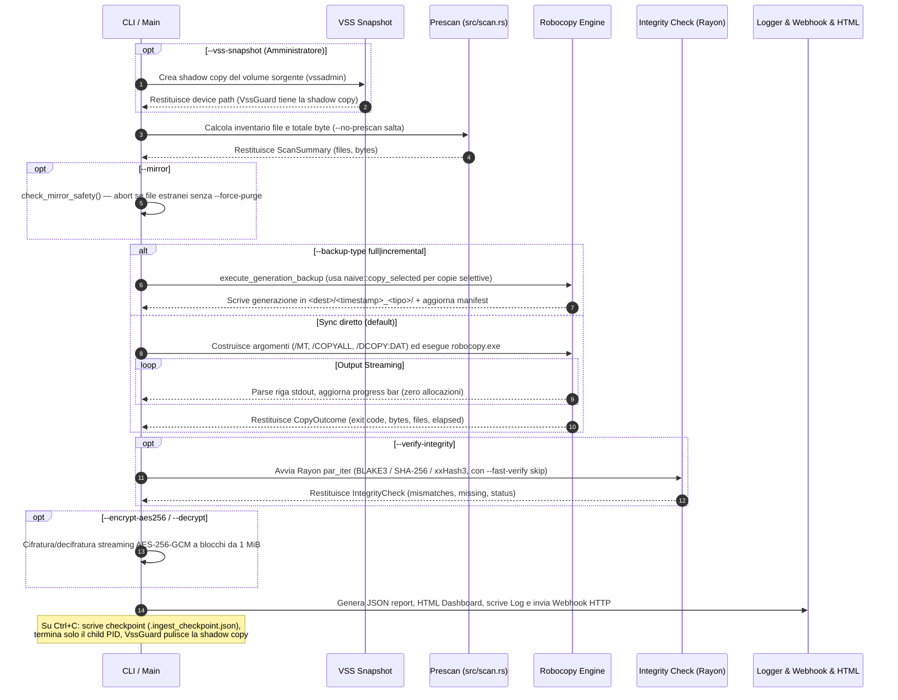

# Architettura di Sistema — robocopy-ingest-cli (v5.4.2)

Questo documento descrive in dettaglio l'**architettura interna, la pipeline di esecuzione, i pattern di progettazione ed i meccanismi di sicurezza e performance** implementati nel crate `robocopy_ingest`.

---

## 1. Diagramma Architetturale ad Alto Livello

```mermaid
graph TD
    User(["Utente / Script CLI / TOML Config"]) -->|Args / Flags| CLI["src/cli.rs - Clap Parser & Validazione"]
    CLI --> Main["src/main.rs - Orchestratore Principale"]

    subgraph Pipeline Ingestion Engine
        Main -->|1. Prescan| Scan["src/scan.rs - Scansione Walkdir & Sizing"]
        Main -->|2. Backup Engine| RobocopyEngine["src/engine/robocopy.rs - Process Streaming Engine"]
        RobocopyEngine -->|Invoca| Exec["robocopy.exe - Native Windows Binary"]
        Exec -->|"Stdout+Stderr Stream OEM"| Dec["Decodifica CP850 dedicata (oem_codec.rs) & Zero-Alloc Parsing"]
    end

    subgraph Integrity & Security Layer
        Main -->|3. Integrity Check| RayonVerify["src/integrity.rs - Rayon Parallel Hashing"]
        RayonVerify -->|"SHA-256 / BLAKE3 / xxHash3"| Hash["Motore di Hashing"]
        Main -->|4. Zero-Trust Crypto| Crypto["src/crypto.rs - AES-256-GCM su file destinazione"]
    end

    subgraph Monitoring, Logging & Reporting
        Main -->|Async Logging| Log["src/logging.rs - Bounded Channel Logger 10k MSGs"]
        Main -->|Report Output| JSONReport["src/report.rs - JSON Report & Host Metadata"]
        Main -->|HTML Dashboard| HTMLReport["src/html_report.rs - Standalone Dashboard HTML"]
        Main -->|HTTP Webhook| Notify["src/notify.rs - Async HTTP Webhook Dispatcher"]
    end

    subgraph Notify Server ["Binario separato, feature notify-server"]
        Main -->|"POST /notify"| NotifyServer["src/bin/notify_server.rs + src/notify_server.rs - axum Router"]
        NotifyServer -->|dispatch| Sinks["src/notify_sink.rs - LogSink / NtfySink / GenericWebhookSink"]
    end

    subgraph Disaster Recovery & Continuità
        Main -->|--restore-from| Restore["src/restore.rs - Reverse Restore Engine"]
        Main -->|--resume-from| Checkpoint["src/checkpoint.rs - Checkpoint & Resume"]
    end

    subgraph Backup Enterprise ["Release 6.0.0"]
        Main -->|--vss-snapshot| VSS["src/vss.rs - Volume Shadow Copy (vssadmin)"]
        Main -->|--backup-type| Generations["src/generations.rs - Generazioni Full/Incrementale"]
        Generations -->|copia selettiva| NaiveEngine["src/engine/naive.rs - copy_selected"]
    end

    subgraph Stubs ["Scaffolding (non implementato)"]
        T["src/cloud.rs - Cloud Sync"]
        U["src/service.rs - Windows Service"]
    end

    A2["src/cache.rs - State Cache (.ingest_cache)"]
    Main -->|--fast-verify| A2
```

---

## 2. Dettaglio dei Moduli e Responsabilità

| Modulo Sorgente | Responsabilità Architetturale | Tecnica / Pattern Utilizzato |
|---|---|---|
| `src/main.rs` | Orchestrazione asincrona e gestione dei segnali. | `tokio::select!` per cattura `Ctrl+C`; termina solo il PID del child `robocopy.exe` tracciato (non `taskkill /IM`); esegue `check_mirror_safety` (diff reale dest vs source) prima del trasferimento; scrive checkpoint su interruzione. |
| `src/cli.rs` | Definition, parsing e validazione delle opzioni CLI. | Struct `clap` derivata con default `*`, flag `--force-purge` e merge automatico dai profili TOML. `--source`/`--dest` sono `Option<PathBuf>` con `required_unless_present = "restore_from"` (fix F24); accessor `Args::source()`/`Args::dest()` restituiscono `&Path`. |
| `src/config.rs` | Caricamento e parsing delle configurazioni riutilizzabili. | Deserializzazione TOML tramite `serde`. Supporta `[[jobs]]` (array di `JobConfig`) con ereditarietà dai default di primo livello del file (`JobConfig::merged_over`). |
| `src/engine/mod.rs` | Astrazione del motore di copia. | Trait `CopyEngine` per disaccoppiare Robocopy dalla copia Naive; `run_with_retries` con backoff esponenziale su exit code transienti. |
| `src/engine/robocopy.rs` | Wrapper ad altissime prestazioni per `robocopy.exe`. | Streaming `read_until` binario, buffer riutilizzato, decodifica OEM via `src/oem_codec.rs`, stdout e stderr entrambi drenati (su thread separati) invece di scartare stderr, PID del child pubblicato per il kill mirato su Ctrl+C. |
| `src/engine/naive.rs` | Motore di copia baseline e copia selettiva per generazioni. | Copia ricorsiva single-thread con buffer 64 KiB. `copy_selected` accetta un elenco esplicito di file per le copie incrementali (generazioni), usato al posto di robocopy perché robocopy non accetta liste arbitrarie di percorsi. |
| `src/oem_codec.rs` | Decodifica OEM/CP850. | Tabella CP850 hardcoded (0x80-0xFF) più controllo a runtime di `GetOEMCP()`; `encoding_rs` non implementa le code page DOS single-byte, quindi non viene usato per questo scopo. |
| `src/integrity.rs` | Verifica di corrispondenza sorgente/destinazione. | Parallelizzazione multi-core con **Rayon** (`par_iter`), pre-check taglia file, **BLAKE3 / SHA-256 / xxHash3** e cap errore a 10k per OOM guard. Supporta `--fast-verify` via `IngestCache`. |
| `src/logging.rs` | Logging asincrono su file per-file. | Canale asincrono `bounded_channel(10_000)` con strategia non bloccante (`try_send`); le righe scartate vengono contate. `--log-level`/`--quiet` per il filtro, `--log-max-bytes`/`--log-max-backups` per la rotazione all'avvio. |
| `src/report.rs` | Generazione dello schema JSON completo. | Serializzazione `serde_json`, conteggio temporizzazioni di fase (`PhaseTiming`), metadati host (`HostMetadata`), `SCHEMA_VERSION = 2`. |
| `src/html_report.rs` | Dashboard visiva HTML standalone. | Template HTML5 autonomo con CSS incorporato; ogni valore interpolato passa da `escape_html`. |
| `src/notify.rs` | Invio notifiche Webhook di completamento. | `WebhookPayload` (con `schema_version`, `BackupStatus` tipizzato) inviato via `reqwest`+`rustls` a `--webhook-url`. Timeout 10s, errori reali propagati. |
| `src/notify_sink.rs` | Canali di notifica per il notify-server. | Trait `NotificationSink` (stesso pattern di `CommandRunner`/`CopyEngine`); `LogSink`/`NtfySink`/`GenericWebhookSink`; config TOML (`NotifyServerConfig`). Sempre compilato (nessuna dipendenza da axum), testabile con un doppio scriptato. |
| `src/notify_server.rs` + `src/bin/notify_server.rs` | Server HTTP di ricezione notifiche. | Router axum (`GET /health`, `POST /notify`), autenticazione a token via header, bind loopback forzato senza token, `DefaultBodyLimit`, graceful shutdown. Feature-gated (`notify-server`): axum non entra nelle dipendenze del binario di backup. |
| `src/restore.rs` | Disaster Recovery e Ripristino guidato. | `build_restore_args` clona gli `Args` **realmente parsati per questa invocazione** (non li ricostruisce da zero) e sovrascrive solo i campi che devono provenire dal report. |
| `src/checkpoint.rs` | Checkpoint di esecuzione e ripresa. | Scritto su `Ctrl+C` da `run()`. `--resume-from` ricostruisce l'invocazione interrotta con la stessa disciplina di `build_restore_args` (clone degli Args reali, non `try_parse_from`). Sfrutta lo skip automatico di robocopy per i file già a destinazione (niente `/Z`). |
| `src/generations.rs` | Backup a generazioni Full/Incrementale. | Ogni run scrive in `<dest>/<timestamp>_<tipo>/` e registra l'inventario completo della sorgente in `<dest>/.rustcopy_generations.json` (`GenerationManifest`). `changed_since` differen size+mtime per le copie incrementali. |
| `src/vss.rs` | Snapshot Volume Shadow Copy. | Shell-out a `vssadmin create/delete shadow`. `VssGuard` (RAII `Drop` sincrono) garantisce la pulizia anche su `Ctrl+C`. Il device path della shadow copy viene usato come `effective_source` senza mutare `Args`. Richiede Amministratore. |
| `src/cache.rs` | Cache di stato incrementale per `--fast-verify`. | `IngestCache` keyed su size+mtime **sorgente**, persistita in `<dest>/.ingest_cache`. Un file che fallisce la verifica non viene mai messo in cache. `--enable-dedup` (deduplica a livello di trasferimento) **non è implementato**. |
| `src/cloud.rs` | **[NON IMPLEMENTATO]** Sincronizzazione Cloud diretta. | `sync_to_cloud` è un mock che ritorna sempre `Ok(100)`; `--cloud-sync-target` non ha effetto. |
| `src/service.rs` | **[NON IMPLEMENTATO]** Registrazione servizio Windows. | `register_windows_service` è un mock; `--install-service` non ha effetto. |
| `src/crypto.rs` | Cifratura/decifratura Zero-Trust. | **AES-256-GCM a blocchi da 1 MiB**, nonce fresco per blocco, header `RCE1` + record length-prefixed, file temporaneo sibling + rename atomico. `--decrypt <KEY>` è il simmetrico di `--encrypt-aes256`. |
| `src/exit_code.rs` | Decodifica bitmask exit code robocopy. | Interpreta i codici di uscita di robocopy; `EXIT_INTEGRITY_FAILED = 4` distingue fallimento di integrità da fallimento di trasferimento. |
| `src/errors.rs` | Enum `IngestError` con classificazione retry. | Errori tipizzati con `is_retryable()` per il backoff automatico. |
| `src/progress.rs` | Progress bar monotonica con throughput. | Observer pattern per aggiornamenti in tempo reale dalla pipeline di trasferimento. |
| `src/testkit.rs` | `ScriptedRunner` e test doubles cross-platform. | Implementa `CommandRunner` con output predefiniti per testare parser, retry e progress senza `robocopy.exe`. |

---

## 3. Flusso della Pipeline di Ingestion



---

## 4. Gestione della Memoria & Prevenzione OOM su Datasets 1 TB+

Per garantire la stabilità su dataset da **milioni di file**:

1. **Buffer Stdout Riutilizzato**: La lettura dell'output di Robocopy riutilizza un unico `Vec<u8>` per tutte le righe, azzerando le allocazioni sull'heap per ogni file copiato.
2. **Logging Asincrono Bounded**: Il canale di trasmissione dei log verso il writer è limitato rigidamente a **10.000 messaggi**. Se il disco di log rallenta, i messaggi in eccesso vengono scartati (`try_send` non bloccante) invece di accumularsi senza limite; il conteggio degli scarti è tracciato ed esposto in `log_lines_dropped` nel report JSON, così l'audit trail perso è visibile invece che silenzioso.
3. **Cap Liste Discrepanze Report**: Nel caso in cui centinaia di migliaia di file risultino corrotti o mancanti, la lista nel report JSON viene troncata a **10.000 elementi** (`MAX_REPORTED_ERRORS`) impostando `truncated: true`.
4. **Cifratura a Blocchi**: `CryptoManager::encrypt_stream` / `decrypt_stream` operano in chunk da **1 MiB** con nonce fresco per blocco — la memoria di picco è O(dimensione blocco), non O(dimensione file).

---

## 5. Matrice di Cross-Platform & Mock Testability

Nonostante `robocopy.exe` sia un binario esclusivamente Windows, l'intera suite di **236 test** (`cargo test` di base) viene eseguita ed è al 100% passante sia su Windows che su Linux / macOS grazie al trait `CommandRunner` ed al mock `ScriptedRunner` che simula perfettamente gli exit code ed i flussi stdout di Robocopy. Su Windows, i test aggiuntivi eseguono `robocopy.exe` realmente (dry-run, cifratura AES-256-GCM end-to-end, blocco del mirror-purge, webhook irraggiungibile, **ripristino completo end-to-end da perdita simulata di file — F24**, **backup cifrato → perdita → `--restore-from --decrypt` end-to-end — F25b**, **backup generazionale full → incrementale → differenziale — F34**, **ritenzione/rotazione delle generazioni per cicli — F35**, **checkpoint e resume — F31**). Con `cargo test --features notify-server` (**249 test** totali) si aggiungono i test unitari sul router axum (su socket TCP reale) e test end-to-end che eseguono i binari `notify-server` e `robocopy_ingest` realmente compilati l'uno contro l'altro.
