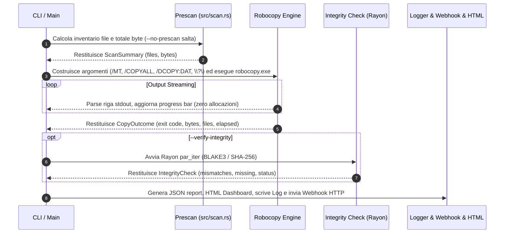

# Architettura di Sistema — robocopy-ingest-cli (v4.0.0 Next-Gen)

Questo documento descrive in dettaglio l'**architettura interna, la pipeline di esecuzione, i pattern di progettazione ed i meccanismi di sicurezza e performance** implementati nel crate `robocopy_ingest`.

---

## 1. Diagramma Architetturale ad Alto Livello

```mermaid
graph TD
    User([Utente / Script CLI / TOML Config]) -->|Args / Flags| CLI[src/cli.rs - Clap Parser & Validazione]
    CLI --> Main[src/main.rs - Orchestratore Principale]

    subgraph Pipeline Ingestion Engine
        Main -->|1. Prescan| Scan[src/scan.rs - Scansione Walkdir & Sizing]
        Main -->|2. Backup Engine| RobocopyEngine[src/engine/robocopy.rs - Process Streaming Engine]
        RobocopyEngine -->|Invoca| Exec[robocopy.exe - Native Windows Binary]
        Exec -->|Stdout Stream OEM/ANSI| Dec[Decodifica Lossy UTF-8 & Zero-Alloc Parsing]
    end

    subgraph Integrity & Security Layer
        Main -->|3. Integrity Check| RayonVerify[src/integrity.rs - Rayon Parallel Hashing]
        RayonVerify -->|Sha256 / Blake3| Hash[BLAKE3 / SHA-256 Engine]
        Main -->|4. Zero-Trust Crypto| Crypto[src/crypto.rs - AES-256 Streaming Encryption]
    end

    subgraph Monitoring, Logging & Reporting
        Main -->|Async Logging| Log[src/logging.rs - Bounded Channel Logger 10k MSGs]
        Main -->|Report Output| JSONReport[src/report.rs - JSON Report & Host Metadata]
        Main -->|HTML Dashboard| HTMLReport[src/html_report.rs - Standalone Dashboard HTML]
        Main -->|HTTP Webhook| Notify[src/notify.rs - Async HTTP Webhook Dispatcher]
        Main -->|Live Monitoring| Server[src/server.rs - Live Web Dashboard Server HTTP]
    end

    subgraph Disaster Recovery
        Main -->|--restore-from| Restore[src/restore.rs - Reverse Restore Engine]
    end
```

---

## 2. Dettaglio dei Moduli e Responsabilità

| Modulo Sorgente | Responsabilità Architetturale | Tecnica / Pattern Utilizzato |
|---|---|---|
| `src/main.rs` | Orchestrazione asincrona e gestione dei segnali. | `tokio::select!` per cattura `Ctrl+C` e shutdown pulito. |
| `src/cli.rs` | Definition, parsing e validazione delle opzioni CLI. | Struct `clap` derivata con merge automatico dai profili TOML. |
| `src/config.rs` | Caricamento e parsing delle configurazioni riutilizzabili. | Deserializzazione TOML tramite `serde`. |
| `src/engine/mod.rs` | Astrazione del motore di copia. | Trait `CopyEngine` per disaccoppiare Robocopy dalla copia Naive baseline. |
| `src/engine/robocopy.rs` | Wrapper ad altissime prestazioni per `robocopy.exe`. | Streaming `read_until` binario, buffer riutilizzato, decodifica OEM/ANSI e Stdio `stderr` a null. |
| `src/integrity.rs` | Verifica di corrispondenza sorgente/destinazione. | Parallelizzazione multi-core con **Rayon** (`par_iter`), pre-check taglia file, **BLAKE3 / SHA-256** e cap errore a 10k per OOM guard. |
| `src/logging.rs` | Logging asincrono su file per-file. | Canale asincrono `bounded_channel(10_000)` con strategia non bloccante (`try_send`). |
| `src/report.rs` | Generazione dello schema JSON completo. | Serializzazione `serde_json`, conteggio temporizzazioni di fase (`PhaseTiming`) e metadati host (`HostMetadata`). |
| `src/html_report.rs` | Dashboard visiva HTML standalone. | Template HTML5 autonomo con CSS/SVG incorporati, azzerando le dipendenze esterne CDN. |
| `src/notify.rs` | Invio notifiche verso endpoint Webhook. | HTTP client asincrono su socket TCP nativa con payload JSON custom. |
| `src/server.rs` | Live Web Dashboard HTTP server. | Server multithread integrato su socket `std::net::TcpListener` per monitoraggio live via browser. |
| `src/restore.rs` | Disaster Recovery e Ripristino guidato. | Inversione automatica dei parametri Sorgente/Destinazione partendo dal report JSON. |
| `src/cache.rs` | Deduplica e Cache di Stato incrementale. | Gestione della mappa di stato `.ingest_cache` basata su timestamp e dimensioni file. |
| `src/crypto.rs` | Cifratura Zero-Trust. | Cifratura/decifratura simmetrica in streaming AES-256. |

---

## 3. Flusso della Pipeline di Ingestion



---

## 4. Gestione della Memoria & Prevenzione OOM su Datasets 1 TB+

Per garantire la stabilità su dataset da **milioni di file**:

1. **Buffer Stdout Riutilizzato**: La lettura dell'output di Robocopy riutilizza un unico `Vec<u8>` per tutte le righe, azzerando le allocazioni sull'heap per ogni file copiato.
2. **Logging Asincrono Bounded**: Il canale di trasmissione dei log verso il writer è limitato rigidamente a **10.000 messaggi**. Se il disco di log rallenta, i messaggi in eccesso vengono gestiti senza saturare la RAM.
3. **Cap Liste Discrepanze Report**: Nel caso in cui centinaia di migliaia di file risultino corrotti o mancanti, la lista nel report JSON viene troncata a **10.000 elementi** (`MAX_REPORTED_ERRORS`) impostando `truncated: true`.

---

## 5. Matrice di Cross-Platform & Mock Testability

Nonostante `robocopy.exe` sia un binario esclusivamente Windows, l'intera suite di **120 test** viene eseguita ed è al 100% passante sia su Windows che su Linux / macOS grazie al trait `CommandRunner` ed al mock `ScriptedRunner` che simula perfettamente gli exit code ed i flussi stdout di Robocopy.
