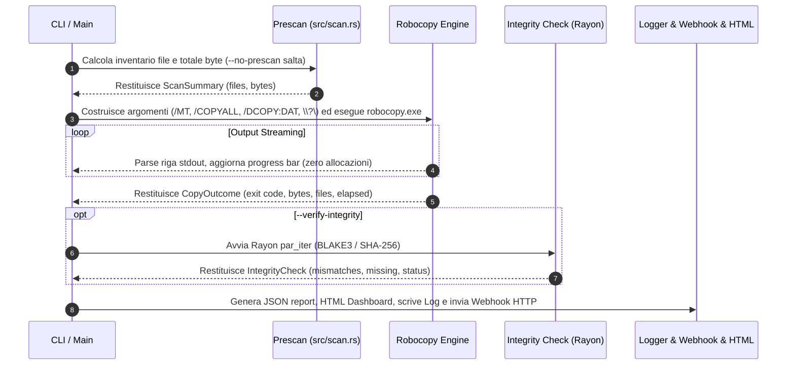

# Architettura di Sistema — robocopy-ingest-cli (v5.1.0 Robustness & Encoding)

Questo documento descrive in dettaglio l'**architettura interna, la pipeline di esecuzione, i pattern di progettazione ed i meccanismi di sicurezza e performance** implementati nel crate `robocopy_ingest`.

---

## 1. Diagramma Architetturale ad Alto Livello

```mermaid
graph TD
    User([Utente / Script CLI / TOML Config]) -->|Args / Flags| CLI[src/cli.rs - Clap Parser & Validazione]
    CLI --> Main[src/main.rs - Orchestratore Principale]

    subgraph Pipeline Ingestion Engine
        Main -->|1. Prescan| Scan[src/scan.rs - Scansione Walkdir & Sizing]
        Main -->|2. Backup Engine| RobocopyEngine[src/engine/robocopy.rs - Process Streaming Engine]
        RobocopyEngine -->|Invoca| Exec[robocopy.exe - Native Windows Binary]
        Exec -->|Stdout+Stderr Stream OEM| Dec[Decodifica CP850 dedicata (oem_codec.rs) & Zero-Alloc Parsing]
    end

    subgraph Integrity & Security Layer
        Main -->|3. Integrity Check| RayonVerify[src/integrity.rs - Rayon Parallel Hashing]
        RayonVerify -->|Sha256 / Blake3| Hash[BLAKE3 / SHA-256 Engine]
        Main -->|4. Zero-Trust Crypto| Crypto[src/crypto.rs - AES-256-GCM su file destinazione]
    end

    subgraph Monitoring, Logging & Reporting
        Main -->|Async Logging| Log[src/logging.rs - Bounded Channel Logger 10k MSGs]
        Main -->|Report Output| JSONReport[src/report.rs - JSON Report & Host Metadata]
        Main -->|HTML Dashboard| HTMLReport[src/html_report.rs - Standalone Dashboard HTML]
        Main -->|HTTP Webhook| Notify[src/notify.rs - Async HTTP Webhook Dispatcher]
    end

    subgraph Notify Server [Binario separato, feature notify-server]
        Main -->|POST /notify| NotifyServer[src/bin/notify_server.rs + src/notify_server.rs - axum Router]
        NotifyServer -->|dispatch| Sinks[src/notify_sink.rs - LogSink / NtfySink / GenericWebhookSink]
    end

    subgraph Disaster Recovery
        Main -->|--restore-from| Restore[src/restore.rs - Reverse Restore Engine]
    end
```

---

## 2. Dettaglio dei Moduli e Responsabilità

| Modulo Sorgente | Responsabilità Architetturale | Tecnica / Pattern Utilizzato |
|---|---|---|
| `src/main.rs` | Orchestrazione asincrona e gestione dei segnali. | `tokio::select!` per cattura `Ctrl+C`; termina solo il PID del child `robocopy.exe` tracciato (non `taskkill /IM`); esegue `check_mirror_safety` (diff reale dest vs source) prima del trasferimento. |
| `src/cli.rs` | Definition, parsing e validazione delle opzioni CLI. | Struct `clap` derivata con default `*`, flag `--force-purge` e merge automatico dai profili TOML. **Nota**: `--source`/`--dest` sono dichiarati `required_unless_present = "restore_from"` con `default_value = ""`, ma clap rifiuta il valore vuoto per `PathBuf` prima di valutare la condizione: restano quindi obbligatori sempre e la modalità restore non è raggiungibile (D1/F24). |
| `src/config.rs` | Caricamento e parsing delle configurazioni riutilizzabili. | Deserializzazione TOML tramite `serde`. |
| `src/engine/mod.rs` | Astrazione del motore di copia. | Trait `CopyEngine` e `CopyRequestBuilder` fluente per disaccoppiare Robocopy dalla copia Naive; `run_with_retries` azzera il `ProgressSink` tra un tentativo e l'altro. |
| `src/engine/robocopy.rs` | Wrapper ad altissime prestazioni per `robocopy.exe`. | Streaming `read_until` binario, buffer riutilizzato, decodifica OEM via `src/oem_codec.rs`, stdout e stderr entrambi drenati (su thread separati) invece di scartare stderr, PID del child pubblicato per il kill mirato su Ctrl+C. |
| `src/oem_codec.rs` | Decodifica OEM/CP850. | Tabella CP850 hardcoded (0x80-0xFF) più controllo a runtime di `GetOEMCP()`; `encoding_rs` non implementa le code page DOS single-byte, quindi non viene usato per questo scopo. |
| `src/integrity.rs` | Verifica di corrispondenza sorgente/destinazione. | Parallelizzazione multi-core con **Rayon** (`par_iter`), pre-check taglia file, **BLAKE3 / SHA-256** e cap errore a 10k per OOM guard. Schema `Mismatch` con campi `kind`/`algorithm`/`source_digest`/`dest_digest` (non più genericamente `*_sha256`). |
| `src/logging.rs` | Logging asincrono su file per-file. | Canale asincrono `bounded_channel(10_000)` con strategia non bloccante (`try_send`); le righe scartate vengono contate ed esposte via `LogHandle::dropped_lines()`. |
| `src/report.rs` | Generazione dello schema JSON completo. | Serializzazione `serde_json`, conteggio temporizzazioni di fase (`PhaseTiming`), metadati host (`HostMetadata`), più `log_lines_dropped`, `encrypted` e `webhook_error`. |
| `src/html_report.rs` | Dashboard visiva HTML standalone. | Template HTML5 autonomo con CSS incorporato; ogni valore interpolato (path, pattern, versione) passa da `escape_html`. |
| `src/notify.rs` | Invio notifiche verso endpoint Webhook. | Client `reqwest` + `rustls` (HTTP e HTTPS), timeout 10s, verifica dello status code, errore reale propagato (non più `Ok(())` silenzioso). |
| `src/notify.rs` | Invio del webhook di completamento. | `WebhookPayload` (con `schema_version`, `BackupStatus` tipizzato) inviato via `reqwest`+`rustls` a `--webhook-url`. |
| `src/notify_sink.rs` | Canali di notifica per il notify-server. | Trait `NotificationSink` (stesso pattern di `CommandRunner`/`CopyEngine`); `LogSink`/`NtfySink`/`GenericWebhookSink`; config TOML (`NotifyServerConfig`). Sempre compilato (nessuna dipendenza da axum), testabile con un doppio scriptato. |
| `src/notify_server.rs` + `src/bin/notify_server.rs` | Server HTTP di ricezione notifiche. | Router axum (`GET /health`, `POST /notify`), autenticazione a token via header, bind loopback forzato senza token, `DefaultBodyLimit`, graceful shutdown. Feature-gated (`notify-server`): axum non entra nelle dipendenze del binario di backup. Sostituisce l'ex `src/server.rs` (pagina statica mock, rimosso). |
| `src/restore.rs` | Disaster Recovery e Ripristino guidato. | Costruisce gli `Args` di ripristino con `Args::try_parse_from` (non più `Args::default()`, che azzerava `report_path`/`log_path`), invertendo Sorgente/Destinazione dal report JSON. |
| `src/cache.rs` | **[NON IMPLEMENTATO]** Deduplica e Cache di Stato incrementale. | Modulo presente (`.ingest_cache`) ma non collegato alla pipeline: `--enable-dedup` non ha effetto. |
| `src/cloud.rs` | **[NON IMPLEMENTATO]** Sincronizzazione Cloud diretta. | `sync_to_cloud` è un mock che ritorna sempre `Ok(100)`; `--cloud-sync-target` non ha effetto. |
| `src/service.rs` | **[NON IMPLEMENTATO]** Registrazione servizio Windows. | `register_windows_service` è un mock; `--install-service` non ha effetto. |
| `src/crypto.rs` | Cifratura Zero-Trust. | **AES-256-GCM** reale (nonce a 96 bit casuale per file, chiave derivata via SHA-256 da passphrase/`env:`/`file:`), applicata ai file in destinazione dopo il trasferimento (e dopo la verifica di integrità). |

---

## 3. Flusso della Pipeline di Ingestion



---

## 4. Gestione della Memoria & Prevenzione OOM su Datasets 1 TB+

Per garantire la stabilità su dataset da **milioni di file**:

1. **Buffer Stdout Riutilizzato**: La lettura dell'output di Robocopy riutilizza un unico `Vec<u8>` per tutte le righe, azzerando le allocazioni sull'heap per ogni file copiato.
2. **Logging Asincrono Bounded**: Il canale di trasmissione dei log verso il writer è limitato rigidamente a **10.000 messaggi**. Se il disco di log rallenta, i messaggi in eccesso vengono scartati (`try_send` non bloccante) invece di accumularsi senza limite; il conteggio degli scarti è tracciato ed esposto in `log_lines_dropped` nel report JSON, così l'audit trail perso è visibile invece che silenzioso.
3. **Cap Liste Discrepanze Report**: Nel caso in cui centinaia di migliaia di file risultino corrotti o mancanti, la lista nel report JSON viene troncata a **10.000 elementi** (`MAX_REPORTED_ERRORS`) impostando `truncated: true`.

---

## 5. Matrice di Cross-Platform & Mock Testability

Nonostante `robocopy.exe` sia un binario esclusivamente Windows, l'intera suite di **149 test** (`cargo test` di base: 131 unit + 12 black-box del binario + 6 di integrazione della pipeline) viene eseguita ed è al 100% passante sia su Windows che su Linux / macOS grazie al trait `CommandRunner` ed al mock `ScriptedRunner` che simula perfettamente gli exit code ed i flussi stdout di Robocopy. Su Windows, alcuni test aggiuntivi eseguono `robocopy.exe` realmente (dry-run, cifratura AES-256-GCM end-to-end, blocco del mirror-purge, webhook irraggiungibile). Con `cargo test --features notify-server` (162 test totali) si aggiungono 10 unit test sul router axum (su socket TCP reale) e 3 test end-to-end che eseguono i binari `notify-server` e `robocopy_ingest` realmente compilati l'uno contro l'altro.
