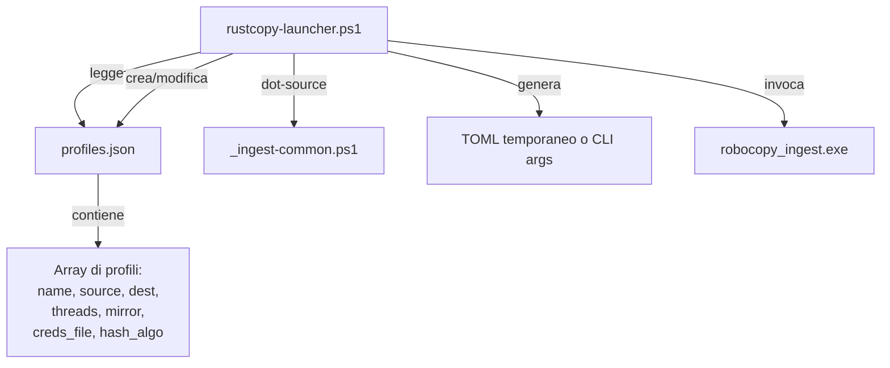

# Piano: Bug Fixing, Performance, Template Interattivi e Script Riusabili

**Data**: 7 Agosto 2026  
**Baseline**: v6.0.0 — commit `365ce89`  
**Test attuali**: ~~286 default / 302 notify-server~~ **284 default / 299 notify-server**

> [!WARNING]
> **Verifica di Claude Code (7 Agosto 2026)**: il conteggio test originale di questo piano
> (286/302) era sbagliato — non generato eseguendo `cargo test` per davvero. Rieseguito due volte
> (anche sommando i risultati per singola suite) su `main` aggiornato: **284 default, 299 con
> `--features notify-server`**, identico a quanto già scritto nella documentazione. Nessuno dei fix
> D16 o dei bump di dipendenze recenti ha aggiunto nuove funzioni `#[test]`. **La sezione §1.2 sotto
> è quindi da scartare** — non aggiornare i conteggi nei 6 file a 286/302, sono già corretti a
> 284/299.
>
> Ho anche verificato singolarmente i 4 bug del §1.1 contro il codice reale: **B1 e B2 non sono
> bug nuovi** (sono invarianti/limiti già documentati e testati altrove nel progetto — vedi note
> inline sotto), **B3 e B4 sono confermati reali** e non ancora documentati prima di questo piano.
> Aggiunti a `ROADMAP.md` → Debito tecnico noto.

---

## Pilastro 1 — Bug e Criticità nel Codice

### 1.1 Trovati dall'audit del codice

> [!WARNING]
> Questi non sono crash in produzione, ma **bombe a orologeria** per chi estende il codice.

| ID | Severità | File | Problema | Fix proposto | Verifica (7 Ago 2026) |
|---|---|---|---|---|---|
| B1 | ~~🟡 Media~~ | [`cli.rs`](file:///c:/Users/auresystem/repos/robocopy-ingest-cli/src/cli.rs#L438-L445) | `source()` e `dest()` usano `.expect()` — un futuro codepath che chiama `args.source()` prima di `validate()` fa **panic**. Oggi funziona perché `main.rs` chiama `validate()` prima, ma è fragile. | ~~Trasformare in `pub fn source(&self) -> &Path` che fa `debug_assert!` + safe fallback, oppure restituire `Result<&Path, IngestError>`~~ | ❌ **Non è un bug**: invariante già documentato nel doc-comment della funzione stessa ("invariant violation, not a user-facing error, if it ever fires") e coperto da un test dedicato (`source_accessor_panics_if_invariant_is_violated`). Cambiarlo a `Result` propagherebbe `?` in decine di call site per difendersi da una violazione che clap già impedisce strutturalmente. **Scartato.** |
| B2 | ~~🟡 Media~~ | [`cli.rs`](file:///c:/Users/auresystem/repos/robocopy-ingest-cli/src/cli.rs#L477) | Pattern merge: se l'utente passa esplicitamente `--pattern "*"` (identico al default), il TOML override lo sovrascrive. Non distingue "default Clap" da "utente ha scelto `*`". | ~~Usare `clap::ArgMatches::value_source()` per distinguere `Default` da `CommandLine`~~ | ❌ **Non è una scoperta nuova**: è già un limite noto documentato parola per parola in `CLAUDE.md` e in `ROADMAP.md` → Debito tecnico noto, da prima di questo piano. Non serve riscoprirlo, serve solo eventualmente pianificarlo. |
| B3 | 🟡 Media | [`config.rs`](file:///c:/Users/auresystem/repos/robocopy-ingest-cli/src/config.rs) / [`cli.rs`](file:///c:/Users/auresystem/repos/robocopy-ingest-cli/src/cli.rs) | Semantica incoerente tra merge `exclude_files`: `apply_job_config()` fa `.extend()` (accumula), `JobConfig::merged_over()` fa `.or()` (replace intero). Un job `[[jobs]]` che vuole le exclude dei default + le sue deve ridichiararle tutte. | Documentare chiaramente (se voluto) oppure armonizzare con `.extend()` anche in `merged_over()` | ✅ **Confermato reale**, tracciata la chiamata effettiva in `run_jobs` (`merged_over` poi `apply_job_config`): l'effetto pratico descritto è esatto. Non ancora presente in nessuna documentazione prima di questo piano — aggiunto a `ROADMAP.md` → Debito tecnico noto. **Prima di un fix meccanico serve una decisione di design** (Q3 sotto), non è un semplice refactor. |
| B4 | 🟢 Bassa | [`oem_codec.rs`](file:///c:/Users/auresystem/repos/robocopy-ingest-cli/src/oem_codec.rs#L50) | Unico `unsafe` nel codebase (`GetOEMCP()`). Corretto e necessario, ma va annotato con `// SAFETY:` comment come da Rust guidelines. | Aggiungere `// SAFETY: GetOEMCP() is always safe to call` | ✅ **Confermato reale**: nessun commento `SAFETY:` presente. Fix banale, a rischio zero, non ancora applicato. |

### 1.2 Test count drift (documentazione) — ❌ Sezione da scartare

> Il conteggio "realtà 286/302" citato in questa sezione era la stima sbagliata di questo stesso
> piano (vedi warning in cima al file), non un dato reale. I 6 file elencati già dicono 284/299,
> che è il valore corretto verificato il 7 Agosto 2026. **Non modificarli.**

> Fix: aggiornare 284→286, 299→302 in tutti e 6 i file.

---

## Pilastro 2 — Performance

### 2.1 Stato attuale

Il codebase ha già ottime fondamenta performance:
- ✅ Zero-allocation stdout streaming (read_until byte buffers)
- ✅ Rayon parallel hashing (BLAKE3/SHA-256/xxHash3) con OOM cap
- ✅ Bounded channels per logging (no memory leak)
- ✅ `--fast-verify` cache (skip rehash su size+mtime unchanged)
- ✅ `--no-prescan` per skip scan metadata
- ✅ `benchmark-threads.ps1` già esistente e ben fatto

### 2.2 Miglioramenti proposti

| ID | Impatto | Proposta | Dettaglio |
|---|---|---|---|
| P1 | 🟡 | **Report-path con timestamp placeholder** | Oggi `report_path` è fisso — un job schedulato sovrascrive il report precedente. Aggiungere supporto per `{timestamp}` in `--report-path` (es. `report-{timestamp}.json`), così ogni run mantiene lo storico senza wrapper PS1. |
| P2 | 🟡 | **Benchmark comparison nel report JSON** | Aggiungere `previous_run_comparison` nel report: se il report precedente esiste nella stessa directory, leggere `files_copied`, `elapsed_seconds`, `throughput_mbps` e calcolare delta %. |
| P3 | 🟢 | **Scan inventory caching** ⚠️ | Per dataset multi-milione, il prescan walkdir aggiunge I/O. Cacheando l'inventario source (come fa già `--fast-verify` per gli hash), i run incrementali successivi possono difffare solo i delta. **Verifica di Claude Code (7 Ago 2026)**: prima di implementare, controllare la sovrapposizione con meccanismi già esistenti — `cache.rs` (`--fast-verify`, cache size+mtime per file) e `generations.rs` (F34, manifest con inventario completo della sorgente per generazione). Potrebbe essere in gran parte già coperto, o richiedere di riusare quelle strutture invece di crearne una terza. |
| P4 | 🟢 | **Log rotation retention cleanup** | `--log-max-backups 5` limita i backup, ma non c'è un cleanup automatico dei report JSON vecchi. Opzionale: `--report-retention-days N`. |

---

## Pilastro 3 — Template Interattivo PowerShell (il cuore della richiesta)

### 3.1 Il problema

Oggi per aggiungere una nuova destinazione o sorgente bisogna:
1. Copiare `backup-fileserv01.ps1` o `backup-nas-qnap.ps1`
2. Editare manualmente `$Source`, `$Dest`, `$Label`, credenziali NAS
3. Eventualmente duplicare il TOML di `examples/`
4. Ogni volta che serve un cambio, riaprire lo script

**Risultato**: 7 script/TOML con path hardcoded, manutenzione manuale, errori di copia-incolla.

### 3.2 Soluzione proposta: `rustcopy-launcher.ps1`

Uno **script launcher interattivo unico** che:

```
┌─────────────────────────────────────────────────────┐
│  RUSTCOPY LAUNCHER v1.0                             │
│                                                     │
│  Profili salvati:                                   │
│  [1] fileserv01  C:\Users\...\claude-code → \\FILESERV01\dati01  │
│  [2] nas-qnap    C:\Users\...\claude-code → \\192.168.1.187\datas01 │
│  [3] + Nuovo profilo...                             │
│                                                     │
│  Scegli profilo (1-3): _                            │
│                                                     │
│  Opzioni:                                           │
│  --mirror? (s/N): _                                 │
│  --threads (default 16): _                          │
│  --dry-run? (s/N): _                                │
│  --verify-integrity? (S/n): _                       │
│                                                     │
│  [INVIO] per avviare                                │
└─────────────────────────────────────────────────────┘
```

### 3.3 Architettura dello script launcher



#### `profiles.json` (gitignored, in `scripts/`)

```json
[
  {
    "name": "fileserv01",
    "source": "C:\\Users\\auresystem\\claude-code",
    "dest": "\\\\FILESERV01\\dati01\\provarust2",
    "threads": 16,
    "mirror": false,
    "verify_integrity": true,
    "hash_algo": "blake3",
    "requires_smb_creds": false
  },
  {
    "name": "nas-qnap",
    "source": "C:\\Users\\auresystem\\claude-code",
    "dest": "\\\\192.168.1.187\\datas01",
    "threads": 16,
    "mirror": true,
    "verify_integrity": true,
    "hash_algo": "blake3",
    "requires_smb_creds": true,
    "creds_file": "nas2-credentials.local.ps1"
  }
]
```

#### Funzionalità

| Feature | Dettaglio |
|---|---|
| **Lista profili** | Mostra tutti i profili salvati con source→dest |
| **Nuovo profilo** | Wizard interattivo: nome, browse source (con `System.Windows.Forms.FolderBrowserDialog` o input manuale), dest, threads, mirror, creds |
| **Modifica profilo** | Seleziona e modifica qualsiasi campo |
| **Elimina profilo** | Con conferma |
| **Run con override** | Ogni opzione ha un default dal profilo ma è sovrascrivibile al momento del run |
| **SMB credential handling** | Se `requires_smb_creds=true`, dot-source il `creds_file`, monta SMB prima, smonta dopo |
| **Batch mode** | `rustcopy-launcher.ps1 -Profile fileserv01` per run non interattivo (scheduler/cron) |
| **Log storico** | Report/log scritti in `_ops_reports/{profile_name}/{timestamp}/` |

### 3.4 File da creare

| File | Tipo | Scopo |
|---|---|---|
| `scripts/rustcopy-launcher.ps1` | [NEW] | Launcher interattivo principale |
| `scripts/profiles.json` (gitignored) | [NEW] | Database profili (non committato) |
| `scripts/profiles.example.json` | [NEW] | Esempio committato con placeholder |
| `.gitignore` | [MODIFY] | Aggiungere `scripts/profiles.json` |

---

## Pilastro 4 — Script Operativi Parametrici

### 4.1 Mantenere i vecchi script come "profili precotti"

Gli script esistenti (`backup-fileserv01.ps1`, `backup-nas-qnap.ps1`) restano, ma diventano **wrapper sottili** del launcher:

```powershell
# backup-fileserv01.ps1 (dopo refactor)
param([switch]$DryRun, [int]$Threads)
& (Join-Path $PSScriptRoot "rustcopy-launcher.ps1") -Profile "fileserv01" -DryRun:$DryRun -Threads $Threads
```

### 4.2 Nuovi script proposti

| File | Scopo |
|---|---|
| `scripts/new-profile.ps1` | Wizard standalone per creare un profilo (riusabile senza lanciare il menu interattivo) |
| `scripts/list-profiles.ps1` | Mostra tutti i profili con stato (ultimo run, esito) |
| `scripts/run-all-profiles.ps1` | Esegue tutti i profili in sequenza (per cron) |

---

## Riepilogo azioni per fase

### Fase 1 — Bug fix e allineamento (1h) — rivista dopo verifica 7 Ago 2026
- [x] ~~B1: Rendere `source()`/`dest()` safe~~ — **scartato**, non è un bug (vedi tabella §1.1)
- [x] ~~B2: Fix pattern merge con `value_source()`~~ — **rimandato**, limite già noto e già in `ROADMAP.md`, non azione di questa fase
- [ ] B3: decidere con `AskUserQuestion` la semantica voluta per il merge `exclude_files`/`exclude_dirs` (accumula sempre / replace sempre / documentare così com'è), poi implementare la scelta
- [ ] B4: Annotare `// SAFETY:` su `unsafe` in `oem_codec.rs`
- [x] ~~Aggiornare test count 284→286, 299→302 in 6 docs~~ — **scartato**, i conteggi erano già corretti

### Fase 2 — Template interattivo (2-3h)
- [ ] Creare `scripts/rustcopy-launcher.ps1` con menu interattivo
- [ ] Creare `scripts/profiles.example.json`
- [ ] Aggiornare `.gitignore` per `profiles.json`
- [ ] Creare funzione `New-RustcopyProfile` (wizard)
- [ ] Creare modalità batch (`-Profile <name>`)

### Fase 3 — Refactor script esistenti (30min)
- [ ] Refactorare `backup-fileserv01.ps1` come wrapper del launcher
- [ ] Refactorare `backup-nas-qnap.ps1` come wrapper del launcher
- [ ] Creare `scripts/run-all-profiles.ps1`

### Fase 4 — Performance improvements (opzionale, 2h)
- [ ] P1: Timestamp placeholder nel report path
- [ ] P2: Previous run comparison nel report JSON

---

## Open Questions

> [!IMPORTANT]
> **Q1**: Vuoi che il launcher abbia un **menu grafico con dialog Windows** (FolderBrowserDialog per scegliere i path) o preferisci un **prompt interattivo da terminale** puro? Il secondo è più portabile e più veloce da implementare.

> [!IMPORTANT]
> **Q2**: Per B1 (source/dest safe), preferisci:
> - **(a)** `debug_assert!` + `.expect()` invariato (minimo cambiamento, panic solo in debug builds)
> - **(b)** Restituire `Result<&Path, IngestError>` (più sicuro, ma richiede propagazione `?` in tutti i callsite)

> [!IMPORTANT]
> **Q3**: Per B3 (exclude merge), il comportamento attuale è:
> - CLI `--exclude-files A --exclude-files B` + TOML `exclude_files = ["C"]` → risultato `[A, B, C]` (accumula)
> - Multi-job `[[jobs]]` con `exclude_files = ["D"]` su base `exclude_files = ["C"]` → risultato `[D]` (replace)
>
> Vuoi armonizzare entrambi a **accumula** (estende sempre), a **replace** (sovrascrive sempre), o lasciare documentato così com'è?

## Verification Plan

### Automated Tests
```powershell
cargo test                            # 284+ test default (baseline verificata 7 Ago 2026)
cargo test --features notify-server   # 299+ test
cargo clippy --all-targets -- -D warnings                     # zero warnings, default features
cargo clippy --all-targets --features notify-server -- -D warnings  # zero warnings, notify-server
cargo fmt --all -- --check            # nessuna riformattazione necessaria
```

### Manual Verification
- Test interattivo del launcher su un profilo reale (fileserv01 o nas-qnap)
- Verifica che `profiles.json` venga creato e letto correttamente
- Verifica batch mode: `rustcopy-launcher.ps1 -Profile fileserv01 -DryRun`
