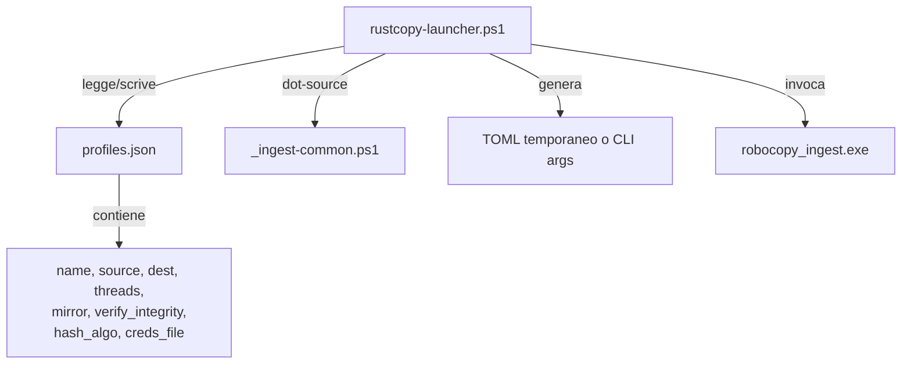

# Piano di Miglioramento Consolidato — rustcopy

**Baseline**: v6.0.0 — commit `0d8a9f0`
**Test**: 286 default / 301 con `--features notify-server` *(misurati il 17 Agosto 2026 dopo l'esecuzione di B3+B4 — erano 284/299 fino al 7 Agosto; +2 dovuti ai due unit test aggiunti da B3 per fissare le semantiche di merge exclude, vedi §Esecuzione blocco 1)*

---

## Provenienza di questo documento

Consolida tre fonti che prima divergevano:

| Fonte | Data | Cosa ne sopravvive |
|---|---|---|
| `PIANO_MIGLIORAMENTI.md` (versione precedente) | 7 Ago 2026 | Pilastri C (bug B3/B4), D (launcher PowerShell), E (performance P1-P4) |
| Piano "Agent Harness + MCP" di Francesco | 16 Ago 2026 | Pilastro A (lacune README, residuo reale della sua "Fase 0"); il resto scartato o rimandato — vedi §Scartato |
| Verifica sul codice reale | 17 Ago 2026 | Pilastro B (economia di contesto), e il log di verifica sotto |
| Decisioni dell'utente su Q1/Q3/Q4 | 17 Ago 2026 | §Decisioni (D-Q1/D-Q3/D-Q4) — **nessuna open question resta aperta**, il piano è eseguibile dall'alto in basso |

`ROADMAP.md` resta il documento **strategico** (milestone, feature F1-F61, storico release, debito tecnico). Questo file è il documento **operativo**: cosa fare adesso e in che ordine. Non duplicare le descrizioni delle feature qui — linkare la riga di `ROADMAP.md`.

---

## Log di verifica — 17 Agosto 2026

Il piano del 16 Agosto è stato scritto senza controllare lo stato attuale del repo: **la sua "Fase 0" (dichiarata bloccante per tutto il resto) è per ~70% lavoro già fatto**. Ogni riga sotto è stata verificata sul codice/filesystem reale, non stimata.

| Affermazione del piano 16 Ago | Verdetto | Evidenza |
|---|---|---|
| README dichiara "123 test" | ❌ **Falso** | `README.md:251,254,255` dicono già 284/299 |
| `ANALYSIS.md` dichiara "123 test" | ❌ **Falso** | `grep -c "123" ANALYSIS.md` → 0 occorrenze |
| README documenta `--serve-dashboard` come esistente | ❌ **Falso** | 0 occorrenze in `README.md`/`ARCHITECTURE.md`; `RUNBOOK.md:340` lo documenta correttamente come **rimosso** |
| `--cloud-sync-target` presentato come funzionante | ❌ **Falso** | `README.md:49,95` già marcati `[NON IMPLEMENTATO]` |
| Manca `LICENSE` | ❌ **Falso** | `LICENSE` (MIT, 1.0K) presente; `Cargo.toml:7` ha `license = "MIT"` |
| Manca CI cross-platform | ❌ **Falso** | `.github/workflows/ci.yml` presente e **più completo** di quanto il piano chiedeva: matrice windows+ubuntu, `fmt --check`, `clippy -D warnings` su **entrambi** i set di feature, `test` su entrambi, più un job `docs` con `okf parse` |
| Skill senza `SKILL.md` | ❌ **Falso** | tutte e 7 le skill in `.agents/skills/` hanno `SKILL.md`; `rustcopy-flow/` ha le 8 molecole + `CHANGELOG.md` intatti |
| **Flag presenti in `--help` ma assenti dal README** | ✅ **Confermato reale** | `--compare-baseline`, `--report-path`, `--retries`, `--retry-wait-seconds` → **0 occorrenze** in `README.md`. Diff fatto tra `--help` del binario compilato e i flag citati nel README |
| **Manca la tabella completa degli exit code** | ✅ **Confermato reale** | i codici 3/4/5 compaiono solo *in prosa*, sparsi in 4 righe della tabella flag (`README.md:66,68,77`); **0, 1 e 2 non sono mai dichiarati nel README** |
| Mancano sezioni su generazioni/VSS/scheduling/servizi/hook/fast-verify | ⚠️ **Parzialmente vero** | i flag *ci sono tutti* nella tabella (46 righe), ma non esiste nessuna sezione narrativa: `grep "^## " README.md` → nessun heading su generazioni, VSS, scheduling o servizi |

**Conseguenza pratica**: eseguire la "Fase 0" così com'è scritta significherebbe riscrivere da zero un README già corretto, con rischio concreto di *regressione* documentale. Va eseguita solo la parte confermata reale, che è il Pilastro A qui sotto.

---

## Pilastro A — Lacune di documentazione (residuo reale)

Priorità più alta del piano: sono le uniche lacune verificate, e sono a rischio zero (nessun codice toccato).

| ID | Sev. | Lacuna | Fix — ✅ **chiuso 17 Ago 2026** |
|---|---|---|---|
| **A1** | 🟠 | 4 flag reali assenti dal README: `--compare-baseline`, `--report-path`, `--retries`, `--retry-wait-seconds` | Aggiunti alla tabella "Guida ai Flag CLI", descrizione/default presi dal `--help` del binario compilato reale, non a memoria |
| **A2** | 🟠 | Tabella exit code assente; 0/1/2 mai dichiarati | Sezione `## 🔢 Codici di Uscita` aggiunta con tutti e 6 i codici (fonte: `AGENTS.md` regola 12) |
| **A3** | 🟡 | Nessuna sezione narrativa per le feature 6.0.0 | 5 sezioni aggiunte: Generazioni di Backup, VSS, Scheduling e Servizi Windows (con nota esplicita sulle **due identità di servizio distinte**, `RustcopyIngestService` vs `RustcopyNotifyServer`), Comandi Pre/Post Job, Fast Verify |
| **A4** | 🟢 | Badge assenti (build/licenza/versione) | 3 badge aggiunti in cima al README: CI (punta al workflow reale `ci.yml`), licenza MIT, versione (allineata a `Cargo.toml`) |

**Verifica reale eseguita** (non stimata):

```
diff <(./target/release/robocopy_ingest.exe --help | grep -oE '\-\-[a-z0-9-]+' | sort -u) \
     <(grep -oE '`--[a-z0-9-]+' README.md | tr -d '`' | sort -u)
# → residuo: --help/--version (mai stati nella tabella, per design) e --features
#   (falso positivo del regex: è un flag di `cargo build`, non del binario). Nessun flag
#   reale del binario manca dal README.
okf parse README.md          → ok
cargo test                   → 286 passed, 0 failed (invariato: nessun src/ toccato in questo blocco)
cargo test --features notify-server → 301 passed, 0 failed
cargo fmt --all -- --check   → nessuna riformattazione necessaria
```

**Nota emersa durante il lavoro, non nello scope originale di A1-A4**: `--log-path <PATH>` (default `./robocopy_ingest.log`) non ha una propria riga nella tabella flag — compare solo citato in prosa dentro la riga di `--log-level`, per questo il diff meccanico (basato sulla presenza del nome flag, non su una riga tabellare dedicata) non l'ha segnalato come mancante. Non corretto qui per disciplina di scope; candidato a un fix separato di un minuto se si vuole coerenza totale della tabella.

**Criteri di accettazione del Pilastro A** (verificabili meccanicamente, da eseguire davvero prima di dichiarare fatto):

```bash
# Nessun flag di --help assente dal README (deve stampare solo --help e --version)
diff <(./target/release/robocopy_ingest.exe --help | grep -oE '\-\-[a-z0-9-]+' | sort -u) \
     <(grep -oE '`--[a-z0-9-]+' README.md | tr -d '`' | sort -u)
```

---

## Pilastro B — Economia di contesto (nuovo, 17 Ago 2026)

> Nasce dall'obiettivo dichiarato dall'utente ("utilizzo di tokens più parsimonioso") applicato al repo stesso, non a un tool esterno.

| ID | Sev. | Problema | Fix — **deciso** (vedi §Decisioni, D-Q4) |
|---|---|---|---|
| **B5** | 🟠 | `CLAUDE.md` è **44.579 caratteri su 87 righe** (misurati, non stimati) e viene caricato in contesto a **ogni** sessione su questo repo, indipendentemente dal task. Gli **8 bullet più grossi valgono ~20K, il 45% del file**: F37 (3.6K), F34 (2.9K), F36 (2.8K), F41 (2.8K), F33 (2.5K), D11 (2.0K), F35 (2.1K), F39 (1.9K) — narrazione per-feature utile solo quando si tocca quel modulo. Contro **27 prescrizioni operative** (`Do not`/`never`/`must`) che sono il vero carico utile | **Deduplicare, non cancellare.** Target **44K → ~25K**. Tenere **tutte e 27 le prescrizioni verbatim**, ciascuna con la sua riga di motivo; ridurre gli 8 bullet grossi a *prescrizione + una riga di motivo + puntatore* alla riga di `ROADMAP.md`/`ANALYSIS.md` che conserva il resto |

**Perché il rischio è minore del previsto**: la narrazione è in gran parte **già una terza copia**. Campionamento del 17 Agosto 2026:

| Contenuto | CLAUDE.md | ROADMAP.md | ANALYSIS.md | ARCHITECTURE.md |
|---|---|---|---|---|
| `service_dispatcher` (F37) | 2 | 2 | — | — |
| `run-as-service` (F37) | 1 | 1 | — | — |
| `filter_entry` (D11) | 1 | — | 1 | — |
| `spawn_blocking_with_span` (D13) | 1 | — | 1 | 1 |
| `atomic_write` (D14) | 1 | — | 3 | 1 |
| **`OnDemand` (F37)** | **1** | **0** | **0** | **0** |

L'ultima riga è il motivo per cui B5 va fatto **con un diff riga per riga e non a blocchi**: la maggior parte è duplicata, ma non tutto. Ogni riga rimossa deve essere dimostrabilmente ritrovabile altrove (`grep`, non a memoria) — altrimenti va riscritta nella destinazione **prima** di toglierla dall'origine.

**Due precisazioni economiche, per non sopravvalutare il beneficio**:

1. Il risparmio **monetario** è minore di quanto suggerisca il numero grezzo: `CLAUDE.md` sta nel prefisso in cache dei prompt, quindi il costo reale è una scrittura di cache per sessione più letture al ~10%, non 44K di token pieni a ogni turno.
2. Il beneficio vero è di **qualità, non di costo**: ~12-14k token di archeologia densa competono per attenzione con il task effettivo in ogni sessione, anche quando quel task non tocca nessuno di quei moduli. È questa la ragione per cui B5 vale la pena, non il risparmio in fattura.

**Regola da non violare**: `"non reintrodurre std::fs::read"` privato di `"perché va in OOM sui file grandi"` è una regola che qualcuno rovescerà per pulizia. Il *motivo* resta sempre; è la cronologia dell'implementazione che si sposta.

---

## Pilastro C — Bug e debito tecnico

Stato aggiornato dopo la verifica del 7 Agosto 2026 (invariato al 17 Agosto: nessun commit su `src/` da allora).

| ID | Sev. | File | Problema | Stato |
|---|---|---|---|---|
| ~~B1~~ | — | `cli.rs` | `source()`/`dest()` usano `.expect()` | ❌ **Scartato**: non è un bug. Invariante documentato nel doc-comment e coperto da `source_accessor_panics_if_invariant_is_violated`. Trasformarlo in `Result` propagherebbe `?` in decine di call site per difendersi da una violazione che clap impedisce strutturalmente |
| ~~B2~~ | — | `cli.rs` | Merge `--pattern`: un `"*"` esplicito è indistinguibile dal default clap | ⏸️ **Rimandato**: limite già noto e già documentato in `CLAUDE.md` e in `ROADMAP.md` → Debito tecnico noto, da prima di questo piano. Servirebbe `ArgMatches::value_source` |
| **B3** | ~~🟡~~ → **🟢** | `config.rs` / `cli.rs` | Le due semantiche di merge divergono: `Args::apply_job_config` fa `.extend()` (accumula), `JobConfig::merged_over` fa `.or_else()` (sostituisce) | ✅ **Chiuso il 17 Ago 2026**: nota in `README.md` (dopo la tabella flag), commenti in `examples/scheduled-incremental.toml`, e due unit test che fissano le due semantiche — `config::tests::job_excludes_replace_not_extend_the_shared_defaults` e `cli::tests::apply_job_config_accumulates_cli_excludes_with_config_excludes`. Zero cambio di comportamento |
| **B4** | 🟢 | `oem_codec.rs:50` | Unico `unsafe` del crate (`GetOEMCP()`) senza commento `// SAFETY:` | ✅ **Chiuso il 17 Ago 2026** — commento `// SAFETY:` aggiunto in `src/oem_codec.rs` |

---

## Pilastro D — Launcher PowerShell interattivo

> Questa era la **richiesta originale** dell'utente nel piano del 7 Agosto e resta la voce a più alto valore pratico dell'intero documento: è l'unica che cambia il lavoro quotidiano invece della documentazione.

### Il problema

Oggi, per aggiungere una sorgente/destinazione: copiare `backup-fileserv01.ps1`, editare a mano `$Source`/`$Dest`/`$Label`/credenziali, eventualmente duplicare il TOML di `examples/`. Risultato: 7 script/TOML con path hardcoded, manutenzione manuale, errori di copia-incolla.

### La soluzione: `scripts/rustcopy-launcher.ps1`

Un launcher unico che legge/scrive un `profiles.json` (gitignorato) e invoca il binario.



| Feature | Dettaglio |
|---|---|
| Lista profili | Mostra tutti i profili salvati con `source → dest` |
| Nuovo profilo | Wizard interattivo **a prompt di terminale** (deciso — vedi §Decisioni, D-Q1): input testuale con validazione `Test-Path` immediata e ri-prompt sull'errore, più la tab-completion nativa di PowerShell sui path. **Nessun `System.Windows.Forms`, nessun `FolderBrowserDialog`** |
| Modifica / elimina | Con conferma sull'eliminazione |
| Run con override | Ogni opzione ha default dal profilo, sovrascrivibile al momento del run |
| Credenziali SMB | Se `requires_smb_creds`, dot-source del `creds_file`, mount SMB prima, unmount dopo |
| Batch mode | `-Profile fileserv01` per run non interattivo (Task Scheduler) |
| Log storico | Report/log in `_ops_reports/{profile}/{timestamp}/` |

**File**: `scripts/rustcopy-launcher.ps1` [NEW], `scripts/profiles.example.json` [NEW], `scripts/profiles.json` [gitignored], `.gitignore` [MODIFY].

**Refactor a seguire**: `backup-fileserv01.ps1` e `backup-nas-qnap.ps1` diventano wrapper sottili (`& launcher.ps1 -Profile "..."`), non vengono eliminati. Più `scripts/run-all-profiles.ps1` per l'esecuzione in sequenza.

> **Nota di coerenza architetturale**: il launcher genera argv/TOML per il binario esistente — **nessuna logica di backup in PowerShell**. Stessa disciplina di `.agents/skills/rustcopy-flow/`, che pilota il binario compilato senza reimplementarne il comportamento. Se una funzione serve al launcher e non esiste nel binario, va aggiunta al binario, non aggirata nello script.

---

## Pilastro E — Performance

Fondamenta già solide: zero-allocation stdout streaming, hashing parallelo Rayon con OOM cap, bounded channel per il logging, `--fast-verify`, `--no-prescan`, `benchmark-threads.ps1`.

| ID | Impatto | Proposta |
|---|---|---|
| **P1** | 🟡 | **Placeholder `{timestamp}` in `--report-path`** — oggi un job schedulato sovrascrive il report precedente. Elimina il bisogno di un wrapper PS1 solo per lo storico. Interagisce con `main.rs::namespaced_path` (F33/D12): verificare che le due namespacizzazioni si compongano, non si escludano |
| **P2** | 🟡 | **`previous_run_comparison` nel report JSON** — se esiste un report precedente nella stessa directory, leggerne `files_copied`/`elapsed_seconds`/`throughput_mbps` e calcolare il delta % |
| **P3** | 🟢 | **Cache dell'inventario di scan** ⚠️ — **prima di implementare**, verificare la sovrapposizione con i due meccanismi esistenti: `cache.rs` (`--fast-verify`, size+mtime per file) e `generations.rs` (F34, inventario **completo** della sorgente per generazione). Rischio concreto di creare una terza struttura che duplica le prime due |
| **P4** | 🟢 | **Retention dei report JSON** — `--log-max-backups` copre i log ma non i report. Eventuale `--report-retention-days N` |

---

## Scartato e rimandato, con motivazione

Registrato qui perché "non fare X" è una decisione che va tracciata come le altre, altrimenti X viene riproposto ogni sessione.

### Scartato — "Fase 0" del piano 16 Agosto (parti già fatte)

README già allineato su test count / `serve-dashboard` / `[NON IMPLEMENTATO]`, `LICENSE` presente, CI presente e più completa del richiesto, skill tutte integre. Vedi il §Log di verifica per l'evidenza puntuale. **Non ri-eseguire.**

### Scartato — `HARNESS.md` + `.leaf-detectors` (Agent Harnesses spec)

Il repo ha già due entry point che funzionano e che il tooling reale consuma davvero: `AGENTS.md` (14 regole architetturali, fonte di verità) e `CLAUDE.md` (auto-caricato da Claude Code). `SKILL.md` copre le skill. Aggiungere un **terzo** file di routing per una specifica che nessuno dei client in uso qui legge in modo verificato introduce esattamente il problema di frammentazione che il piano voleva risolvere: una fonte in più da tenere sincronizzata, a costo di manutenzione reale e beneficio non dimostrato.

**Condizione per riprendere**: quando un client concretamente in uso legge `HARNESS.md`/`.leaf-detectors` — verificato, non ipotizzato.

### Scartato — ridurre `CLAUDE.md` a un puntatore

Il piano del 16 Agosto chiedeva di svuotare `CLAUDE.md` migrando il contenuto unico in `AGENTS.md`. **Da non fare così**: sono 43.5K di dettaglio non-ovvio (razionale per-flag, narrazione dei fix D1-D16, lezioni tipo F25b) contro i 13.3K di `AGENTS.md`, che vale proprio perché è una lista concisa di regole. Il risultato sarebbe un `AGENTS.md` da 50K+ che perde la sua funzione, oppure una perdita secca di sapere.

L'obiettivo legittimo sotto quella proposta — il costo in contesto — è raccolto in forma sicura in **B5** (split verso `ANALYSIS.md`, non collasso verso `AGENTS.md`).

### Rimandato — server MCP → `ROADMAP.md` backlog, **F61**

Contraddice una decisione architetturale già presa e documentata (`AGENTS.md` §128-130): `rustcopy-flow` è **"Zero MCP dependency — pure Bash/PowerShell against the compiled binary"**, proprio per funzionare anche fuori da questo repo e con qualunque CLI agentica. Il piano stesso lo ammette ("`rustcopy-flow` già copre l'uso agentico da CLI") e procede comunque: 2-3 giorni, una dipendenza `rmcp`, un binario, una superficie di test nuova, per servire solo host che non sanno eseguire skill Bash/PowerShell. Nessun host di questo tipo è oggi un requisito, e la preferenza dichiarata dall'utente è CLI+skill per parsimonia di token.

**Il design però è buono e va conservato**: exit code 0-5 mappati 1:1 su errori MCP, esclusione esplicita delle operazioni distruttive (`--force-purge`, `--mirror` non presidiato, purge di retention, install/uninstall di servizi e schedule) dalla superficie dei tool. Registrato in `ROADMAP.md` come F61 con questi vincoli, da riprendere quando emerge un host non-CLI reale.

### Rimandato — OpenWorker e blueprint Tauri (Fasi 3-4 del piano 16 Ago)

Corretti come sono: sperimentali, nessun rischio, priorità bassa, nessuna dipendenza introdotta nel codice di rustcopy. La Fase 4 (studio dei pattern di packaging/sidecar Tauri) alimenta la milestone 8.0.0 già in `ROADMAP.md` (F52-F60) — va annotata lì quando prodotta, non duplicata qui.

---

## Ordine di esecuzione consigliato

Ordinato per rapporto valore/rischio, non per numerazione.

> **Tutte le decisioni bloccanti sono chiuse** (vedi §Decisioni): nessun blocco è in attesa di risposta. L'ordine sotto è eseguibile dall'alto in basso senza ulteriori conferme.

| # | Blocco | Stima | Rischio | Perché in questa posizione |
|---|---|---|---|---|
| 1 | ~~**B4**~~ (commento `// SAFETY:`) | 5 min | Nullo | ✅ **Chiuso 17 Ago 2026** |
| 2 | ~~**B3**~~ (documentare le due semantiche + test che le fissano) | 20 min | Nullo | ✅ **Chiuso 17 Ago 2026** — vedi §Esecuzione blocco 1 per l'evidenza dei test |
| 3 | ~~**Pilastro A**~~ (A1-A4, documentazione) | 1-1.5h | Nullo | ✅ **Chiuso 17 Ago 2026** — diff meccanico verificato pulito, vedi §Pilastro A |
| 4 | **Pilastro D** (launcher PowerShell) | 2-3h | Basso | Richiesta originale dell'utente, valore pratico quotidiano più alto. Forma decisa in D-Q1 (terminale, nessun WinForms) |
| 5 | **Refactor script → wrapper** | 30 min | Basso | Dipende da 4 |
| 6 | **P1 / P2** (performance) | 2h | Basso | Valore reale ma nessuno lo blocca oggi |
| 7 | **B5** (dedup `CLAUDE.md`, 44K → ~25K) | 1-2h | Medio | Approvato in D-Q4. Resta per ultimo: va verificato riga per riga con `grep` sulla destinazione, e non va mescolato ad altro lavoro nello stesso diff |

## Esecuzione blocco 1 (B4 + B3) — 17 Agosto 2026

Entrambi chiusi sullo stesso branch `chore/b3-b4-pilastro-a`, non ancora mergiato/pushato (in attesa di richiesta esplicita, per regola di ingaggio).

**Modifiche**:
- `src/oem_codec.rs` — commento `// SAFETY:` su `unsafe { GetOEMCP() }`
- `README.md` — nota sulle due semantiche di merge dopo la tabella flag
- `examples/scheduled-incremental.toml` — commenti che mostrano il caso accumula (CLI+TOML) e il caso sostituisce (job che non ridichiara le proprie exclude eredita i default; se le ridichiarasse le sostituirebbe)
- `src/config.rs` — nuovo test `job_excludes_replace_not_extend_the_shared_defaults`
- `src/cli.rs` — nuovo test `apply_job_config_accumulates_cli_excludes_with_config_excludes`
- Conteggio test aggiornato **284→286 / 299→301** in `README.md`, `AGENTS.md`, `ROADMAP.md`, `ARCHITECTURE.md` (regola del progetto: la documentazione si aggiorna nello stesso giro del codice, non dopo)

**Verifica reale eseguita** (non stimata):

```
cargo test                              → 232 (lib) + 48 (cli_smoke) + 6 (ingest_pipeline) = 286 passed, 0 failed
cargo test --features notify-server     → 242 (lib) + 48 + 6 + 5 (notify_server_e2e)      = 301 passed, 0 failed
cargo fmt --all -- --check              → nessuna riformattazione necessaria
cargo clippy --all-targets -- -D warnings                          → 0 warning
cargo clippy --all-targets --features notify-server -- -D warnings → 0 warning
```

Nessuna regressione: +2 test rispetto alla baseline 284/299, esattamente i due aggiunti da B3.

**Regola di ingaggio ereditata dal piano 16 Agosto** (buona, da mantenere): un branch per blocco, mai lavorare su `main`, mai dichiarare completo senza aver eseguito `cargo test` **e** `cargo test --features notify-server` riportando l'output reale, mai inventare numeri non misurati. Commit e push solo su richiesta esplicita dell'utente.

---

## Decisioni prese (17 Agosto 2026)

Nessuna open question resta aperta: le tre che bloccavano l'esecuzione sono state decise dall'utente il 17 Agosto 2026, ciascuna dopo verifica sul codice reale. Registrate qui perché la motivazione conta più della scelta: senza il "perché", una decisione viene rimessa in discussione a ogni sessione.

### D-Q1 — Launcher: **prompt da terminale puro** ✅

Scartato il `FolderBrowserDialog`. Tre motivi, tutti verificati:

1. **Le destinazioni di questo progetto sono tutte UNC** — `\\FILESERV01\dati01`, `\\192.168.1.187\datas01`, `\\NAS\share` (estratte dagli script reali in `scripts/`). Il folder dialog è lo strumento peggiore proprio per i path UNC: non accetta digitazione diretta e obbliga a navigare "Rete", lento e inaffidabile quando la share non è ancora montata — e nel caso NAS **non lo è**, perché il mount SMB avviene più tardi dentro lo script stesso.
2. **Il batch mode deve girare da Task Scheduler.** Qualunque codice che tocchi `System.Windows.Forms` in Session 0 si blocca o fallisce, e resterebbero due percorsi da tenere separati per sempre — con la modalità fragile che è proprio quella non presidiata.
3. **`pwsh` 7 è MTA per default, `powershell.exe` 5.1 è STA**: un dialog funziona in uno e crasha nell'altro finché non gli si costruisce un runspace STA dedicato. Complessità reale per zero valore.

Argomento di coerenza: gli script esistenti hanno **zero occorrenze di `Read-Host` o `FolderBrowser`** (verificato) — sono interamente parametrizzati. Un launcher a dialog sarebbe l'unico elemento interattivo del parco script.

**Se un domani il browse servisse davvero**, si aggiunge come `-Browse` opt-in che il batch mode non attraversa mai. Non ora.

### D-Q3 — Semantica exclude: **documentare, non armonizzare** ✅

> Questa decisione ha ribaltato l'orientamento iniziale (che era "armonizzare ad accumula"), dopo lettura di `src/config.rs:56-60`.

Il comportamento di `merged_over` **è già una scelta deliberata e documentata nel suo stesso doc-comment**:

> *"Whole-value overwrite for every field, including the list fields (`exclude_files`/`exclude_dirs`) — a job that wants both the shared defaults' excludes and its own must repeat them, keeping the merge rule uniform across all fields instead of special-casing lists as 'extend'."*

Chi l'ha scritta sapeva e ha scelto, con una motivazione valida: uniformità, tutti i campi si comportano allo stesso modo.

E l'altro lato **non è correggibile nella direzione opposta**: rendere `apply_job_config` un replace farebbe sì che un file di config **scarti silenziosamente un `--exclude-files` esplicito da riga di comando** — violazione diretta della filosofia di merge del progetto (la CLI vince finché è sul default clap) e peggioramento netto.

I due livelli sono semanticamente **diversi, e ciascuno ha ragione**:

| Livello | Natura | Semantica corretta |
|---|---|---|
| CLI + TOML top-level | due *sorgenti* per la stessa esecuzione | additiva (`.extend()`) |
| job `[[jobs]]` su defaults | *ereditarietà* con override | sostituzione (`.or_else()`), uniforme con ogni altro campo |

Quindi B3 è un difetto di **visibilità**, non di comportamento: nessun documento rivolto all'utente dice che i due livelli differiscono. Vantaggio collaterale del non toccare nulla: con la sostituzione un job può **restringere** le esclusioni ereditate; con l'accumulo togliere un'esclusione ereditata sarebbe impossibile, per sempre.

**Azione** (~20 min, zero rischio, nessun cambio di comportamento):
- nota nella sezione config del README + commento nel TOML d'esempio
- **uno unit test che fissa entrambe le semantiche** — è il pezzo che vale davvero: oggi un refactor che uniformasse i due lati "per pulizia" passerebbe verde

### D-Q4 — Split di `CLAUDE.md`: **sì, ridotto e per ultimo** ✅

Approvato nella forma misurata del Pilastro B: target 44K → ~25K, deduplicazione verificata riga per riga, tutte e 27 le prescrizioni tenute verbatim con il loro motivo. Resta l'**ultimo** blocco della coda e non va mescolato ad altro lavoro nello stesso diff.

*(Q2 non compare: riguardava B1, scartato.)*

---

## Piano di verifica

### Test automatici

```bash
cargo test                                                          # atteso >= 286
cargo test --features notify-server                                 # atteso >= 301
cargo clippy --all-targets -- -D warnings                           # zero warning
cargo clippy --all-targets --features notify-server -- -D warnings  # zero warning
cargo fmt --all -- --check                                          # nessuna riformattazione
cargo tree | grep -i axum                                           # deve stampare NULLA (AGENTS.md regola 8)
```

### Verifica documentale (Pilastro A)

Il `diff` fra i flag di `--help` e quelli del README (comando in fondo al Pilastro A) deve restare vuoto a parte `--help`/`--version`. Vale la pena eseguirlo **anche prima** di iniziare, per confermare che le 4 lacune siano ancora quelle e non ne siano comparse altre.

### Verifica manuale (Pilastro D)

- Run interattivo del launcher su un profilo reale (`fileserv01` o `nas-qnap`)
- `profiles.json` creato e riletto correttamente; `profiles.json` **non** compare in `git status`
- Batch mode: `rustcopy-launcher.ps1 -Profile fileserv01 -DryRun`
