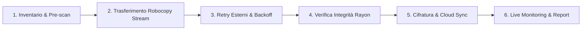

# 🚀 robocopy-ingest-cli (rustcopy)

[](https://github.com/matrixNeo76/rustcopy/actions/workflows/ci.yml)
[](LICENSE)
[](Cargo.toml)

> **CLI High-Performance in Rust per Ingestion Massiva, Backup Enterprise, Disaster Recovery e Real-Time Web Monitoring su Windows (e Cross-Platform).**

`robocopy-ingest-cli` è uno strumento da riga di comando per il **trasferimento, sincronizzazione, backup e verifica di integrità di grandi volumi di dati (da 50 GB a oltre 10 TB con milioni di file)**.  
Combina la potenza nativa di `robocopy.exe` su Windows con le garanzie di sicurezza della memoria, concorrenza multi-threaded ed asincronia di Rust.

---

## 💡 Perché usare robocopy-ingest-cli?

Quando si gestiscono backup o ingestion di volumetrie massive su Windows, l'uso diretto di script PowerShell (`Copy-Item`) o invocazioni grezze di `robocopy.exe` presenta problemi critici:
- **Deadlock su pipe stdout/stderr** quando robocopy emette milioni di righe di diagnostica.
- **Saturazione della RAM (OOM)** durante il logging o la generazione dei report JSON per milioni di file.
- **Mancanza di verifica di integrità automatica e veloce** (checksum checksum single-thread troppo lenti).
- **Mancanza di visibilità in tempo reale** o notifiche per le pipeline CI/CD aziendali.

`robocopy-ingest-cli` risolve alla radice tutti questi problemi!

---

## 🛠️ Come Funziona la Pipeline (Fase per Fase)

Il tool orchestra ogni operazione attraverso 6 fasi distinte:



1. **Scansione Iniziale (Prescan)**: Mappa l'albero della directory sorgente (`walkdir`), calcola le dimensioni ed esegue il matching dei filtri glob (`--pattern "*.csv"`). Se si gestiscono milioni di file, il flag `--no-prescan` avvia il trasferimento all'istante senza attese.
2. **Trasferimento Robocopy Streaming**: Invoca `robocopy.exe` su Windows iniettando i flag ottimali (`/MT:N` thread automatici sulle CPU dell'host, `/COPYALL` permessi ACL, `/DCOPY:DAT` timestamp directory, `/MIR` mirroring, `/IPG` throttling). Legge stdout e stderr tramite buffer binario riutilizzato (drenati su thread separati per evitare deadlock), decodificando i caratteri OEM (CP850) con una tabella dedicata (`src/oem_codec.rs`) invece di un fallback UTF-8 silenzioso.
3. **Retry Esterni & Resilience**: Se Robocopy restituisce exit code transitori di blocco file (codici 8, 9, 11), l'invocazione viene ripetuta automaticamente con backoff esponenziale. Se si preme `Ctrl+C`, l'applicazione intercetta il segnale e termina **solo** il processo `robocopy.exe` figlio effettivamente in corso (tramite il suo PID), senza toccare altri eventuali processi robocopy in esecuzione sull'host.
4. **Verifica Integrità Multi-Threaded**: Verifica la corrispondenza dei checksum tra sorgente e destinazione utilizzando **Rayon** su tutte le CPU dell'host. Supporta **SHA-256** ed l'algoritmo **BLAKE3** (3-5x più veloce).
5. **Cifratura**: Supporta la cifratura **AES-256-GCM** reale a blocchi da 1 MiB (`--encrypt-aes256`, memoria O(dimensione blocco) anche su file enormi) e la sua controparte funzionante `--decrypt`, tipicamente usata insieme a `--restore-from` per ripristinare un backup cifrato. La sincronizzazione diretta verso S3/Azure (`--cloud-sync-target`) è **riservata ma non implementata** (vedi tabella flag).
6. **Reporting & Notifiche**: Scrive un report JSON completo con metadati sull'host, genera una **Dashboard HTML Standalone** (`--html-report-path`, con escaping di ogni valore interpolato) e invia un alert **HTTP/HTTPS Webhook** (`--webhook-url`, con timeout ed errori realmente riportati). Il **notify-server** opzionale incluso nel repo riceve queste notifiche e le inoltra su più canali.

---

## 📌 Guida ai Flag CLI e Mappatura Robocopy

| Flag CLI | Default | Flag Robocopy | Descrizione Operativa |
|---|---|---|---|
| `--source <PATH>` | *obbligatorio* | 1° arg | Percorso della directory sorgente. |
| `--dest <PATH>` | *obbligatorio* | 2° arg | Percorso della directory di destinazione. |
| `--pattern <GLOB>` | `*` | 3° arg | Pattern dei file da includere nell'ingestion (default `*` = tutti i file). |
| `--config <PATH>` | *nessuno* | — | Carica la configurazione da un file TOML riutilizzabile. |
| `--threads <N>` | *CPU logiche* | `/MT:N` | Thread paralleli di copia per Robocopy (1-128). |
| `--retries <N>` | `3` | `/R:N` | Retry per file fallito, sia lato robocopy sia come budget del retry loop esterno di rustcopy. |
| `--retry-wait-seconds <N>` | `5` | `/W:N` | Attesa in secondi tra un retry e l'altro, sia lato robocopy sia come base del backoff esterno. |
| `--preserve-acl` | `false` | `/COPYALL` | Preserva i permessi di sicurezza NTFS e le ACL di dominio. |
| `--preserve-timestamps` | `false` | `/DCOPY:DAT` | Preserva le date di creazione e modifica delle directory. |
| `--long-paths` | `false` | — | Attiva il prefisso `\\?\` per percorsi lunghi oltre 240 caratteri. |
| `--mirror` | `false` | `/MIR` | Sincronizza ed elimina i file in destinazione non presenti in sorgente. Senza `--force-purge`, se ci sono file estranei in destinazione l'esecuzione si interrompe (exit code 3) o chiede conferma a console. Incompatibile con `--backup-type`. |
| `--backup-type <full\|incremental\|differential>` | *nessuno* | — | (Release 6.0.0) Attiva un backup a generazioni: scrive in `<dest>/<timestamp>_<tipo>/` e registra la generazione in `<dest>/.rustcopy_generations.json`. `full` copia tutto; `incremental` copia solo i file nuovi/cambiati dall'**ultima generazione di qualsiasi tipo** (richiede che ne esista già una); `differential` copia i file nuovi/cambiati dall'**ultimo full** (non dall'ultimo differenziale — richiede che esista già un full). Omesso, il comportamento è quello di sempre (sync diretto in `--dest`, nessuna cartella di generazione). Vedi [RUNBOOK.md](RUNBOOK.md) per un esempio completo. |
| `--keep-generations <N>` | *nessuno* | — | (Release 6.0.0, F35) Ritenzione: mantiene gli ultimi N **cicli** (un `full` più tutti gli `incremental`/`differential` successivi fino al prossimo `full`) ed elimina interamente le cartelle e le voci di manifest dei cicli più vecchi. Richiede `--backup-type` (nessuna generazione da ruotare altrimenti) e, come `--mirror`, richiede `--force-purge` o conferma interattiva prima di eliminare — altrimenti l'esecuzione si interrompe con exit code 5 (il backup appena eseguito resta comunque salvato, solo la rotazione viene annullata). |
| `--force-purge` | `false` | — | Disattiva la conferma interattiva per l'eliminazione di file/cartelle: per la modalità `--mirror` (F21) e, separatamente, per la rotazione di `--keep-generations` (F35). |
| `--exclude-files <GLOB>` | *nessuno* | `/XF` | Esclude file corrispondenti ai pattern indicati (ripetibile). |
| `--exclude-dirs <GLOB>` | *nessuno* | `/XD` | Esclude directory corrispondenti ai pattern indicati (ripetibile). |
| `--exclude-junctions` | `false` | `/XJ` | Esclude junction point e directory symlinkate. Senza questo flag, Robocopy le segue (suo default) e il prescan fa lo stesso, così i due contano sempre lo stesso albero (F26d). |
| `--min-age-days <N>` | *nessuno* | `/MINAGE:N` | Esclude i file modificati negli ultimi N giorni. |
| `--max-age-days <N>` | *nessuno* | `/MAXAGE:N` | Esclude i file più vecchi di N giorni. |
| `--bandwidth-limit-mbps <N>`| *nessuno* | `/IPG` | Limita la banda di trasferimento a N MB/s. |
| `--no-prescan` | `false` | — | Salta la scansione preventiva ed avvia immediatamente la copia. |
| `--verify-integrity` | `false` | — | Esegue la verifica dei checksum sorgente vs destinazione a fine copia. Un fallimento di sola integrità (trasferimento riuscito ma checksum non tornano) termina con **exit code 4**, distinto dall'exit code 1 di un trasferimento fallito (F29b). |
| `--fast-verify` | `false` | — | Salta il ri-hashing dei file il cui size+mtime sorgente coincidono con l'ultima verifica riuscita, tracciata in `<dest>/.ingest_cache`. Un file che fallisce la verifica non viene mai messo in cache come "fidato", quindi resta segnalato ad ogni run finché non è davvero corretto (F28). |
| `--ignore-transient-missing` | `false` | — | Dopo `--verify-integrity`, non considera un fallimento l'assenza di file con pattern transienti noti (`.log`, `.tmp`, `.git/objects/`) (F26a). |
| `--hash-algo <ALGO>` | `sha256` | — | Algoritmo per la verifica checksum: `sha256`, `blake3` (3-5x più veloce) o `xxh3` (~5-10x più veloce di blake3, **non crittografico** — solo per rilevare corruzioni accidentali, non per un backup dove un attaccante potrebbe aver manomesso i dati). |
| `--compare-baseline` | `false` | — | Esegue anche una copia ricorsiva naive (l'equivalente di `Get-ChildItem \| Copy-Item`) verso una destinazione temporanea e ne cronometra la durata, per confronto con robocopy. |
| `--report-path <PATH>` | `./robocopy_ingest_report.json` | — | Percorso del report JSON finale. Supporta il placeholder `{timestamp}` (Release 6.0.0, P1): viene sostituito con la data/ora di avvio del run nel formato `yyyyMMdd_HHmmss`, lo stesso già usato dal launcher PowerShell — es. `report-{timestamp}.json` → `report-20260819_140509.json`. Senza il placeholder il comportamento è quello di sempre (path fisso, sovrascritto ad ogni run — è da questo caso che dipende `previous_run_comparison` nel report, vedi sopra). In modalità multi-job (`[[jobs]]`) il placeholder viene risolto per ciascun job **dopo** la namespacizzazione per nome (F33) — l'ordine tra i due non incide sul risultato finale, dato che toccano parti disgiunte del nome file — e compongono correttamente: `report-{timestamp}.json` → `report-20260819_140509.nome-job.json`. |
| `--log-level <LIVELLO>` | `debug` | — | Verbosità scritta su `--log-path` (trace/debug/info/warn/error). Ignorato se `RUST_LOG` è impostata. |
| `--quiet` | `false` | — | Scorciatoia per `--log-level warn`: elimina le righe DEBUG per-file, la causa principale dei log da GB su alberi grandi (F27). |
| `--log-max-bytes <N>` | 20 MB | — | Ruota il log precedente (`<path>.1`, `.2`, ...) quando raggiunge N byte. `0` disattiva la rotazione. |
| `--log-max-backups <N>` | `3` | — | Numero di backup di log ruotati da mantenere. |
| `--html-report-path <PATH>`| *nessuno* | — | Genera un report visivo autonomo in formato HTML (valori interpolati sempre sottoposti ad escaping). |
| `--webhook-url <URL>` | *nessuno* | — | Trasmette una notifica HTTP/HTTPS POST JSON a fine job (timeout 10s, errori reali riportati, non più ignorati). |
| `--pre-command <CMD>` | *nessuno* | — | (Release 6.0.0, F39) Comando eseguito **prima** dell'avvio del job (es. fermare un servizio/database perché i suoi file siano coerenti). Eseguito via `cmd /C` su Windows, `sh -c` altrove. Se esce con codice diverso da zero (o non può essere lanciato), il job si interrompe **senza copiare nulla**. |
| `--post-command <CMD>` | *nessuno* | — | (Release 6.0.0, F39) Comando eseguito **dopo** la fine del job (es. riavviare il servizio fermato da `--pre-command`). A differenza di `--pre-command`, un suo fallimento **non** fa fallire il job (il backup è già riuscito) — viene solo loggato e registrato nel campo `post_command_error` del report. |
| `--install-schedule <SPEC>` | *nessuno* | — | (Release 6.0.0, F36) Installa l'invocazione corrente (senza i flag di scheduling) come voce ricorrente di Task Scheduler via `schtasks.exe`, poi esce senza eseguire un backup ora. `SPEC`: `daily@HH:MM`, `hourly@N` o `weekly@LUN,MER,...@HH:MM` (codici giorno a 3 lettere in inglese: `MON`..`SUN`). Nessuno scheduler interno: è Windows stesso a risvegliare il binario. Ri-eseguire con lo stesso `--schedule-name` aggiorna la voce esistente invece di fallire. |
| `--schedule-name <NAME>` | `rustcopy` | — | (Release 6.0.0, F36) Nome della voce di Task Scheduler creata da `--install-schedule` o rimossa da `--uninstall-schedule`. |
| `--uninstall-schedule <NAME>` | *nessuno* | — | (Release 6.0.0, F36) Rimuove una voce di Task Scheduler precedentemente installata, poi esce. A differenza di `--install-schedule`, non richiede `--source`/`--dest`. |
| `--restore-from <PATH>` | *nessuno* | — | Modalità Disaster Recovery: inverte il backup Dest -> Source dal report JSON. `--source`/`--dest` non richiesti in questa modalità (fix F24, verificato con test black-box). Non combinabile con `--resume-from`. |
| `--resume-from <PATH>` | *nessuno* | — | Continua un run interrotto (`Ctrl+C`) leggendo il checkpoint scritto automaticamente in `<report-path>.checkpoint.json`. `--source`/`--dest` non richiesti. **Non** è un resume a metà file: sfrutta lo skip-automatico di robocopy sui file già corrispondenti a destinazione (F31). Non combinabile con `--restore-from`. |
| `--vss-snapshot` | `false` | — | Crea una Volume Shadow Copy del volume sorgente prima di scansionare/copiare, per leggere file bloccati da altri processi. **Richiede Amministratore**; fallisce in modo chiaro senza fallback silenzioso al volume live. Solo Windows. La shadow copy è solo crash-consistent (nessun coordinamento con VSS writer applicativi) (F30). |
| `--cloud-sync-target <URI>`| *nessuno* | — | **[NON IMPLEMENTATO]** Accettato per compatibilità futura; nessuna sincronizzazione viene eseguita. |
| `--encrypt-aes256 <KEY>` | *nessuno* | — | Cifra ogni file in destinazione con **AES-256-GCM a blocchi da 1 MiB** dopo il trasferimento (nonce fresco per blocco; memoria di picco indipendente dalla dimensione del file). `KEY` può essere `env:NOME`, `file:PERCORSO` o una passphrase letterale (sconsigliata: visibile nella process list). |
| `--decrypt <KEY>` | *nessuno* | — | Decifra ogni file in destinazione dopo il trasferimento — il simmetrico di `--encrypt-aes256`, stesso formato `KEY`. Tipicamente usato con `--restore-from` per ripristinare un backup cifrato. Non combinabile con `--encrypt-aes256` nello stesso comando. |
| `--install-service` | `false` | — | (Release 6.0.0, F37) Registra questo binario come servizio Windows reale (via Service Control Manager) ed esce senza eseguire un backup ora. Il servizio parte `OnDemand` e resta **inattivo** una volta avviato (risponde solo a Stop/Interrogate) — nessuna logica di backup gira ancora al suo interno; è pura infrastruttura, in attesa di F41. **Richiede Amministratore**. Non richiede `--source`/`--dest`. Incompatibile con `--uninstall-service`. |
| `--uninstall-service` | `false` | — | (Release 6.0.0, F37) Rimuove il servizio Windows precedentemente installato ed esce. **Richiede Amministratore**. Non richiede `--source`/`--dest`. Incompatibile con `--install-service`. |
| `--enable-dedup` | `false` | — | **[NON IMPLEMENTATO]** Accettato per compatibilità futura; nessuna cache di stato viene usata. |
| `--dry-run` | `false` | `/L` | Simula le operazioni senza modificare o copiare file. |

> [!NOTE]
> **`--exclude-files`/`--exclude-dirs` e la configurazione multi-job (`[[jobs]]`, F33) hanno due semantiche di merge diverse**, per scelta deliberata:
> - **CLI + i default di primo livello del file TOML si sommano**: `--exclude-files` passato sulla riga di comando si aggiunge a quelli eventualmente presenti nel file, non li sostituisce.
> - **Un singolo `[[jobs]]` che dichiara le proprie `exclude_files`/`exclude_dirs` le sostituisce per intero** rispetto ai default di primo livello — non le eredita. Un job che vuole "i default più le proprie" deve ripetere anche quelle di default.
>
> Vedi `examples/scheduled-incremental.toml` per un esempio commentato dei due casi.

---

## 🔢 Codici di Uscita

| Codice | Significato |
|---|---|
| `0` | Successo. |
| `1` | Il trasferimento è fallito (robocopy ha esaurito i retry su almeno un elemento). |
| `2` | Errore d'uso o non recuperabile (flag non validi, precondizione violata, `--pre-command` fallito). |
| `3` | `--mirror`: la purge di sicurezza è stata abortita (file estranei in destinazione senza `--force-purge` né conferma interattiva). |
| `4` | `--verify-integrity` ha trovato un mismatch di checksum — il trasferimento in sé è comunque riuscito, distinto da `1` (F29b). |
| `5` | `--keep-generations`: la purge di ritenzione è stata abortita — il backup appena eseguito resta comunque salvato, solo la rotazione dei cicli più vecchi viene annullata (F35). |

---

## 🗂️ Generazioni di Backup (Full / Incrementale / Differenziale)

`--backup-type <full|incremental|differential>` (Release 6.0.0, F34) trasforma il comportamento di default (sync diretto in `--dest`) in un backup a generazioni: ogni run scrive in una nuova sottocartella `<dest>/<timestamp>_<tipo>/` e registra la generazione in `<dest>/.rustcopy_generations.json` (o `<dest>/.rustcopy_generations.<nome-job>.json` in modalità multi-job `[[jobs]]`, F33 — ogni job ha il proprio manifest namespaced, D12: due job che condividono la stessa `dest` altrimenti mescolerebbero le rispettive cronologie di generazioni), che conserva per ciascuna l'inventario **completo** della sorgente a quel momento (non solo il delta copiato). `incremental` diffa contro l'ultima generazione di qualsiasi tipo (richiede che ne esista già una); `differential` diffa sempre contro l'ultimo `full` (non contro l'ultimo differenziale), così ogni differenziale ha lo stesso riferimento indipendentemente da quanti ne sono girati nel frattempo. Incompatibile con `--mirror` (un mirror presume una singola destinazione speculare, non un manifest con più generazioni). `--keep-generations <N>` (F35) ruota per **cicli** (un `full` più tutti gli `incremental`/`differential` fino al prossimo `full`), non per singola generazione — così non elimina mai un `full` ancora referenziato da una generazione più recente rimasta.

## 📸 Volume Shadow Copy (VSS)

`--vss-snapshot` crea uno snapshot VSS del volume sorgente prima di scansionare/copiare (via `vssadmin.exe`), utile per leggere file bloccati da altri processi invece di fallire dopo aver esaurito i retry. **Richiede Amministratore**; fallisce in modo esplicito senza fallback silenzioso sul volume live. Solo Windows. Lo snapshot è **crash-consistent**, non applicazione-consistent: non c'è coordinamento con VSS writer applicativi (es. un database), quindi va combinato con `--pre-command`/`--post-command` se serve fermare un servizio prima dello snapshot.

## ⏰ Scheduling e Servizi Windows

`--install-schedule <SPEC>` registra l'invocazione corrente (senza i flag di scheduling stessi) come voce ricorrente di Task Scheduler via `schtasks.exe` — `SPEC` accetta `daily@HH:MM`, `hourly@N` o `weekly@LUN,...@HH:MM`. Nessuno scheduler interno: è Windows stesso a risvegliare il binario alla scadenza, rileggendo `--config` se presente. `--install-service`/`--uninstall-service` registra invece questo binario come **servizio Windows reale** via Service Control Manager.

> [!IMPORTANT]
> **Ci sono due identità di servizio distinte, non una sola**:
> - `RustcopyIngestService` — il servizio di `robocopy_ingest.exe` stesso (F37). Una volta avviato resta **inattivo** (risponde solo a Stop/Interrogate): è pura infrastruttura, senza logica di backup al suo interno.
> - `RustcopyNotifyServer` — il servizio di `notify-server.exe` (F41), che **ospita davvero** il router axum. Non è lo stesso servizio con un nome diverso: sono due processi, due identità SCM, installate/rimosse separatamente con `--install-service`/`--uninstall-service` sul rispettivo binario.

## ▶️⏹️ Comandi Pre/Post Job

`--pre-command <CMD>` gira **prima di tutto**, incluso lo snapshot VSS — utile per fermare un servizio/database perché i suoi file siano coerenti al momento della copia. Se esce con codice diverso da zero (o non può essere lanciato), il job si interrompe **senza copiare nulla** (exit code 2). `--post-command <CMD>` gira dopo che il backup è già riuscito (es. riavviare il servizio fermato da `--pre-command`): a differenza del pre-command, un suo fallimento **non** fa fallire il job — viene solo loggato e registrato nel campo `post_command_error` del report JSON. Entrambi via `cmd /C` su Windows, `sh -c` altrove.

## ⚡ Fast Verify

`--fast-verify` (richiede `--verify-integrity`) salta il ri-hashing dei file il cui size+mtime sorgente coincidono con l'ultima verifica riuscita, tracciata in `<dest>/.ingest_cache`. Un file che fallisce la verifica non viene mai messo in cache come "fidato": resta ri-controllato ad ogni run finché non passa davvero. **Limite dichiarato**: si fida dell'identità della sorgente (size+mtime), non ri-controlla i byte reali della destinazione — una corruzione indipendente lato destinazione (es. bit rot) con una sorgente invariata non verrebbe rilevata in un run in cui quel file viene saltato.

---

## 💻 Esempi d'Uso Pratici

### 1. Ingestion Base Veloci
```powershell
robocopy_ingest.exe --source D:\landing --dest E:\warehouse
```

### 2. Ingestion Enterprise con Notifica, Dashboard HTML e Hashing BLAKE3
```powershell
robocopy_ingest.exe `
  --source D:\landing\2026-07 `
  --dest E:\warehouse\2026-07 `
  --pattern "*.csv" `
  --preserve-acl `
  --preserve-timestamps `
  --long-paths `
  --verify-integrity `
  --hash-algo blake3 `
  --html-report-path E:\reports\dashboard.html `
  --webhook-url "http://127.0.0.1:3000/notify"
```
`--webhook-url` può puntare a **qualunque** endpoint che accetti una POST JSON (Slack, Teams, un
webhook custom) — oppure al **notify-server** incluso in questo repo (`cargo build --release
--features notify-server`), che inoltra la notifica su più canali (log, ntfy, webhook generico) da
un solo punto di configurazione. Vedi la sezione [Notify Server](#-notify-server-notifiche-di-backup)
più sotto.

### 3. Ripristino da Disastro (Disaster Recovery Mode)
```powershell
robocopy_ingest.exe --restore-from E:\reports\robocopy_ingest_report.json
```
`--source`/`--dest` non sono richiesti in questa modalità: vengono derivati (e invertiti) dal
report JSON indicato. **Corretto e verificato con un test black-box reale** (F24, `ANALYSIS.md`
D1): `--source`/`--dest` erano dichiarati `PathBuf` con `default_value = ""`, e clap tratta un
default a stringa vuota come "nessun default", ignorando `required_unless_present` — l'eseguibile
richiedeva sempre `--source` anche con `--restore-from` presente. Ora sono `Option<PathBuf>`,
`None` quando omessi, esattamente come già avviene per `--config`.

---

## 📦 Installazione su altre macchine Windows

`rustcopy` è un eseguibile **portable**: nessuna installazione formale è tecnicamente necessaria, si
copiano gli `.exe` e si lanciano da qualunque cartella. Due avvertenze concrete verificate sul
binario compilato:

- **Richiede il Visual C++ Redistributable x64** (Microsoft, gratuito). Il binario Rust
  `windows-msvc` importa dinamicamente `VCRUNTIME140.dll`, che **non** è incluso in
  un'installazione Windows pulita (a differenza della Universal CRT, presente di default su
  Windows 10 1607+/11). Senza, l'eseguibile non parte.
- **Si appoggia a `robocopy.exe` di sistema**, presente su ogni Windows da Vista in poi: non serve
  installarlo, ma il tool non lo include.

### Installer Windows (Inno Setup)

Per una distribuzione più comoda di un semplice copia-incolla, il repo include uno script Inno
Setup (`installer/rustcopy.iss`) che genera un vero `setup.exe` con disinstaller, opzione di
aggiunta al PATH di sistema e verifica automatica del Visual C++ Redistributable:

```powershell
# 1. Build dei binari (dalla root del repo)
cargo build --release --features notify-server

# 2. Compilazione dell'installer (richiede Inno Setup 6: winget install JRSoftware.InnoSetup)
& "$env:LOCALAPPDATA\Programs\Inno Setup 6\ISCC.exe" installer\rustcopy.iss
# Output: installer-output\rustcopy-<versione>-setup.exe
```

Testato realmente (non solo compilato): installazione silenziosa, avvio dei due `.exe`, verifica
del PATH di sistema, disinstallazione con ripristino del PATH — ciclo completo verde.

```powershell
# Installazione silenziosa (utile per deploy automatizzati)
rustcopy-6.0.0-setup.exe /VERYSILENT /SUPPRESSMSGBOXES /NORESTART /TASKS="addtopath"
```

L'installer impacchetta il tool **così com'è oggi** (CLI, nessuna GUI). Non va confuso con la
milestone **8.0.0** in `ROADMAP.md`, che pianifica un'app desktop Tauri con un proprio bundler:
sono due deliverable distinti, uno disponibile ora, l'altro pianificato.

---

## 📬 Notify Server: notifiche di backup

`notify-server` è un secondo binario opzionale (non compilato di default: richiede
`--features notify-server`) che riceve le notifiche inviate da `--webhook-url` e le inoltra su più
canali configurabili da un solo file TOML, invece di replicare la logica in ogni script di backup.

```powershell
# Build (il binario di backup normale NON include axum a meno di questa feature)
cargo build --release --features notify-server

# Avvio: senza token, resta sul solo loopback (nessuna esposizione di rete)
.\target\release\notify-server.exe

# Avvio con canali configurati e autenticazione
$env:ROBOCOPY_NOTIFY_TOKEN = "un-token-lungo-e-casuale"
.\target\release\notify-server.exe --config notify-server.toml --bind 127.0.0.1:3000
```

Esempio di `notify-server.toml`:
```toml
bind = "127.0.0.1:3000"

[ntfy]
enabled = true
topic_url = "https://ntfy.sh/i-miei-backup"

[generic_webhook]
enabled = false
url = "https://hooks.slack.com/services/..."
```

Collegare un backup al server:
```powershell
robocopy_ingest.exe --source D:\dati --dest \\SERVER\share `
  --verify-integrity --hash-algo blake3 `
  --webhook-url "http://127.0.0.1:3000/notify"
```

**Sicurezza**: `/notify` richiede `Authorization: Bearer <token>` quando `ROBOCOPY_NOTIFY_TOKEN` è
impostato. Il server **si rifiuta di avviarsi** se il bind non è un indirizzo loopback (127.0.0.1 /
::1) e nessun token è configurato — esporre un endpoint non autenticato sulla rete permetterebbe a
chiunque di iniettare notifiche di backup false.

**Comportamento se il server è spento o irraggiungibile**: il backup **non fallisce**. L'errore di
consegna viene registrato nel report JSON (campo `webhook_error`) — una notifica mancata è visibile,
non silenziosa.

**Endpoint disponibili**: `GET /health` (stato + versione schema), `POST /notify` (riceve il payload
di `--webhook-url`; risponde `200` se consegnato su tutti i canali, `401` senza/con token errato,
`422` per payload malformato, `502` se un canale fallisce la consegna).

---

## 🏗️ Architettura e Documentazione Estesa

Per dettagli tecnici approfonditi, diagrammi architetturali e roadmap di sviluppo consultare:
- 📖 **[RUNBOOK.md](RUNBOOK.md)** — Manuale operativo, copie multi-sorgente e comandi reali verificati.
- 📄 **[ARCHITECTURE.md](ARCHITECTURE.md)** — Diagrammi di sequenza, gestione memoria anti-OOM e struttura interna dei moduli.
- 📊 **[ANALYSIS.md](ANALYSIS.md)** — Diagnosi delle criticità storiche e validazione dei 302 test.
- 🗺️ **[ROADMAP.md](ROADMAP.md)** — Diagramma Gantt dello storico delle release e pianificazione futura.
- 🤖 **[AGENTS.md](AGENTS.md)** — Linee guida per sviluppatori e contributori AI.

---

## 🧪 Esecuzione dei Test (302 di Base, 317 con `notify-server`)

```bash
cargo test                              # 302 test (default build, senza axum)
cargo test --features notify-server     # 317 test (+15 test sul router axum e sui binari reali)
```

Esito atteso: `test result: ok.` su tutti i target, in entrambe le modalità.

---

## 📄 Licenza

Rilasciato sotto licenza **MIT**.
