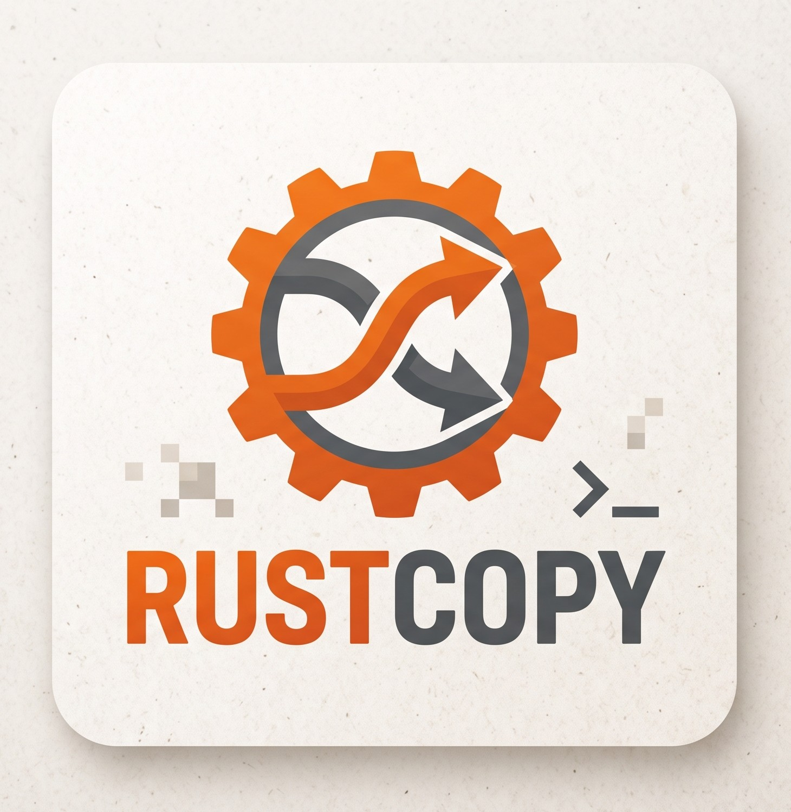

<p align="center">
  
</p>

# 🚀 robocopy-ingest-cli (rustcopy)

[](https://github.com/matrixNeo76/rustcopy/actions/workflows/ci.yml)
[](https://github.com/matrixNeo76/rustcopy/actions/workflows/security-audit.yml)
[](LICENSE)
[](Cargo.toml)

**Backup e ingestion di grandi volumi di dati su Windows, con verifica di integrità.** `rustcopy`
avvolge `robocopy.exe` in un binario Rust che ne risolve i limiti pratici sui dataset enormi —
deadlock sulle pipe, saturazione della RAM, nessuna verifica dei checksum — e aggiunge backup a
generazioni, cifratura, scheduling e notifiche. Progettato per volumi da 50 GB a oltre 10 TB con
milioni di file.

```console
$ rustcopy --source C:\dati --dest E:\backup\dati --verify-integrity --hash-algo blake3 `
    --report-path E:\backup\report.json --log-path E:\backup\ingest.log

Inventory: 8 file(s) matching *, 2.50 MB

Verifying integrity with Blake3...

Source          : C:\dati
Destination     : E:\backup\dati
Inventory       : 8 file(s), 2.50 MB
Robocopy        : 2.50 MB in 0.06s (44.13 MB/s), exit code 1, 0 retry attempt(s)
Integrity       : PASSED (8 file(s) checked, 0 mismatch(es), 0 missing)

JSON report: E:\backup\report.json
Log file   : E:\backup\ingest.log
```

> [!NOTE]
> I backup li esegue **solo la CLI**, e non c'è monitoraggio live: il progresso si segue dalla
> progress bar a terminale; a run concluso restano il report JSON e la dashboard HTML statica
> (`--html-report-path`).
>
> Dalla milestone **7.0.0** esiste anche una **console desktop** (Tauri, componente opzionale
> dell'installer): mostra job, impostazioni risolte e storico, avvia backup avviando la stessa CLI
> come processo separato, e prepara proposte di configurazione in file nuovi. Non installa servizi
> né pianificazioni, non forza un mirror non presidiato, e non tocca mai la configurazione in uso —
> vedi [ROADMAP.md](ROADMAP.md) e [`PIANO_GUI.md`](PIANO_GUI.md).

---

## 📚 Documentazione

| Documento | Contenuto |
|---|---|
| 📋 **[Riferimento CLI](docs/cli-reference.md)** | Tutti i flag, i codici di uscita e il comportamento dettagliato di ogni funzionalità. |
| 📦 **[Installazione](docs/installation.md)** | Requisiti, installer Windows, deploy silenzioso, notify-server. |
| 📖 **[RUNBOOK](RUNBOOK.md)** | Flussi operativi, copie multi-sorgente, comandi reali verificati sul campo. |
| 📄 **[ARCHITECTURE](ARCHITECTURE.md)** | Diagrammi, pipeline interna, gestione memoria anti-OOM, struttura dei moduli. |
| 🗺️ **[ROADMAP](ROADMAP.md)** | Storico delle release e pianificazione futura. |
| 📊 **[ANALYSIS](ANALYSIS.md)** | Audit di robustezza e difetti storici documentati. |
| 📝 **[CHANGELOG](CHANGELOG.md)** | Cronologia delle versioni. |
| 🤖 **[AGENTS](AGENTS.md)** | Linee guida per sviluppatori e contributori AI. |

---

## ⚡ Installazione

`rustcopy` è un eseguibile **portable**: si copiano gli `.exe` e si lanciano da qualunque cartella.

```powershell
# Build dai sorgenti
cargo build --release -p rustcopy-cli --features notify-server
```

Due requisiti verificati sul binario compilato:

- **Visual C++ Redistributable x64** (Microsoft, gratuito) — il binario `windows-msvc` importa
  `VCRUNTIME140.dll`, che non è presente in un'installazione Windows pulita. Senza, non parte.
- **`robocopy.exe` di sistema**, presente su ogni Windows da Vista in poi: non serve installarlo,
  ma il tool non lo include.

Il repo include anche uno script **Inno Setup** (`installer/rustcopy.iss`) — un installer unico
in cui la console grafica è un componente opzionale (F60) — che genera un vero
`setup.exe` con disinstaller, aggiunta al PATH e deploy silenzioso — istruzioni complete in
**[Installazione e distribuzione](docs/installation.md)**, che copre anche il **notify-server**
per le notifiche multi-canale.

---

## 🏃 Primi comandi

```powershell
# Copia con verifica di integrità
rustcopy --source "C:\dati" --dest "E:\backup" --verify-integrity --hash-algo blake3

# Simulazione: mostra cosa farebbe, senza scrivere nulla
rustcopy --source "C:\dati" --dest "E:\backup" --dry-run

# Backup a generazioni: il primo run dev'essere full, poi si incrementa
rustcopy --source "C:\dati" --dest "E:\backup" --backup-type full
rustcopy --source "C:\dati" --dest "E:\backup" --backup-type incremental --keep-generations 3 --force-purge
```

I flag essenziali per l'uso quotidiano:

| Flag | Cosa fa |
|---|---|
| `--source` / `--dest` | Cartella di origine e destinazione. |
| `--verify-integrity` | Confronta i checksum sorgente/destinazione a copia finita. |
| `--hash-algo <sha256\|blake3\|xxh3>` | Algoritmo di verifica; `blake3` è 3-5x più veloce di `sha256`. |
| `--dry-run` | Simula senza modificare nulla. |
| `--config <PATH>` | Carica i parametri da un file TOML riutilizzabile. |
| `--backup-type <full\|incremental\|differential>` | Attiva il backup a generazioni. |

**[→ Riferimento completo: tutti i flag e i codici di uscita](docs/cli-reference.md)**

---

## ✨ Funzionalità

- **Verifica di integrità multi-core** — checksum SHA-256, BLAKE3 o xxHash3 parallelizzati con
  Rayon su tutte le CPU. `--fast-verify` salta i file già verificati e immutati.
- **Backup a generazioni** — full, incrementale e differenziale in sottocartelle separate, con
  ritenzione per cicli (`--keep-generations`) che non orfana mai una catena.
- **Resistente ai dataset enormi** — streaming dell'output di robocopy senza deadlock, logging su
  canale limitato, cifratura a blocchi: la memoria di picco non cresce con la dimensione dei dati.
- **Disaster recovery** — `--restore-from` inverte un backup a partire dal suo report JSON;
  `--resume-from` riprende un run interrotto da `Ctrl+C`.
- **Cifratura AES-256-GCM** — a blocchi da 1 MiB, con la controparte `--decrypt`.
- **Volume Shadow Copy** — `--vss-snapshot` per leggere file bloccati da altri processi.
- **Automazione** — scheduling via Task Scheduler, servizi Windows, comandi pre/post job,
  configurazioni multi-job in TOML.
- **Notifiche** — report JSON, dashboard HTML standalone, webhook HTTP e un **notify-server**
  opzionale che li inoltra su più canali.

**[→ Dettaglio del comportamento di ogni funzionalità](docs/cli-reference.md#-comportamento-dettagliato-per-funzionalità)**

---

## 🧪 Sviluppo

```bash
cargo test --workspace --exclude rustcopy-gui                                   # 482 test
cargo test --workspace --exclude rustcopy-gui --features rustcopy-cli/notify-server  # 497 test
```

CI su Windows e Linux, `clippy -D warnings` e `cargo fmt --check` su entrambe le configurazioni di
feature, più un audit RustSec settimanale delle dipendenze. Convenzioni e regole architetturali in
[AGENTS.md](AGENTS.md).

---

## 📄 Licenza

Rilasciato sotto licenza **MIT**.
