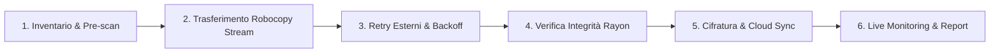

# 🚀 robocopy-ingest-cli (rustcopy)

> **CLI High-Performance in Rust per Ingestion Massiva, Backup Enterprise, Disaster Recovery e Real-Time Web Monitoring su Windows (e Cross-Platform).**

`robocopy-ingest-cli` è uno strumento da riga di comando per il **trasferimento, sincronizzazione, backup e verifica di integrità di grandi volumi di dati (da 50 GB a oltre 10 TB con milioni di file)**.  
Combina la potenza nativa di `robocopy.exe` su Windows con le garanzie di sicurezza della memoria, concorrenza multi-threaded ed asincronia di Rust.

---

## 💡 Perché usare robocopy-ingest-cli?

Quando si gestiscono backup o ingestion di volumetrie massive su Windows, l'uso diretto di script PowerShell (`Copy-Item`) o invocazioni grezze di `robocopy.exe` presenta problemi critici:
- **Deadlock su pipe stdout/stderr** quando robocopy emette milioni di righe di diagnostica.
- **Saturazione della RAM (OOM)** durante il logging o la generazione dei report JSON per milioni di file.
- **Mancanza di verifica di integrità automatica e veloce** (checksum checksum single-thread troppo lenti).
- **Mancanza di visibilità in tempo reale** o notifiche per le pipeline CI/CD aziendali.

`robocopy-ingest-cli` risolve alla radice tutti questi problemi!

---

## 🛠️ Come Funziona la Pipeline (Fase per Fase)

Il tool orchestra ogni operazione attraverso 6 fasi distinte:



1. **Scansione Iniziale (Prescan)**: Mappa l'albero della directory sorgente (`walkdir`), calcola le dimensioni ed esegue il matching dei filtri glob (`--pattern "*.csv"`). Se si gestiscono milioni di file, il flag `--no-prescan` avvia il trasferimento all'istante senza attese.
2. **Trasferimento Robocopy a Zero Allocazioni**: Invoca `robocopy.exe` su Windows iniettando i flag ottimali (`/MT:N` thread automatici sulle CPU dell'host, `/COPYALL` permessi ACL, `/DCOPY:DAT` timestamp directory, `/MIR` mirroring, `/IPG` throttling). Legge lo stdout tramite buffer binario riutilizzato, evitando qualsiasi allocazione heap per riga e decodificando in modo lossy i set di caratteri OEM/ANSI (CP850).
3. **Retry Esterni & Resilience**: Se Robocopy restituisce exit code transitori di blocco file (codici 8, 9, 11), l'invocazione viene ripetuta automaticamente con backoff esponenziale. Se si seleziona `Ctrl+C`, l'applicazione intercetta il segnale, invia un `kill()` forzato a `robocopy.exe` per evitare processi orfani e termina in modo ordinato salvando i log.
4. **Verifica Integrità Multi-Threaded**: Verifica la corrispondenza dei checksum tra sorgente e destinazione utilizzando **Rayon** su tutte le CPU dell'host. Supporta **SHA-256** ed l'algoritmo **BLAKE3** (3-5x più veloce).
5. **Cifratura & Cloud Sync**: Supporta la cifratura simmetrica in streaming **AES-256** (`--encrypt-aes256`) per backup Zero-Trust e la sincronizzazione diretta verso storage remoti S3 / Azure Blob Container (`--cloud-sync-target`).
6. **Live Monitoring & Reporting**: Scrive un report JSON completo con metadati sull'host, genera una **Dashboard HTML Standalone** (`--html-report-path`), invia un alert **HTTP Webhook** (Slack/Teams) ed espone un **Server Web HTTP Live** (`--serve-dashboard 8080`) per monitorare l'avanzamento dal browser.

---

## 📌 Guida ai Flag CLI e Mappatura Robocopy

| Flag CLI | Default | Flag Robocopy | Descrizione Operativa |
|---|---|---|---|
| `--source <PATH>` | *obbligatorio* | 1° arg | Percorso della directory sorgente. |
| `--dest <PATH>` | *obbligatorio* | 2° arg | Percorso della directory di destinazione. |
| `--pattern <GLOB>` | `*` | 3° arg | Pattern dei file da includere nell'ingestion (default `*` = tutti i file). |
| `--config <PATH>` | *nessuno* | — | Carica la configurazione da un file TOML riutilizzabile. |
| `--threads <N>` | *CPU logiche* | `/MT:N` | Thread paralleli di copia per Robocopy (1-128). |
| `--preserve-acl` | `false` | `/COPYALL` | Preserva i permessi di sicurezza NTFS e le ACL di dominio. |
| `--preserve-timestamps` | `false` | `/DCOPY:DAT` | Preserva le date di creazione e modifica delle directory. |
| `--long-paths` | `false` | — | Attiva il prefisso `\\?\` per percorsi lunghi oltre 240 caratteri. |
| `--mirror` | `false` | `/MIR` | Sincronizza ed elimina i file in destinazione non presenti in sorgente. |
| `--force-purge` | `false` | — | Disattiva la soglia di protezione per la modalità `--mirror` (F21). |
| `--exclude-files <GLOB>` | *nessuno* | `/XF` | Esclude file corrispondenti ai pattern indicati (ripetibile). |
| `--exclude-dirs <GLOB>` | *nessuno* | `/XD` | Esclude directory corrispondenti ai pattern indicati (ripetibile). |
| `--min-age-days <N>` | *nessuno* | `/MINAGE:N` | Esclude i file modificati negli ultimi N giorni. |
| `--max-age-days <N>` | *nessuno* | `/MAXAGE:N` | Esclude i file più vecchi di N giorni. |
| `--bandwidth-limit-mbps <N>`| *nessuno* | `/IPG` | Limita la banda di trasferimento a N MB/s. |
| `--no-prescan` | `false` | — | Salta la scansione preventiva ed avvia immediatamente la copia. |
| `--verify-integrity` | `false` | — | Esegue la verifica dei checksum sorgente vs destinazione a fine copia. |
| `--hash-algo <ALGO>` | `sha256` | — | Algoritmo per la verifica checksum: `sha256` o `blake3`. |
| `--html-report-path <PATH>`| *nessuno* | — | Genera un report visivo autonomo in formato HTML/SVG. |
| `--serve-dashboard <PORT>`| *nessuno* | — | Avvia il server Web Dashboard HTTP live (es. `http://localhost:8080`). |
| `--webhook-url <URL>` | *nessuno* | — | Trasmette una notifica HTTP POST JSON summary a fine job. |
| `--restore-from <PATH>` | *nessuno* | — | Modalità Disaster Recovery: inverte il backup Dest -> Source dal report JSON. |
| `--cloud-sync-target <URI>`| *nessuno* | — | Target per la sincronizzazione diretta (es. `s3://bucket/prefix`). |
| `--encrypt-aes256 <KEY>` | *nessuno* | — | Cifra i file inviati con algoritmo AES-256 usando la chiave fornita. |
| `--install-service` | `false` | — | Registra l'applicativo come servizio Windows di background. |
| `--dry-run` | `false` | `/L` | Simula le operazioni senza modificare o copiare file. |

---

## 💻 Esempi d'Uso Pratici

### 1. Ingestion Base Veloci
```powershell
robocopy_ingest.exe --source D:\landing --dest E:\warehouse
```

### 2. Ingestion Enterprise con Dashboard Live, Webhook e Hashing BLAKE3
```powershell
robocopy_ingest.exe `
  --source D:\landing\2026-07 `
  --dest E:\warehouse\2026-07 `
  --pattern "*.csv" `
  --preserve-acl `
  --preserve-timestamps `
  --long-paths `
  --verify-integrity `
  --hash-algo blake3 `
  --serve-dashboard 8080 `
  --html-report-path E:\reports\dashboard.html `
  --webhook-url "http://api.company.local/webhook/backup"
```

### 3. Ripristino da Disastro (Disaster Recovery Mode)
```powershell
robocopy_ingest.exe --restore-from E:\reports\robocopy_ingest_report.json
```

---

## 🏗️ Architettura e Documentazione Estesa

Per dettagli tecnici approfonditi, diagrammi architetturali e roadmap di sviluppo consultare:
- 📖 **[RUNBOOK.md](file:///c:/Users/auresystem/repos/robocopy-ingest-cli/RUNBOOK.md)** — Manuale operativo, copie multi-sorgente e comandi reali verificati.
- 📄 **[ARCHITECTURE.md](file:///c:/Users/auresystem/repos/robocopy-ingest-cli/ARCHITECTURE.md)** — Diagrammi di sequenza, gestione memoria anti-OOM e struttura interna dei moduli.
- 📊 **[ANALYSIS.md](file:///c:/Users/auresystem/repos/robocopy-ingest-cli/ANALYSIS.md)** — Diagnosi delle criticità storiche e validazione dei 123 test.
- 🗺️ **[ROADMAP.md](file:///c:/Users/auresystem/repos/robocopy-ingest-cli/ROADMAP.md)** — Diagramma Gantt dello storico delle release e pianificazione futura.
- 🤖 **[AGENTS.md](file:///c:/Users/auresystem/repos/robocopy-ingest-cli/AGENTS.md)** — Linee guida per sviluppatori e contributori AI.

---

## 🧪 Esecuzione dei Test (123 Test Superati)

```bash
cargo test
```

Esito: `test result: ok. 123 passed; 0 failed`.

---

## 📄 Licenza

Rilasciato sotto licenza **MIT**.
