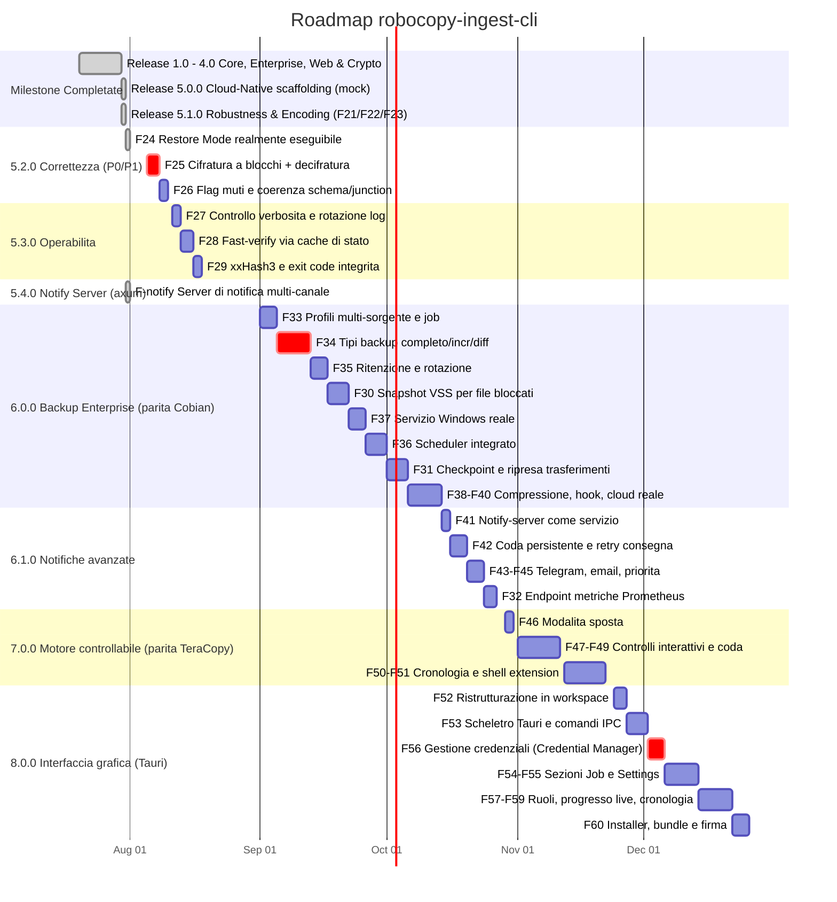

# 🗺️ Roadmap di Progetto — robocopy-ingest-cli

> **Stato Attuale**: 🟢 **Release 5.4.2** (`Cargo.toml` = 5.4.2) — F24, F25a, F25b completate e verificate
> | ✅ **Nessun difetto P0 aperto**: D1 (31 Luglio 2026, F24), D3/D4 (3 Agosto 2026, F25a/F25b) — vedi `ANALYSIS.md` Parte 3
> | 🎯 **Analisi di parità** vs TeraCopy / Cobian / ntfy nella sezione dedicata: le milestone 6.0.0, 6.1.0, 7.0.0 e 8.0.0 ne derivano.
>
> **Nota sulla numerazione**: i numeri di versione seguono le milestone funzionali, **non** una
> sequenza rigida. La 5.4.0 (notify-server) è stata rilasciata prima della 5.2.0 (correttezza), che
> resta aperta. `Cargo.toml` è la fonte di verità della versione rilasciata ed è ciò che finisce nel
> campo `tool_version` dei report.

---

## 📅 Diagramma Gantt delle Release (v1.0 → v8.0)

---

## 📋 Tabella dei Task e Milestones

| Milestone | Caratteristica / Task | Stato | Descrizione Tecnico-Operativa |
|---|---|---|---|
| **v5.0.0** | **Direct Cloud Sync** | `[ ] NON IMPLEMENTATO` | `src/cloud.rs` è uno scaffolding: `sync_to_cloud` è un mock che ritorna sempre `Ok(100)`. `--cloud-sync-target` non ha effetto. |
| **v5.0.0** | **Windows Service Integration** | `[ ] NON IMPLEMENTATO` | `src/service.rs` è uno scaffolding: `register_windows_service` è un mock. `--install-service` non ha effetto. |
| **v5.1.0** | **F21: Mirror Safety Threshold** | `[x] Completato` | `check_mirror_safety` in `main.rs`: diff reale dest vs source, abort con exit code dedicato (3) o conferma interattiva, bypass solo con `--force-purge`. Testato end-to-end in `tests/cli_smoke.rs`. |
| **v5.1.0** | **F22: OEM CP850 Decoder** | `[x] Completato` | `src/oem_codec.rs`: tabella CP850 dedicata (non `encoding_rs`, che non supporta le code page DOS single-byte) più controllo `GetOEMCP()` a runtime. |
| **v5.1.0** | **F23: Child Process Kill Guard** | `[x] Completato` | PID del child `robocopy.exe` tracciato via `Arc<AtomicU32>`; Ctrl+C termina solo quel processo, non più ogni `robocopy.exe` sull'host. |
| **v5.1.0** | **Crypto reale (AES-256-GCM)** | `[x] Completato` | `--encrypt-aes256` cifra realmente i file in destinazione (in precedenza era uno XOR mai invocato). Testato end-to-end su Windows. |
| **v5.1.0** | **Webhook HTTPS affidabile** | `[x] Completato` | `src/notify.rs` riscritto su `reqwest`+`rustls`: HTTPS, timeout, controllo status code, errore propagato nel report (`webhook_error`). |
| **v5.1.0** | **Restore Mode senza `--source`/`--dest`** | `[x] Completato in F24` (31 Luglio 2026) | Il tentativo originale in 5.1.0 non aveva funzionato (clap trattava `default_value = ""` come "nessun default", ignorando `required_unless_present"). Risolto con `Option<PathBuf>` e verificato con test black-box reale. Vedi D1 in `ANALYSIS.md` e **F24** qui sotto. |

---

## 🚨 Milestone 5.2.0 — Correttezza

Deriva interamente dall'audit post-5.1.0 (`ANALYSIS.md` Parte 3). Tutte le voci sono **difetti
verificati eseguendo il binario**, non ipotesi. **I 3 difetti P0 (F24, F25a, F25b) sono tutti
risolti**; restano aperti i 4 P1 (F26a-d).

| ID | Task | Priorità | Difetto | Descrizione |
|---|---|---|---|---|
| **F24** | Restore Mode realmente eseguibile | `[x] Completato` (31 Luglio 2026) | D1 | Causa isolata con una riproduzione minima fuori dal crate: clap tratta `default_value = ""` come "nessun default", ignorando `required_unless_present`. Portato `source`/`dest` a `Option<PathBuf>` con accessor `Args::source()`/`Args::dest()`. Verificato con `tests/cli_smoke.rs::restore_from_runs_end_to_end_without_source_or_dest`: backup reale → perdita di file simulata in sandbox `tempdir` isolata → `--restore-from` senza `--source`/`--dest` → file recuperato con contenuto corretto. Confermato anche via PowerShell nativa. |
| **F25a** | Cifratura a blocchi (streaming) | `[x] Completato` (3 Agosto 2026) | D3 | `CryptoManager::encrypt_stream`/`decrypt_stream`: chunk da 1 MiB, nonce fresco per blocco, header `RCE1` + record length-prefixed, file temporaneo sibling + rename atomico. Verificato su un file reale da 5,24 MB (5 blocchi) con confronto SHA-256 byte-per-byte. |
| **F25b** | Comando di decifratura | `[x] Completato` (3 Agosto 2026) | D4 | Flag `--decrypt <KEY>` aggiunto, simmetrico a `--encrypt-aes256`. **Ha scoperto un secondo difetto reale**: `build_restore_args` ricostruiva `Args` da zero scartando ogni flag della riga di comando reale (incluso `--decrypt`) tranne i 5 campi copiati dal report — risolto facendolo partire da un clone degli argomenti realmente digitati. Verificato end-to-end: backup cifrato → perdita simulata → `--restore-from --decrypt` in un solo comando → file recuperato in chiaro, byte-identico. |
| **F26a** | Flag muti censiti | 🟠 P1 | D2 | `--fast-verify` e `--ignore-transient-missing` non sono letti da nessun modulo: implementarli (vedi F28) o marcarli `[NON IMPLEMENTATO]` come gli altri. |
| **F26b** | `check_mirror_safety` non bloccante | 🟠 P1 | D5 | Spostare il walk della destinazione in `spawn_blocking`: oggi congela l'executor tokio (e la gestione del `Ctrl+C`) per tutta la scansione. |
| **F26c** | `SCHEMA_VERSION` a 2 + retrocompatibilità | 🟠 P1 | D6 | Lo schema `Mismatch` è cambiato in modo breaking senza incrementare la versione; aggiungere `#[serde(default)]` per continuare a leggere i report storici. |
| **F26d** | `/XJ` e coerenza junction | 🟠 P1 | D7 | Robocopy segue junction/symlink mentre `scan.rs` no: inventario e copia percorrono alberi diversi. Esporre `--exclude-junctions` e allineare le due semantiche. |

---

## ⚙️ Milestone 5.3.0 — Operabilità

| ID | Task | Priorità | Origine | Descrizione |
|---|---|---|---|---|
| **F27** | `--log-level` / `--quiet` + rotazione | 🟡 P2 | D9 | Il livello `debug` di default scrive una riga per file: 59.963 file → 121.576 righe (~19 MB) misurati sul campo. Su milioni di file sono GB per esecuzione, senza rotazione. |
| **F28** | `--fast-verify` via cache di stato | 🟡 P2 | O2 | Riusa `cache.rs` (oggi orfano): hash solo dei file dichiarati copiati da robocopy. Su un incrementale reale (905 nuovi su 55.269) la verifica passerebbe da minuti a secondi. |
| **F29a** | xxHash3 come terzo algoritmo | 🟡 P2 | O6 | Per la sola rilevazione di corruzione è ~5-10x più veloce di BLAKE3; la verifica è la fase più lenta della pipeline. |
| **F29b** | Exit code dedicato per integrità | 🟡 P2 | O7 | Oggi `1` significa sia "robocopy ha fallito" sia "checksum non tornano": indistinguibili per uno scheduler. |
| **F29c** | Rimozione codice morto | 🟢 P3 | D8 | `CopyRequestBuilder`, `CopyRequest::builder()`, `IngestError::IntegrityFailed`, `report::seconds()` non hanno chiamanti. |
| **F29d** | **Installer Windows per la CLI attuale** | `[x] Completato` | Richiesta diretta | `installer/rustcopy.iss` (Inno Setup): impacchetta `robocopy_ingest.exe` + `notify-server.exe`, rileva il Visual C++ Redistributable mancante, offre l'aggiunta al PATH, genera un uninstaller. **Testato realmente**: ciclo installazione silenziosa → verifica PATH → disinstallazione → PATH ripristinato, tutto verde. Non sostituisce **F60** (bundler Tauri per la futura GUI 8.0.0): impacchetta la CLI così com'è, non un prerequisito né un'alternativa a quella milestone. |

---

## 🎯 Analisi di Parità Funzionale (31 Luglio 2026)

Confronto verificato **sul codice compilato**, non sulla documentazione, contro i tre strumenti che
`rustcopy` punta a sostituire. Legenda: ✅ presente · 🟡 parziale · ❌ assente · 💀 mock (flag accettato
ma senza effetto).

### vs TeraCopy (copia interattiva desktop)

| Funzionalità | Stato | Nota di verifica |
|---|---|---|
| Verifica checksum post-copia | ✅ | BLAKE3/SHA-256 parallelizzati su Rayon — **superiore** al CRC32 di TeraCopy. |
| Preservazione timestamp/ACL | ✅ | `--preserve-timestamps`, `--preserve-acl`. |
| Esclusioni e filtri | ✅ | `--exclude-files`, `--exclude-dirs`, `--min/max-age-days`. |
| Benchmark di velocità | 🟡 | `--compare-baseline` misura robocopy contro una copia naive; **non** è il disk speed test di TeraCopy. |
| Integrazione shell di Explorer ("Copia con...") | ❌ | Richiede una shell extension COM (DLL separata). |
| Finestra di progresso interattiva (pausa/riprendi/salta) | ❌ | Solo progress bar `indicatif` non interattiva; nessun `pause`/`resume` nel codice. |
| Coda di copie gestibile a video | ❌ | Un job per invocazione. |
| Scelta utente su errore per-file (salta/riprova/ignora) | ❌ | Solo retry automatico su exit code robocopy transitori. |
| Cronologia trasferimenti navigabile | ❌ | Solo report JSON/HTML per singolo job. |
| **Modalità "sposta"** (elimina sorgente dopo verifica) | ❌ | *Non presente nella tua analisi*: TeraCopy la offre, qui non esiste alcun flag `--move`. |
| **Salvataggio/ricarica lista file** | ❌ | *Non presente nella tua analisi*. |

### vs Cobian Backup (backup schedulato enterprise)

| Funzionalità | Stato | Nota di verifica |
|---|---|---|
| Mirror / sync con protezione purge | ✅ | `--mirror` + `check_mirror_safety` (exit code 3 dedicato). |
| Notifiche di completamento | ✅ | `--webhook-url` + notify-server multi-canale. |
| Scheduler integrato | ❌ | Assente: si dipende da Task Scheduler/cron esterni. |
| Esecuzione come servizio Windows | 💀 | `register_windows_service()` è un mock che ritorna `Ok(())`. |
| Compressione (zip/7z) | ❌ | Nessun flag, nessuna dipendenza. |
| Snapshot VSS per file bloccati | ❌ | Pianificato **F30**. Problema osservato realmente sul campo. |
| Sync cloud / FTP / SFTP | 💀 | `sync_to_cloud()` ritorna sempre `Ok(100)` senza trasferire nulla. |
| Profili multi-sorgente / job multipli | ❌ | Pianificato **F33**. Un solo `source`/`dest` per invocazione. |
| Cifratura utilizzabile | ✅ | AES-256-GCM reale, a blocchi (niente OOM su file grandi, **D3** risolto), con comando `--decrypt` funzionante (**D4** risolto). |
| Restore mode | ❌ | `--restore-from` irraggiungibile da CLI (**D1**). |
| **Tipi di backup: completo / incrementale / differenziale** | ❌ | *Non presente nella tua analisi ed è il concetto centrale di Cobian*: oggi esiste solo "copia/mirror lo stato attuale", senza generazioni. |
| **Politica di ritenzione (conserva N copie, rotazione)** | ❌ | *Non presente nella tua analisi*: conseguenza diretta del punto sopra. |
| **Comandi pre/post job** | ❌ | *Non presente nella tua analisi*: Cobian li chiama "eventi" (es. fermare un servizio prima del backup). |
| **Notifica via email/SMTP** | ❌ | *Non presente nella tua analisi*: il notify-server ha log/ntfy/webhook, non SMTP. |

### vs ntfy (sistema di notifica push)

| Funzionalità | Stato | Nota di verifica |
|---|---|---|
| Inoltro evento verso canali esterni | ✅ | Reale e testato end-to-end (Release 5.4.0). |
| Autenticazione a token | ✅ | `ROBOCOPY_NOTIFY_TOKEN`, rifiuto di bind non-loopback senza token. |
| `TelegramSink` | ❌ | Segnato come opzionale nel piano, non implementato. |
| Push su mobile senza dipendere da ntfy | ❌ | `NtfySink` fa POST verso un'istanza ntfy esistente: **non la elimina dallo stack**. |
| Modello pub/sub a topic multipli | ❌ | Un solo endpoint `/notify`, sink statici da TOML. |
| Priorità, allegati, pulsanti azione, tag | ❌ | Verificato: l'unico header inviato è `Title`. |
| Persistenza/cronologia messaggi | ❌ | Nessuna coda: se il server è spento il messaggio è perso (resta solo `webhook_error` nel report del backup). |
| Retry di consegna lato server | ❌ | Verificato: `dispatch_to_all` prova ogni sink **una volta sola**. |
| Esecuzione come servizio persistente | ❌ | Stesso mock `service.rs` del punto Cobian. |

---

## 🏢 Milestone 6.0.0 — Backup Enterprise (parità Cobian)

| ID | Task | Priorità | Origine | Descrizione |
|---|---|---|---|---|
| **F30** | Snapshot VSS (Volume Shadow Copy) | 🟠 P1 | O1 | I file bloccati da altri processi falliscono in modo permanente ed esauriscono il budget di retry (osservato realmente in sessione). È la funzionalità che separa un tool di backup da una copia. |
| **F31** | Checkpoint e ripresa | 🟡 P2 | O5 | Un `Ctrl+C` o un calo della share su un trasferimento da ore oggi obbliga a ripartire da zero. |
| **F32** | Endpoint metriche Prometheus | 🟡 P2 | O8 | Da montare sulla stessa istanza axum del notify-server. |
| **F33** | Profili multi-sorgente / job multipli nel TOML | 🟠 P1 | O10 | Prerequisito di F34 e F35: senza un concetto di "job" non esistono né scheduling né ritenzione. |
| **F34** | **Tipi di backup: completo / incrementale / differenziale** | 🔴 P0 | Parità Cobian | Il concetto centrale di Cobian, oggi del tutto assente. Richiede un manifesto di generazione persistente, non solo i flag robocopy. È il vero spartiacque tra "strumento di copia" e "strumento di backup". |
| **F35** | **Politica di ritenzione e rotazione** | 🟠 P1 | Parità Cobian | Conserva N generazioni, elimina le più vecchie. Dipende da F34. |
| **F36** | **Scheduler integrato** | 🟠 P1 | Parità Cobian | Oggi si dipende da Task Scheduler esterno. Da valutare: scheduler interno al servizio (F37) oppure generazione automatica di attività Task Scheduler. |
| **F37** | **Servizio Windows reale** | 🟠 P1 | Parità Cobian | Sostituisce il mock `service.rs`. Serve sia al backup schedulato sia al notify-server persistente (vedi F41). |
| **F38** | **Compressione degli archivi (zip/7z)** | 🟡 P2 | Parità Cobian | Da valutare l'interazione con la verifica di integrità e con la cifratura (F25). |
| **F39** | **Comandi pre/post job** | 🟡 P2 | Parità Cobian | Gli "eventi" di Cobian: fermare un servizio/database prima del backup e riavviarlo dopo. |
| **F40** | **Cloud/FTP/SFTP reale** | 🟡 P2 | Parità Cobian | Sostituisce il mock `sync_to_cloud()`. Alternativa più economica: documentare rclone come backend esterno invece di reimplementarlo. |

---

## 📨 Milestone 6.1.0 — Notifiche avanzate

| ID | Task | Priorità | Origine | Descrizione |
|---|---|---|---|---|
| **F41** | Notify-server come servizio persistente | 🟠 P1 | Parità ntfy | Dipende da F37. Oggi va avviato a mano o via NSSM/Task Scheduler. |
| **F42** | Coda persistente + retry di consegna | 🟠 P1 | Parità ntfy | Oggi una notifica verso un canale irraggiungibile è **persa**: `dispatch_to_all` prova una volta sola. Il caso "il canale era giù per 30 secondi" oggi non è recuperabile. |
| **F43** | `TelegramSink` | 🟡 P2 | Debito 5.4.0 | Era opzionale nel piano originale e non è stato implementato. |
| **F44** | `EmailSink` (SMTP) | 🟠 P1 | Parità Cobian | Canale di notifica classico degli ambienti enterprise, oggi assente. Implementazione come nuovo `NotificationSink` in `src/notify_sink.rs` — il trait esiste già, non serve toccare l'architettura. Candidato: crate `lettre` (client SMTP di riferimento in Rust), con **STARTTLS/SMTPS obbligatorio** e credenziali lette da env/keyring, **mai dal TOML di configurazione** (stessa regola di `crypto::resolve_key`). Da prevedere: destinatari multipli, oggetto configurabile con l'esito, e corpo derivato da `report_summary`. |
| **F45** | Priorità e tag nel payload | 🟢 P3 | Parità ntfy | Oggi l'unico header inviato a ntfy è `Title`. |

---

## 🖱️ Milestone 7.0.0 — Motore controllabile (parità TeraCopy)

> ⚠️ Questa milestone cambia la natura del prodotto: da CLI a strumento interattivo. Va affrontata
> solo dopo che 5.2.0 (correttezza) e 6.0.0 (backup core) sono chiuse.
>
> È il **lavoro di libreria** che rende possibile la UI della milestone 8.0.0: pausa, ripresa e skip
> per-file non sono un problema di interfaccia ma di motore, perché `robocopy.exe` è un processo
> esterno non pilotabile a runtime. Va fatta **prima** della GUI, altrimenti si ottiene una finestra
> con pulsanti collegati a nulla.

| ID | Task | Priorità | Origine | Descrizione |
|---|---|---|---|---|
| **F46** | Modalità "sposta" (elimina sorgente dopo verifica) | 🟡 P2 | Parità TeraCopy | Sicura solo *dopo* la verifica di integrità: la sequenza copia → verifica → elimina è già tutta presente, manca solo l'ultimo passo. Il candidato a costo più basso di questa milestone. |
| **F47** | Controlli interattivi: pausa / riprendi / salta file | 🟠 P1 | Parità TeraCopy | Difficile con robocopy come motore (processo esterno non pilotabile a runtime): potrebbe richiedere di usare il motore di copia nativo invece di robocopy per i job interattivi. **Da prototipare prima di impegnarsi.** |
| **F48** | Scelta utente sull'errore per-file | 🟡 P2 | Parità TeraCopy | Stessa dipendenza architetturale di F47. |
| **F49** | Coda di job gestibile | 🟡 P2 | Parità TeraCopy | Dipende da F33 (concetto di job). |
| **F50** | Cronologia trasferimenti navigabile | 🟢 P3 | Parità TeraCopy | I report JSON esistono già: serve un indice consultabile, non nuovi dati. |
| **F51** | Shell extension per Explorer ("Copia con rustcopy") | 🟢 P3 | Parità TeraCopy | **Deliverable separato**: DLL COM registrata nel sistema (fattibile in Rust con `windows-rs`, ma è un binario di natura diversa, con installer e registrazione COM). Il costo più alto dell'intera roadmap. |

---

## 🖥️ Milestone 8.0.0 — Interfaccia grafica (Tauri)

> ⚠️ **Fase finale della roadmap, e va mantenuta tale.** Una UI moltiplica la superficie di ciò che
> c'è sotto. I 3 difetti P0 originari (**D1** restore irraggiungibile, **D3** cifratura in OOM,
> **D4** nessuna decifratura) sono stati risolti (F24, F25a, F25b) — ma restano 4 difetti P1
> aperti in 5.2.0 (F26a-d: flag muti, blocco del runtime su mirror safety, versionamento schema,
> junction). Prerequisito non negoziabile: **5.2.0 chiusa per intero**, P1 inclusi.

### Relazione con la milestone 7.0.0

7.0.0 e 8.0.0 si sovrappongono solo in apparenza. La divisione corretta è:

- **7.0.0 rende il motore controllabile** (parte difficile): pausa/ripresa e skip per-file richiedono
  di non usare `robocopy.exe` come processo esterno — un processo figlio non è pilotabile a runtime.
  È lavoro di libreria, indipendente da qualunque UI.
- **8.0.0 mette una faccia** su ciò che 7.0.0 ha reso possibile.

Costruire la UI prima porterebbe a una finestra con pulsanti Pausa/Salta non collegati a nulla.
L'unica parte di 7.0.0 che resta fuori dall'app Tauri è la shell extension (**F51**): una DLL COM che
al massimo *lancia* l'app.

| ID | Task | Priorità | Descrizione |
|---|---|---|---|
| **F52** | **Ristrutturazione in workspace Cargo** | 🔴 Prerequisito | Oggi il repo è un **package singolo**. Tauri porta con sé una toolchain JS (npm/vite), `tauri.conf.json`, icone e bundler: non deve entrare nel crate della CLI. Struttura proposta: `crates/rustcopy-core` (la lib attuale), `crates/rustcopy-cli`, `crates/rustcopy-gui`. Il notify-server può restare un bin feature-gated perché è puro Rust; la GUI no. |
| **F53** | Scheletro Tauri + comandi IPC | 🟠 P1 | Tauri 2.x. La GUI è un **consumatore della lib** come lo è `notify-server`: i comandi `#[tauri::command]` chiamano `CopyEngine`/`ScanSummary`/`IngestReport`, non reimplementano logica. Nessuna regola di business nel frontend. |
| **F54** | Sezione **Job** | 🟠 P1 | Creare/modificare/eseguire job. Dipende da **F33** (concetto di job) e **F34** (tipi di backup): senza, la UI può solo lanciare copie singole. |
| **F55** | Sezione **Settings**: variabili e script | 🟠 P1 | Frontend di **F39** (comandi pre/post job) e delle variabili di configurazione. **Vedi l'avviso di sicurezza sotto: non è una semplice pagina di form.** |
| **F56** | **Gestione credenziali** | 🔴 P0 della milestone | Credenziali SMB/NAS, SMTP, token notify, chiavi di cifratura. **Non implementare uno storage proprio**: usare il Windows Credential Manager (DPAPI) tramite il crate `keyring`. Deve **estendere** la convenzione esistente (`env:`/`file:` di `crypto::resolve_key`), non sostituirla con un formato nuovo. Nessun segreto nei file TOML/JSON scritti dalla UI. |
| **F57** | Ruoli admin / operatore | 🟡 P2 | **Vedi l'avviso di sicurezza sotto.** Utile come prevenzione degli errori, non come confine di sicurezza. |
| **F58** | Progresso live e controlli interattivi | 🟠 P1 | Dipende da **F47**. Progress bar, pausa/riprendi/salta, esito per-file. |
| **F59** | Cronologia e report navigabili | 🟡 P2 | Dipende da **F50**. I report JSON esistono già: serve l'indice e la navigazione, non nuovi dati. |
| **F60** | Installer, bundle e firma del codice | 🟡 P2 | MSI/NSIS via il bundler Tauri. Su Windows un eseguibile non firmato che chiede privilegi genera avvisi SmartScreen: da mettere in conto se distribuito. |

### 🔐 Avvisi di sicurezza per F55/F56/F57 (da leggere prima di progettare)

1. **I ruoli in un'app desktop non sono un confine di sicurezza.** Chiunque abbia una sessione locale
   può eseguire `rustcopy.exe` direttamente, leggere il TOML o modificare i file dei job, scavalcando
   completamente la UI. Il ruolo "operatore" serve a **impedire errori** (evitare che chi non deve
   riconfiguri un job `--mirror`), non a impedire un'azione deliberata. Se serve un controllo accessi
   reale, va messo lato server (API dei job autenticata), non nel client desktop: dichiaralo nella UI
   invece di lasciar credere il contrario.

2. **Script configurabili + servizio privilegiato = escalation di privilegi locale.** Se il servizio
   di F37 gira come SYSTEM ed esegue gli script pre/post configurati dalla UI (F39/F55), un utente
   non amministratore che può scrivere quello script ottiene esecuzione di codice come SYSTEM.
   Mitigazioni: far girare il servizio con un account dedicato a privilegi minimi, **e/o** far
   rifiutare al servizio gli script scrivibili da utenti non amministratori (verifica delle ACL prima
   dell'esecuzione).

3. **La UI non deve diventare una nuova sede dei segreti.** Il repository ha già una convenzione
   funzionante (`env:NAME`, `file:PATH`, file `*.local.ps1` esclusi da git): F56 la estende al
   Credential Manager, non introduce un formato parallelo.

---

## 🚫 Fuori perimetro (deciso, non "da fare più avanti")

Sostituire **ntfy per intero** non è un obiettivo sensato per questo progetto, e vale la pena
dichiararlo invece di lasciarlo come debito implicito:

- **Push nativo su mobile** richiede app iOS/Android proprie e integrazione con APNs/FCM. È un
  prodotto a sé, non una funzionalità di uno strumento di backup.
- **Modello pub/sub a topic con sottoscrizione dinamica** implica gestione utenti, ACL per topic,
  connessioni long-lived e una web UI.
- **Caching dei messaggi per client offline** è il cuore di ntfy come servizio, non di un relay.

La posizione corretta di `rustcopy` è **integrarsi** con ntfy (come fa già `NtfySink`), non
rimpiazzarlo. Il sottoinsieme che ha davvero valore per un tool di backup — Telegram, email, retry
con coda persistente, esecuzione come servizio — è pianificato in **6.1.0**.

---

## 📬 Milestone 5.4.0 — Notify Server (axum)

Implementata seguendo `PIANO_NOTIFY_SERVER.md` (piano dettagliato con le decisioni di design e le
insidie note — rimane nel repo come riferimento storico).

| Task | Stato | Descrizione |
|---|---|---|
| Binario feature-gated | `[x] Completato` | `src/bin/notify_server.rs`, feature `notify-server`, axum **non** entra nelle dipendenze del binario di backup (verificato con `cargo tree`). |
| Contratto condiviso | `[x] Completato` | `WebhookPayload` esteso con `schema_version`, `BackupStatus` tipizzato (serializza comunque `"SUCCESS"`/`"FAILED"`), `source`/`dest`/`host`/`tool_version`/`exit_code`/`integrity_status`. |
| Sicurezza | `[x] Completato` | Token via `ROBOCOPY_NOTIFY_TOKEN`, rifiuto di avvio su bind non-loopback senza token, `DefaultBodyLimit`, graceful shutdown. |
| Canali | `[x] Completato` | Trait `NotificationSink` (`src/notify_sink.rs`, sempre compilato, testabile senza la feature); `LogSink`, `NtfySink`, `GenericWebhookSink`; config TOML. |
| Rimozione mock | `[x] Completato` | `src/server.rs` e `--serve-dashboard` rimossi. |
| Test | `[x] Completato` | Unit test su 401/422/502/200 con router reale su socket TCP reale; test black-box end-to-end con il binario compilato. |

---

## 📄 Storico delle Release

- **v1.0.0**: Core CopyEngine, Zero-Alloc Stdout Stream, Rayon Hashing, Bounded Logging.
- **v2.0.0**: Enterprise NTFS ACLs (`/COPYALL`), Long Paths (`\\?\`), Disaster Recovery Restore.
- **v3.0.0**: Standalone HTML5 Dashboard Generator, State Cache & Deduplicazione (`.ingest_cache`) — *cache mai collegata alla pipeline, vedi v5.0.0*.
- **v4.0.0**: Live Web Server HTTP Dashboard (pagina statica), Zero-Trust AES-256 Streaming Encryption (all'epoca uno XOR, corretto in v5.1.0).
- **v5.0.0**: Scaffolding per Direct Cloud Sync (S3/Azure) e Windows Service Daemon — entrambi mock, non implementati.
- **v5.1.0**: Mirror Safety Threshold reale, decodifica CP850 reale, kill mirato del child process, crypto AES-256-GCM reale, webhook HTTPS affidabile. *(Il fix Restore Mode dichiarato in questa release non aveva funzionato — risolto definitivamente in **F24**, 31 Luglio 2026.)*
- **v5.4.0**: Notify Server basato su axum (binario separato, feature-gated), canali multipli (log/ntfy/webhook generico) da configurazione TOML. Sostituisce `--serve-dashboard`/`src/server.rs` (rimossi).
- **v5.4.1**: F24 (restore mode realmente eseguibile).
- **v5.4.2**: F25a (cifratura a blocchi anti-OOM), F25b (comando `--decrypt`, e fix del difetto correlato in `build_restore_args` che scartava i flag reali della riga di comando). I 3 difetti P0 dell'audit post-5.1.0 sono ora tutti chiusi.

## 📌 Debito tecnico noto (non ancora pianificato)

- `src/cache.rs`, `src/cloud.rs`, `src/service.rs` restano scaffolding non collegati; i relativi flag (`--enable-dedup`, `--cloud-sync-target`, `--install-service`) sono marcati `[NOT IMPLEMENTED]` in `--help`. `cache.rs` verrebbe finalmente utilizzato da F28.
- Il notify-server implementa solo `LogSink`/`NtfySink`/`GenericWebhookSink` e prova ogni sink **una volta sola**: una notifica verso un canale momentaneamente irraggiungibile è persa. Pianificato in 6.1.0 (F42 coda persistente, F43 Telegram, F44 email).
- `integrity::verify` richiede ancora l'intera lista file in RAM (`Vec<ScannedFile>`); `--no-prescan` evita solo la sua costruzione, disabilitando la verifica di integrità in quel modo, ma non introduce hashing in streaming.
- `Args::merge_config` applica il pattern del TOML solo quando la CLI è ancora sul default `"*"`; non distingue un `--pattern "*"` esplicito da nessun flag passato (richiederebbe `ArgMatches::value_source`), e la stessa limitazione vale per gli altri campi booleani.
- Il grafo `graphify-out/` copre ora tutti i 26 file (685 nodi / 1374 archi / 24 community, rigenerato dopo l'aggiunta del notify-server), ma i nodi metodo non sono qualificati con il tipo proprietario (`.encrypt()` invece di `CryptoManager::encrypt`): la query di reachability da `main`/`lib` resta inaffidabile e **non va usata come gate anti-dead-code**. Il codice morto reale (D8) è stato individuato per grep.
