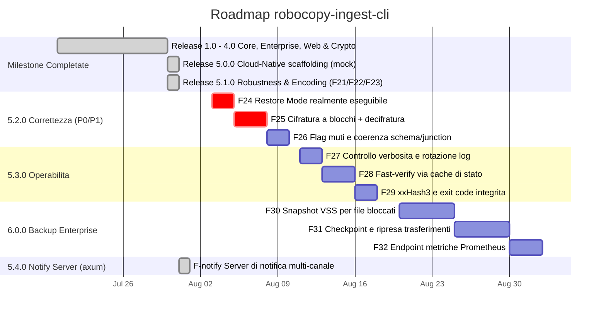

# 🗺️ Roadmap di Progetto — robocopy-ingest-cli

> **Stato Attuale**: 🟢 **Release 5.1.0 Robustness & Encoding Enhancement Completata** (F21/F22/F23 implementate e verificate con test end-to-end)
> | 🔴 **Audit post-5.1.0 ha individuato 3 difetti P0 aperti** — vedi `ANALYSIS.md` Parte 3 e la milestone 5.2.0 qui sotto (**non ancora risolti**)
> | 🟢 **Release 5.4.0 Notify Server (axum) Completata** — vedi milestone dedicata qui sotto.

---

## 📅 Diagramma Gantt delle Release (v1.0 - v5.1)

---

## 📋 Tabella dei Task e Milestones

| Milestone | Caratteristica / Task | Stato | Descrizione Tecnico-Operativa |
|---|---|---|---|
| **v5.0.0** | **Direct Cloud Sync** | `[ ] NON IMPLEMENTATO` | `src/cloud.rs` è uno scaffolding: `sync_to_cloud` è un mock che ritorna sempre `Ok(100)`. `--cloud-sync-target` non ha effetto. |
| **v5.0.0** | **Windows Service Integration** | `[ ] NON IMPLEMENTATO` | `src/service.rs` è uno scaffolding: `register_windows_service` è un mock. `--install-service` non ha effetto. |
| **v5.1.0** | **F21: Mirror Safety Threshold** | `[x] Completato` | `check_mirror_safety` in `main.rs`: diff reale dest vs source, abort con exit code dedicato (3) o conferma interattiva, bypass solo con `--force-purge`. Testato end-to-end in `tests/cli_smoke.rs`. |
| **v5.1.0** | **F22: OEM CP850 Decoder** | `[x] Completato` | `src/oem_codec.rs`: tabella CP850 dedicata (non `encoding_rs`, che non supporta le code page DOS single-byte) più controllo `GetOEMCP()` a runtime. |
| **v5.1.0** | **F23: Child Process Kill Guard** | `[x] Completato` | PID del child `robocopy.exe` tracciato via `Arc<AtomicU32>`; Ctrl+C termina solo quel processo, non più ogni `robocopy.exe` sull'host. |
| **v5.1.0** | **Crypto reale (AES-256-GCM)** | `[x] Completato` | `--encrypt-aes256` cifra realmente i file in destinazione (in precedenza era uno XOR mai invocato). Testato end-to-end su Windows. |
| **v5.1.0** | **Webhook HTTPS affidabile** | `[x] Completato` | `src/notify.rs` riscritto su `reqwest`+`rustls`: HTTPS, timeout, controllo status code, errore propagato nel report (`webhook_error`). |
| **v5.1.0** | **Restore Mode senza `--source`/`--dest`** | `[!] NON RIUSCITO` | Dichiarato risolto ma **non funzionante**: clap rifiuta `default_value = ""` su `PathBuf`, quindi `--source` resta obbligatorio in ogni invocazione. Vedi D1 in `ANALYSIS.md`. Ripianificato come **F24**. |

---

## 🚨 Milestone 5.2.0 — Correttezza (difetti P0/P1 aperti)

Deriva interamente dall'audit post-5.1.0 (`ANALYSIS.md` Parte 3). Tutte le voci sono **difetti
verificati eseguendo il binario**, non ipotesi.

| ID | Task | Priorità | Difetto | Descrizione |
|---|---|---|---|---|
| **F24** | Restore Mode realmente eseguibile | 🔴 P0 | D1 | Rimuovere `default_value = ""` (clap lo rifiuta prima di valutare `required_unless_present`); portare `source`/`dest` a `Option<PathBuf>` o usare `default_value_if`. **Obbligatorio**: test black-box che esegua il binario con `--restore-from`, non solo `build_restore_args()`. |
| **F25a** | Cifratura a blocchi (streaming) | 🔴 P0 | D3 | `std::fs::read` carica ogni file interamente in RAM: 50 GB → OOM. Passare ad AEAD a chunk da 1 MiB su file temporaneo + rename atomico. |
| **F25b** | Comando di decifratura | 🔴 P0 | D4 | Oggi un backup cifrato **non è ripristinabile con lo strumento stesso**. Aggiungere `--decrypt` e integrare la decifratura in `--restore-from`. |
| **F26a** | Flag muti censiti | 🟠 P1 | D2 | `--fast-verify` e `--ignore-transient-missing` non sono letti da nessun modulo: implementarli (vedi F28) o marcarli `[NON IMPLEMENTATO]` come gli altri. |
| **F26b** | `check_mirror_safety` non bloccante | 🟠 P1 | D5 | Spostare il walk della destinazione in `spawn_blocking`: oggi congela l'executor tokio (e la gestione del `Ctrl+C`) per tutta la scansione. |
| **F26c** | `SCHEMA_VERSION` a 2 + retrocompatibilità | 🟠 P1 | D6 | Lo schema `Mismatch` è cambiato in modo breaking senza incrementare la versione; aggiungere `#[serde(default)]` per continuare a leggere i report storici. |
| **F26d** | `/XJ` e coerenza junction | 🟠 P1 | D7 | Robocopy segue junction/symlink mentre `scan.rs` no: inventario e copia percorrono alberi diversi. Esporre `--exclude-junctions` e allineare le due semantiche. |

---

## ⚙️ Milestone 5.3.0 — Operabilità

| ID | Task | Priorità | Origine | Descrizione |
|---|---|---|---|---|
| **F27** | `--log-level` / `--quiet` + rotazione | 🟡 P2 | D9 | Il livello `debug` di default scrive una riga per file: 59.963 file → 121.576 righe (~19 MB) misurati sul campo. Su milioni di file sono GB per esecuzione, senza rotazione. |
| **F28** | `--fast-verify` via cache di stato | 🟡 P2 | O2 | Riusa `cache.rs` (oggi orfano): hash solo dei file dichiarati copiati da robocopy. Su un incrementale reale (905 nuovi su 55.269) la verifica passerebbe da minuti a secondi. |
| **F29a** | xxHash3 come terzo algoritmo | 🟡 P2 | O6 | Per la sola rilevazione di corruzione è ~5-10x più veloce di BLAKE3; la verifica è la fase più lenta della pipeline. |
| **F29b** | Exit code dedicato per integrità | 🟡 P2 | O7 | Oggi `1` significa sia "robocopy ha fallito" sia "checksum non tornano": indistinguibili per uno scheduler. |
| **F29c** | Rimozione codice morto | 🟢 P3 | D8 | `CopyRequestBuilder`, `CopyRequest::builder()`, `IngestError::IntegrityFailed`, `report::seconds()` non hanno chiamanti. |

---

## 🏢 Milestone 6.0.0 — Backup Enterprise

| ID | Task | Priorità | Origine | Descrizione |
|---|---|---|---|---|
| **F30** | Snapshot VSS (Volume Shadow Copy) | 🟠 P1 | O1 | I file bloccati da altri processi falliscono in modo permanente ed esauriscono il budget di retry (osservato realmente in sessione). È la funzionalità che separa un tool di backup da una copia. |
| **F31** | Checkpoint e ripresa | 🟡 P2 | O5 | Un `Ctrl+C` o un calo della share su un trasferimento da ore oggi obbliga a ripartire da zero. |
| **F32** | Endpoint metriche Prometheus | 🟡 P2 | O8 | Da montare sulla stessa istanza axum del notify-server (Release 5.4.0). |
| **F33** | Profilo multi-sorgente nel TOML | 🟢 P3 | O10 | Il RUNBOOK descrive workflow multi-sorgente eseguiti a mano con un run per sorgente. |

---

## 📬 Milestone 5.4.0 — Notify Server (axum)

Implementata seguendo `PIANO_NOTIFY_SERVER.md` (piano dettagliato con le decisioni di design e le
insidie note — rimane nel repo come riferimento storico).

| Task | Stato | Descrizione |
|---|---|---|
| Binario feature-gated | `[x] Completato` | `src/bin/notify_server.rs`, feature `notify-server`, axum **non** entra nelle dipendenze del binario di backup (verificato con `cargo tree`). |
| Contratto condiviso | `[x] Completato` | `WebhookPayload` esteso con `schema_version`, `BackupStatus` tipizzato (serializza comunque `"SUCCESS"`/`"FAILED"`), `source`/`dest`/`host`/`tool_version`/`exit_code`/`integrity_status`. |
| Sicurezza | `[x] Completato` | Token via `ROBOCOPY_NOTIFY_TOKEN`, rifiuto di avvio su bind non-loopback senza token, `DefaultBodyLimit`, graceful shutdown. |
| Canali | `[x] Completato` | Trait `NotificationSink` (`src/notify_sink.rs`, sempre compilato, testabile senza la feature); `LogSink`, `NtfySink`, `GenericWebhookSink`; config TOML. |
| Rimozione mock | `[x] Completato` | `src/server.rs` e `--serve-dashboard` rimossi. |
| Test | `[x] Completato` | Unit test su 401/422/502/200 con router reale su socket TCP reale; test black-box end-to-end con il binario compilato. |

---

## 📄 Storico delle Release

- **v1.0.0**: Core CopyEngine, Zero-Alloc Stdout Stream, Rayon Hashing, Bounded Logging.
- **v2.0.0**: Enterprise NTFS ACLs (`/COPYALL`), Long Paths (`\\?\`), Disaster Recovery Restore.
- **v3.0.0**: Standalone HTML5 Dashboard Generator, State Cache & Deduplicazione (`.ingest_cache`) — *cache mai collegata alla pipeline, vedi v5.0.0*.
- **v4.0.0**: Live Web Server HTTP Dashboard (pagina statica), Zero-Trust AES-256 Streaming Encryption (all'epoca uno XOR, corretto in v5.1.0).
- **v5.0.0**: Scaffolding per Direct Cloud Sync (S3/Azure) e Windows Service Daemon — entrambi mock, non implementati.
- **v5.1.0**: Mirror Safety Threshold reale, decodifica CP850 reale, kill mirato del child process, crypto AES-256-GCM reale, webhook HTTPS affidabile. *(Il fix Restore Mode dichiarato in questa release non ha funzionato — vedi F24.)*
- **v5.4.0**: Notify Server basato su axum (binario separato, feature-gated), canali multipli (log/ntfy/webhook generico) da configurazione TOML. Sostituisce `--serve-dashboard`/`src/server.rs` (rimossi).

## 📌 Debito tecnico noto (non ancora pianificato)

- `src/cache.rs`, `src/cloud.rs`, `src/service.rs` restano scaffolding non collegati; i relativi flag (`--enable-dedup`, `--cloud-sync-target`, `--install-service`) sono marcati `[NOT IMPLEMENTED]` in `--help`. `cache.rs` verrebbe finalmente utilizzato da F28.
- Il notify-server implementa solo `LogSink`/`NtfySink`/`GenericWebhookSink`; `TelegramSink` era segnato come opzionale nel piano e non è stato implementato in questa passata.
- `integrity::verify` richiede ancora l'intera lista file in RAM (`Vec<ScannedFile>`); `--no-prescan` evita solo la sua costruzione, disabilitando la verifica di integrità in quel modo, ma non introduce hashing in streaming.
- `Args::merge_config` applica il pattern del TOML solo quando la CLI è ancora sul default `"*"`; non distingue un `--pattern "*"` esplicito da nessun flag passato (richiederebbe `ArgMatches::value_source`), e la stessa limitazione vale per gli altri campi booleani.
- Il grafo `graphify-out/` copre ora tutti i 26 file (685 nodi / 1374 archi / 24 community, rigenerato dopo l'aggiunta del notify-server), ma i nodi metodo non sono qualificati con il tipo proprietario (`.encrypt()` invece di `CryptoManager::encrypt`): la query di reachability da `main`/`lib` resta inaffidabile e **non va usata come gate anti-dead-code**. Il codice morto reale (D8) è stato individuato per grep.
