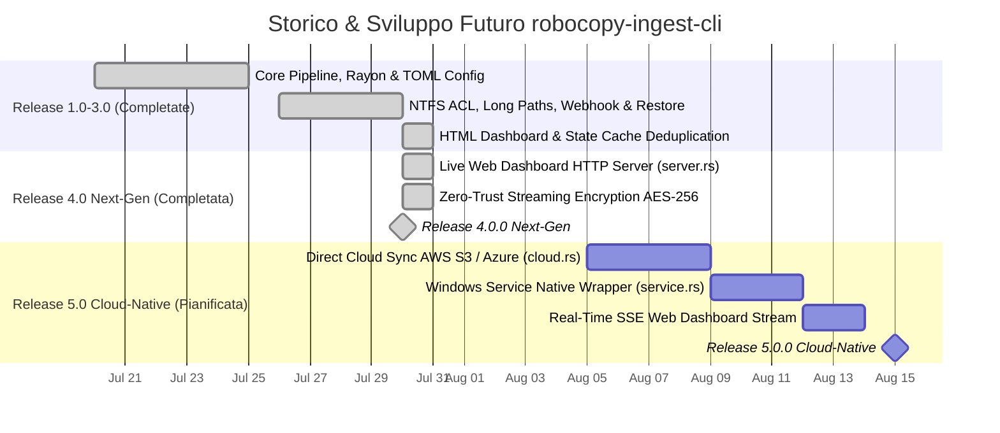

# Roadmap Storica ed Evolutiva — robocopy-ingest-cli

> **Stato del Progetto**: 🟢 **Release 4.0.0 Next-Gen Completata e Verificata**.

---

## 🗺️ Diagramma Gantt Completo del Progetto

---

## 📋 Pianificazione Dettagliata Prossime Fasi (v5.0)

- `[ ]` **Fase 18 — Modulo Cloud Sync (`src/cloud.rs`)**: Sincronizzazione ed il backup diretto di dataset verso bucket S3 / Azure Blob Storage.
- `[ ]` **Fase 19 — Windows Service Integration (`src/service.rs`)**: Avvio nativo come servizio di background persistente registrato nel SCM di Windows.
- `[ ]` **Fase 20 — Real-Time SSE Dashboard Stream**: Trasmissione tramite Server-Sent Events dei dati di throughput in tempo reale verso la dashboard web.
