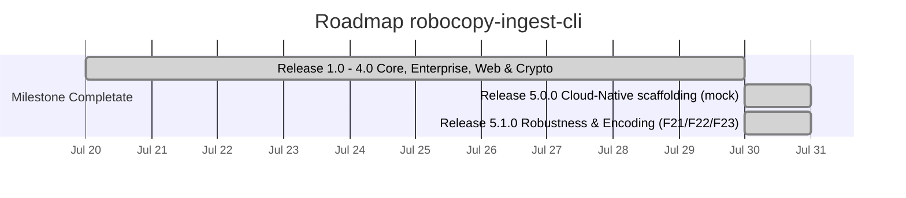

# 🗺️ Roadmap di Progetto — robocopy-ingest-cli

> **Stato Attuale**: 🟢 **Release 5.1.0 Robustness & Encoding Enhancement Completata** (F21/F22/F23 implementate e verificate con test end-to-end).

---

## 📅 Diagramma Gantt delle Release (v1.0 - v5.1)

---

## 📋 Tabella dei Task e Milestones

| Milestone | Caratteristica / Task | Stato | Descrizione Tecnico-Operativa |
|---|---|---|---|
| **v5.0.0** | **Direct Cloud Sync** | `[ ] NON IMPLEMENTATO` | `src/cloud.rs` è uno scaffolding: `sync_to_cloud` è un mock che ritorna sempre `Ok(100)`. `--cloud-sync-target` non ha effetto. |
| **v5.0.0** | **Windows Service Integration** | `[ ] NON IMPLEMENTATO` | `src/service.rs` è uno scaffolding: `register_windows_service` è un mock. `--install-service` non ha effetto. |
| **v5.1.0** | **F21: Mirror Safety Threshold** | `[x] Completato` | `check_mirror_safety` in `main.rs`: diff reale dest vs source, abort con exit code dedicato (3) o conferma interattiva, bypass solo con `--force-purge`. Testato end-to-end in `tests/cli_smoke.rs`. |
| **v5.1.0** | **F22: OEM CP850 Decoder** | `[x] Completato` | `src/oem_codec.rs`: tabella CP850 dedicata (non `encoding_rs`, che non supporta le code page DOS single-byte) più controllo `GetOEMCP()` a runtime. |
| **v5.1.0** | **F23: Child Process Kill Guard** | `[x] Completato` | PID del child `robocopy.exe` tracciato via `Arc<AtomicU32>`; Ctrl+C termina solo quel processo, non più ogni `robocopy.exe` sull'host. |
| **v5.1.0** | **Crypto reale (AES-256-GCM)** | `[x] Completato` | `--encrypt-aes256` cifra realmente i file in destinazione (in precedenza era uno XOR mai invocato). Testato end-to-end su Windows. |
| **v5.1.0** | **Webhook HTTPS affidabile** | `[x] Completato` | `src/notify.rs` riscritto su `reqwest`+`rustls`: HTTPS, timeout, controllo status code, errore propagato nel report (`webhook_error`). |

---

## 📄 Storico delle Release

- **v1.0.0**: Core CopyEngine, Zero-Alloc Stdout Stream, Rayon Hashing, Bounded Logging.
- **v2.0.0**: Enterprise NTFS ACLs (`/COPYALL`), Long Paths (`\\?\`), Disaster Recovery Restore.
- **v3.0.0**: Standalone HTML5 Dashboard Generator, State Cache & Deduplicazione (`.ingest_cache`) — *cache mai collegata alla pipeline, vedi v5.0.0*.
- **v4.0.0**: Live Web Server HTTP Dashboard (pagina statica), Zero-Trust AES-256 Streaming Encryption (all'epoca uno XOR, corretto in v5.1.0).
- **v5.0.0**: Scaffolding per Direct Cloud Sync (S3/Azure) e Windows Service Daemon — entrambi mock, non implementati.
- **v5.1.0**: Mirror Safety Threshold reale, decodifica CP850 reale, kill mirato del child process, crypto AES-256-GCM reale, webhook HTTPS affidabile.

## 📌 Debito tecnico noto (non pianificato in questa release)

- `src/cache.rs`, `src/cloud.rs`, `src/service.rs` restano scaffolding non collegati; i relativi flag (`--enable-dedup`, `--cloud-sync-target`, `--install-service`) sono marcati `[NOT IMPLEMENTED]` in `--help`.
- `--serve-dashboard` serve solo una pagina di stato statica, senza dati live.
- `integrity::verify` richiede ancora l'intera lista file in RAM (`Vec<ScannedFile>`); `--no-prescan` evita solo la sua costruzione, disabilitando la verifica di integrità in quel modo, ma non introduce hashing in streaming.
- `Args::merge_config` applica il pattern del TOML solo quando la CLI è ancora sul default `"*"`; non distingue un `--pattern "*"` esplicito da nessun flag passato (richiederebbe `ArgMatches::value_source`), e la stessa limitazione vale per gli altri campi booleani.
