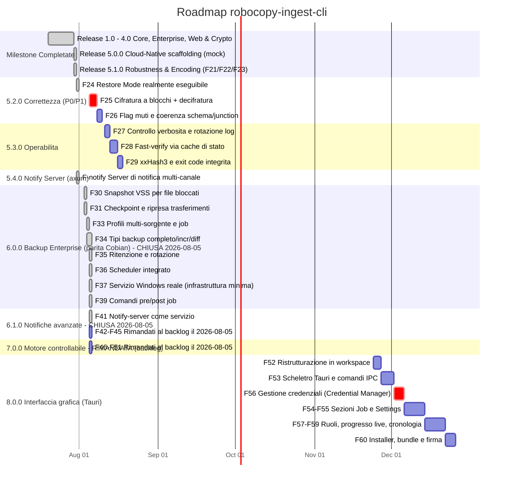

# 🗺️ Roadmap di Progetto — robocopy-ingest-cli

> **Stato Attuale**: 🟢 **Release 6.0.0** (`Cargo.toml` = 6.0.0) — Milestone 5.2.0 (Correttezza) e
> 5.3.0 (Operabilità) **entrambe chiuse**; 6.0.0 (Backup Enterprise) **chiusa** (5 Agosto 2026):
> F30/F31/F33/F34/F35/F36/F37/F39 tutti completati. F32 (metriche Prometheus), F38 (compressione
> zip/7z) e F40 (cloud/FTP/SFTP reale) sono stati **rimandati a un backlog non vincolato a una
> milestone** (vedi sezione dedicata più sotto) — non erano bloccanti per il resto della milestone
> e mancava un caso d'uso concreto per giustificarli ora (F40 in particolare è troppo generico
> senza un target reale: quale provider/protocollo). Anche la milestone **7.0.0** (motore
> controllabile) è stata rimandata al backlog (F46-F51) — cambia la natura del prodotto da CLI a
> strumento interattivo, senza un bisogno concreto oggi. **Milestone 6.1.0 (Notifiche avanzate)
> chiusa** (5 Agosto 2026) con **F41** (notify-server come servizio Windows persistente, identità
> separata da `robocopy_ingest`/F37): F42 (coda persistente/retry), F43 (Telegram), F44 (email),
> F45 (priorità/tag) rimandati al backlog lo stesso giorno — un'analisi iniziale che li dava per
> "già coperti da `GenericWebhookSink`" si è rivelata tecnicamente imprecisa (`GenericWebhookSink`
> posta una forma JSON fissa, senza header configurabili né templating: non raggiunge Telegram —
> manca `chat_id` — né sostituisce SMTP reale, protocollo diverso da HTTP), quindi sono rimandati
> per assenza di bisogno concreto, non perché già risolti.
> | ✅ **Solo D10 aperto** (strumentazione grafo, bassa priorità) su 21 difetti totali documentati (D1-D21: i 10 dell'audit post-5.1.0 + D11, prescan/exclude_dirs, 5 Agosto 2026 + D12, manifest generazioni/cache non isolati per job in un batch `[[jobs]]`, 6 Agosto 2026 + D13, righe di log non attribuibili al job in un batch `[[jobs]]`, 6 Agosto 2026 + D14, scrittura non atomica del manifest generazioni/cache fast-verify, 6 Agosto 2026 + D15, incoerenza exit code/report fra le pipeline plain-sync e `--backup-type`, 6 Agosto 2026 + D16, bug reale in `vss::remap_to_shadow` e test obsoleti/non platform-gated scoperti dalla prima CI su Linux, 6 Agosto 2026 + D17, prescan che ignorava `--min-age-days`/`--max-age-days` più la loro direzione invertita nel `--help`, 21 Agosto 2026 + D18, default di log a DEBUG e rotazione mai live, 22 Agosto 2026 + D19, `GenerationManifest::save` riscriveva l'intera cronologia ad ogni run, ora NDJSON append-only, 23 Agosto 2026 + D20, il manifest generazioni veniva caricato interamente in RAM anche da chi non lo usava (580 MB misurati su un profilo reale), ora letture streaming e metadati-only, 23 Agosto 2026 + D21, l'inventario di scan veniva duplicato ad ogni passaggio invece che condiviso (580 MB contro 145 misurati in `verify`), ora `Arc<[ScannedFile]>`, 23 Agosto 2026); O1-O7 delle opportunità di miglioramento tutte implementate — vedi `ANALYSIS.md` Parte 3
> | 🎯 **Analisi di parità** vs TeraCopy / Cobian / ntfy nella sezione dedicata: le milestone 6.0.0, 6.1.0 (chiusa), 7.0.0 (rimandata) e 8.0.0 ne derivano.
>
> **Nota sulla numerazione**: i numeri di versione seguono le milestone funzionali, **non** una
> sequenza rigida. La 5.4.0 (notify-server) è stata rilasciata prima della 5.2.0/5.3.0 (correttezza
> e operabilità), entrambe ora chiuse. `Cargo.toml` è la fonte di verità della versione rilasciata
> ed è ciò che finisce nel campo `tool_version` dei report.

---

## 📅 Diagramma Gantt delle Release (v1.0 → v8.0)

---

## 📋 Tabella dei Task e Milestones

| Milestone | Caratteristica / Task | Stato | Descrizione Tecnico-Operativa |
|---|---|---|---|
| **v5.0.0** | **Direct Cloud Sync** | `[ ] NON IMPLEMENTATO` | `src/cloud.rs` è uno scaffolding: `sync_to_cloud` è un mock che ritorna sempre `Ok(100)`. `--cloud-sync-target` non ha effetto. |
| **v5.0.0** | **Windows Service Integration** | `[ ] NON IMPLEMENTATO` | `src/service.rs` è uno scaffolding: `register_windows_service` è un mock. `--install-service` non ha effetto. |
| **v5.1.0** | **F21: Mirror Safety Threshold** | `[x] Completato` | `check_mirror_safety` in `main.rs`: diff reale dest vs source, abort con exit code dedicato (3) o conferma interattiva, bypass solo con `--force-purge`. Testato end-to-end in `tests/cli_smoke.rs`. |
| **v5.1.0** | **F22: OEM CP850 Decoder** | `[x] Completato` | `src/oem_codec.rs`: tabella CP850 dedicata (non `encoding_rs`, che non supporta le code page DOS single-byte) più controllo `GetOEMCP()` a runtime. |
| **v5.1.0** | **F23: Child Process Kill Guard** | `[x] Completato` | PID del child `robocopy.exe` tracciato via `Arc<AtomicU32>`; Ctrl+C termina solo quel processo, non più ogni `robocopy.exe` sull'host. |
| **v5.1.0** | **Crypto reale (AES-256-GCM)** | `[x] Completato` | `--encrypt-aes256` cifra realmente i file in destinazione (in precedenza era uno XOR mai invocato). Testato end-to-end su Windows. |
| **v5.1.0** | **Webhook HTTPS affidabile** | `[x] Completato` | `src/notify.rs` riscritto su `reqwest`+`rustls`: HTTPS, timeout, controllo status code, errore propagato nel report (`webhook_error`). |
| **v5.1.0** | **Restore Mode senza `--source`/`--dest`** | `[x] Completato in F24` (31 Luglio 2026) | Il tentativo originale in 5.1.0 non aveva funzionato (clap trattava `default_value = ""` come "nessun default", ignorando `required_unless_present"). Risolto con `Option<PathBuf>` e verificato con test black-box reale. Vedi D1 in `ANALYSIS.md` e **F24** qui sotto. |

---

## 🚨 Milestone 5.2.0 — Correttezza

Deriva interamente dall'audit post-5.1.0 (`ANALYSIS.md` Parte 3). Tutte le voci sono **difetti
verificati eseguendo il binario**, non ipotesi. **Milestone chiusa**: tutti e 7 i difetti (3 P0 +
4 P1) sono risolti e verificati.

| ID | Task | Priorità | Difetto | Descrizione |
|---|---|---|---|---|
| **F24** | Restore Mode realmente eseguibile | `[x] Completato` (31 Luglio 2026) | D1 | Causa isolata con una riproduzione minima fuori dal crate: clap tratta `default_value = ""` come "nessun default", ignorando `required_unless_present`. Portato `source`/`dest` a `Option<PathBuf>` con accessor `Args::source()`/`Args::dest()`. Verificato con `tests/cli_smoke.rs::restore_from_runs_end_to_end_without_source_or_dest`: backup reale → perdita di file simulata in sandbox `tempdir` isolata → `--restore-from` senza `--source`/`--dest` → file recuperato con contenuto corretto. Confermato anche via PowerShell nativa. |
| **F25a** | Cifratura a blocchi (streaming) | `[x] Completato` (3 Agosto 2026) | D3 | `CryptoManager::encrypt_stream`/`decrypt_stream`: chunk da 1 MiB, nonce fresco per blocco, header `RCE1` + record length-prefixed, file temporaneo sibling + rename atomico. Verificato su un file reale da 5,24 MB (5 blocchi) con confronto SHA-256 byte-per-byte. |
| **F25b** | Comando di decifratura | `[x] Completato` (3 Agosto 2026) | D4 | Flag `--decrypt <KEY>` aggiunto, simmetrico a `--encrypt-aes256`. **Ha scoperto un secondo difetto reale**: `build_restore_args` ricostruiva `Args` da zero scartando ogni flag della riga di comando reale (incluso `--decrypt`) tranne i 5 campi copiati dal report — risolto facendolo partire da un clone degli argomenti realmente digitati. Verificato end-to-end: backup cifrato → perdita simulata → `--restore-from --decrypt` in un solo comando → file recuperato in chiaro, byte-identico. |
| **F26a** | Flag muti censiti | `[x] Completato` (3 Agosto 2026) | D2 | `--ignore-transient-missing` **implementato per davvero**: `integrity::ignore_transient_missing()` filtra da `missing_in_dest`/`unreadable` i pattern transienti noti (`.log`, `.tmp`, `.git/objects/`) e ricalcola lo status. Verificato con `tests/cli_smoke.rs::ignore_transient_missing_turns_an_excluded_log_into_a_pass` sul binario compilato (usa il fatto che il prescan non applica `--exclude-files`, a differenza di robocopy, come riproduzione deterministica). `--fast-verify` **marcato esplicitamente `[NON IMPLEMENTATO]`** invece di lasciarlo no-op non dichiarato: verificare solo i file "toccati da questo run" richiede sapere *quali* file robocopy ha copiato (non solo quanti), tracciabilità che esiste solo nel sottosistema `cache.rs`, oggi orfano — cablarlo in produzione è tracciato a sé come **F28**. |
| **F26b** | `check_mirror_safety` non bloccante | `[x] Completato` (3 Agosto 2026) | D5 | Funzione portata ad `async fn`, walk della destinazione spostato in `tokio::task::spawn_blocking` come tutte le altre operazioni bloccanti del file. Comportamento osservabile invariato: i test black-box esistenti (`mirror_without_force_purge_aborts_instead_of_deleting_extraneous_files`, `mirror_with_force_purge_proceeds`) continuano a passare senza modifiche. |
| **F26c** | `SCHEMA_VERSION` a 2 + retrocompatibilità | `[x] Completato` (3 Agosto 2026) | D6 | `report::SCHEMA_VERSION` portato a 2; `#[serde(default)]` su `kind`/`algorithm`/`source_digest`/`dest_digest` di `Mismatch` (con `impl Default for MismatchKind` dedicato) così un report v1 pre-rename resta deserializzabile. Verificato con `tests/cli_smoke.rs::restore_from_accepts_a_legacy_report_with_pre_rename_mismatch_shape`: un report scritto a mano nella forma pre-rename esatta viene accettato da `--restore-from` sul binario compilato invece di far fallire il parsing JSON. |
| **F26d** | `/XJ` e coerenza junction | `[x] Completato` (3 Agosto 2026) | D7 | Aggiunto `--exclude-junctions` (→ `/XJ` in `build_args`) e `CopyRequest::exclude_junctions`; `scan::scan`/`inventory`/`directory_size` prendono ora `follow_links: bool`, pilotato da `!exclude_junctions` in ogni punto di chiamata (prescan, mirror-safety check, conteggio post-fallimento, poller, engine naive) — prescan e trasferimento reale seguono sempre la stessa regola. **Verificato contro una vera NTFS junction** (`mklink /J`, nessun privilegio elevato richiesto): unit test in `scan.rs` e test black-box `tests/cli_smoke.rs::exclude_junctions_flag_actually_changes_what_the_binary_copies` sul binario compilato, in entrambi i casi (con e senza il flag). |

`cargo test`: 174 (era 164). `cargo test --features notify-server`: 187 (era 177).

---

## ⚙️ Milestone 5.3.0 — Operabilità `[x] Chiusa` (3 Agosto 2026)

Tutte le voci sotto sono completate e verificate, sia con unit test sia con test black-box che
eseguono il binario compilato reale.

| ID | Task | Priorità | Origine | Descrizione |
|---|---|---|---|---|
| **F27** | `--log-level` / `--quiet` + rotazione | `[x] Completato` | D9 | `--log-level <trace\|debug\|info\|warn\|error>` e `--quiet` (scorciatoia per `warn`, mutuamente esclusivo con `--log-level`), `RUST_LOG` continua a vincere su entrambi. `--log-max-bytes`/`--log-max-backups` (default 20 MB / 3 backup) ruotano il log precedente prima dell'apertura, non durante l'esecuzione. Verificato con `tests/cli_smoke.rs::quiet_suppresses_per_file_debug_lines_in_the_real_log` e `oversized_log_is_rotated_by_a_real_run` sul binario compilato. |
| **F28** | `--fast-verify` via cache di stato | `[x] Completato` | O2 | **Deviazione consapevole dal testo originale**: non "file dichiarati copiati da robocopy" (il parser dello stdout di robocopy non espone nomi file, solo byte totali, ed è già delicato/testato a fondo per la progress bar) ma `cache.rs`/`IngestCache` keyed su size+mtime **sorgente**, persistita in `<dest>/.ingest_cache`. Un file che fallisce la verifica non viene mai messo in cache come fidato — resta segnalato ad ogni run finché non è davvero corretto. Limite noto e documentato in help text: non rileva una corruzione della *destinazione* se la sorgente resta identica. Verificato con 3 test black-box sul binario compilato: skip su run invariato, ri-verifica del solo file cambiato, mai-fidarsi-di-un-file-fallito. |
| **F29a** | xxHash3 come terzo algoritmo | `[x] Completato` | O6 | Aggiunta la dipendenza `xxhash-rust` (MIT, pure Rust). `--hash-algo xxh3`, documentato come non-crittografico (solo rilevamento corruzione) sia nel flag che nel codice. Verificato con test di rilevamento corruzione e un test black-box end-to-end sul binario compilato. |
| **F29b** | Exit code dedicato per integrità | `[x] Completato` | O7 | Nuovo `EXIT_INTEGRITY_FAILED = 4`, distinto da `1` (trasferimento fallito). `run()` in `main.rs` restituisce ora l'exit code (`u8`) direttamente invece di un `bool`. Verificato con due test black-box distinti: uno che produce exit 1 (file bloccato, il trasferimento fallisce) e uno che produce exit 4 (trasferimento riuscito, verifica fallita). |
| **F29c** | Rimozione codice morto | `[x] Completato` | D8 | Rimossi `CopyRequestBuilder`, `CopyRequest::builder()`, `IngestError::IntegrityFailed`, `report::seconds()` — zero chiamanti. `IngestCache` **non** rimosso: F28 l'ha reso codice di produzione, non più orfano. |
| **F29d** | **Installer Windows per la CLI attuale** | `[x] Completato` | Richiesta diretta | `installer/rustcopy.iss` (Inno Setup): impacchetta `robocopy_ingest.exe` + `notify-server.exe`, rileva il Visual C++ Redistributable mancante, offre l'aggiunta al PATH, genera un uninstaller. **Testato realmente**: ciclo installazione silenziosa → verifica PATH → disinstallazione → PATH ripristinato, tutto verde. Non sostituisce **F60** (bundler Tauri per la futura GUI 8.0.0): impacchetta la CLI così com'è, non un prerequisito né un'alternativa a quella milestone. |

`cargo test`: 195 (era 174). `cargo test --features notify-server`: 208 (era 187).

---

## 🎯 Analisi di Parità Funzionale (31 Luglio 2026)

Confronto verificato **sul codice compilato**, non sulla documentazione, contro i tre strumenti che
`rustcopy` punta a sostituire. Legenda: ✅ presente · 🟡 parziale · ❌ assente · 💀 mock (flag accettato
ma senza effetto).

### vs TeraCopy (copia interattiva desktop)

| Funzionalità | Stato | Nota di verifica |
|---|---|---|
| Verifica checksum post-copia | ✅ | BLAKE3/SHA-256 parallelizzati su Rayon — **superiore** al CRC32 di TeraCopy. |
| Preservazione timestamp/ACL | ✅ | `--preserve-timestamps`, `--preserve-acl`. |
| Esclusioni e filtri | ✅ | `--exclude-files`, `--exclude-dirs`, `--min/max-age-days`. |
| Benchmark di velocità | 🟡 | `--compare-baseline` misura robocopy contro una copia naive; **non** è il disk speed test di TeraCopy. |
| Integrazione shell di Explorer ("Copia con...") | ❌ | Richiede una shell extension COM (DLL separata). |
| Finestra di progresso interattiva (pausa/riprendi/salta) | ❌ | Solo progress bar `indicatif` non interattiva; nessun `pause`/`resume` nel codice. |
| Coda di copie gestibile a video | ❌ | Un job per invocazione. |
| Scelta utente su errore per-file (salta/riprova/ignora) | ❌ | Solo retry automatico su exit code robocopy transitori. |
| Cronologia trasferimenti navigabile | ❌ | Solo report JSON/HTML per singolo job. |
| **Modalità "sposta"** (elimina sorgente dopo verifica) | ❌ | *Non presente nella tua analisi*: TeraCopy la offre, qui non esiste alcun flag `--move`. |
| **Salvataggio/ricarica lista file** | ❌ | *Non presente nella tua analisi*. |

### vs Cobian Backup (backup schedulato enterprise)

| Funzionalità | Stato | Nota di verifica |
|---|---|---|
| Mirror / sync con protezione purge | ✅ | `--mirror` + `check_mirror_safety` (exit code 3 dedicato). |
| Notifiche di completamento | ✅ | `--webhook-url` + notify-server multi-canale. |
| Scheduler integrato | ❌ | Assente: si dipende da Task Scheduler/cron esterni. |
| Esecuzione come servizio Windows | 💀 | `register_windows_service()` è un mock che ritorna `Ok(())`. |
| Compressione (zip/7z) | ❌ | Nessun flag, nessuna dipendenza. |
| Snapshot VSS per file bloccati | ❌ | Pianificato **F30**. Problema osservato realmente sul campo. |
| Sync cloud / FTP / SFTP | 💀 | `sync_to_cloud()` ritorna sempre `Ok(100)` senza trasferire nulla. |
| Profili multi-sorgente / job multipli | ✅ | **F33**: `[[jobs]]` nel TOML, eseguiti in sequenza in un solo processo. |
| Cifratura utilizzabile | ✅ | AES-256-GCM reale, a blocchi (niente OOM su file grandi, **D3** risolto), con comando `--decrypt` funzionante (**D4** risolto). |
| Restore mode | ❌ | `--restore-from` irraggiungibile da CLI (**D1**). |
| **Tipi di backup: completo / incrementale** | ✅ | **F34**: `--backup-type full\|incremental`, cartelle di generazione + manifest persistente. Differenziale non ancora implementato (stessa infrastruttura, riferimento del diff diverso). |
| **Politica di ritenzione (conserva N copie, rotazione)** | ❌ | Pianificato **F35**, ora sbloccato da F34 (generazioni reali da ruotare). |
| **Comandi pre/post job** | ❌ | *Non presente nella tua analisi*: Cobian li chiama "eventi" (es. fermare un servizio prima del backup). |
| **Notifica via email/SMTP** | ❌ | *Non presente nella tua analisi*: il notify-server ha log/ntfy/webhook, non SMTP. |

### vs ntfy (sistema di notifica push)

| Funzionalità | Stato | Nota di verifica |
|---|---|---|
| Inoltro evento verso canali esterni | ✅ | Reale e testato end-to-end (Release 5.4.0). |
| Autenticazione a token | ✅ | `ROBOCOPY_NOTIFY_TOKEN`, rifiuto di bind non-loopback senza token. |
| `TelegramSink` | ❌ | Segnato come opzionale nel piano, non implementato. |
| Push su mobile senza dipendere da ntfy | ❌ | `NtfySink` fa POST verso un'istanza ntfy esistente: **non la elimina dallo stack**. |
| Modello pub/sub a topic multipli | ❌ | Un solo endpoint `/notify`, sink statici da TOML. |
| Priorità, allegati, pulsanti azione, tag | ❌ | Verificato: l'unico header inviato è `Title`. |
| Persistenza/cronologia messaggi | ❌ | Nessuna coda: se il server è spento il messaggio è perso (resta solo `webhook_error` nel report del backup). |
| Retry di consegna lato server | ❌ | Verificato: `dispatch_to_all` prova ogni sink **una volta sola**. |
| Esecuzione come servizio persistente | ❌ | Stesso mock `service.rs` del punto Cobian. |

---

## 🏢 Milestone 6.0.0 — Backup Enterprise (parità Cobian)

> **Milestone chiusa il 5 Agosto 2026.** F30/F31/F33/F34 (Full+Incrementale+Differenziale)/F35
> (ritenzione per cicli)/F36 (scheduler via Task Scheduler)/F37 (servizio Windows reale,
> infrastruttura minima)/F39 (comandi pre/post job) tutti completati e verificati. F32, F38, F40
> sono stati **rimandati** a `## 🗄️ Backlog non vincolato a una milestone` (sezione subito dopo
> questa tabella) — non erano bloccanti per il resto della milestone.

| ID | Task | Priorità | Origine | Descrizione |
|---|---|---|---|---|
| **F30** | Snapshot VSS (Volume Shadow Copy) | `[x] Completato` | O1 | `--vss-snapshot` shella verso `vssadmin create/delete shadow` (non l'API COM diretta — vedi `ANALYSIS.md` O1 per il perché) e reindirizza scan/robocopy/verify sul device path della shadow copy, mentre report/log continuano a mostrare il percorso sorgente reale. Richiede Amministratore, fallisce in modo chiaro senza fallback silenzioso. Pulizia della shadow copy garantita anche su `Ctrl+C` da un `Drop` sincrono (`VssGuard` in `main.rs`) tenuto nello scope locale di `execute()`, mai spostato dentro uno `spawn_blocking`. **Limite di test dichiarato**: la creazione/cancellazione reale non è automatizzata (richiede elevazione e tocca stato di sistema vero); coperta da 6 unit test sulla logica pura di parsing/remap con output `vssadmin` reale catturato. |
| **F31** | Checkpoint e ripresa | `[x] Completato` | O5 | **Deviazione consapevole dal testo originale**: non resume a metà file (richiederebbe `/Z`, evitato deliberatamente per le prestazioni — vedi Parte 2 di `ANALYSIS.md`) ma un checkpoint scritto quando `run()` intercetta `Ctrl+C` (`src/checkpoint.rs`) + `--resume-from <checkpoint>`, simmetrico a `--restore-from` ma senza invertire sorgente/destinazione. Sfrutta lo skip-automatico già esistente di robocopy sui file già corrispondenti a destinazione. Verificato con test black-box sul binario compilato (`resume_from_reconstructs_and_runs_the_interrupted_invocation`) e unit test che replicano esattamente la lezione F25b (flag della vera invocazione di resume devono sopravvivere, non essere scartati ricostruendo `Args` da zero). |
| **F33** | Profili multi-sorgente / job multipli nel TOML | `[x] Completato` | O10 | `IngestConfig` accetta un array `[[jobs]]` (`src/config.rs::JobConfig`), ciascuna voce eredita i campi non impostati dai default di primo livello del file. `main.rs::run_jobs` esegue i job in sequenza nello stesso processo, con `Args` ricostruito da zero per ciascuno a partire dall'invocazione CLI originale (stessa logica di `restore::build_restore_args`/`checkpoint::build_resume_args`: mai ricostruire `Args` via `try_parse_from`). Un job con errori di validazione viene segnalato e saltato, non aborta gli altri; `Ctrl+C` interrompe il job corrente (con checkpoint) e aborta i successivi. Report JSON per-job auto-namespaced sul nome del job quando il job non ne specifica uno esplicito. **Deviazione consapevole**: un solo file di log condiviso da tutti i job del batch — `logging::init` installa il subscriber `tracing` una sola volta per processo (non per-invocazione), quindi log_path differenti tra job non avrebbero comunque effetto oltre il primo. **Effetto collaterale corretto in corsa**: `--source`/`--dest` mancavano da `required_unless_present_any` per `--config`, quindi anche il preesistente modo a singolo job via file di config richiedeva comunque `--source`/`--dest` fittizi sulla CLI — mai realmente utilizzabile da solo. Verificato con test black-box sul binario compilato (`a_jobs_array_config_runs_every_job_with_its_own_report`) più unit test su `JobConfig::merged_over` e `Args::apply_job_config`. **D12 (6 Agosto 2026)**: la namespacizzazione per job copriva solo `report_path`, non la cache `.ingest_cache` (F28) né il manifest `.rustcopy_generations.json` (F34/F35) — entrambi derivati solo da `dest`, senza identità di job. Vedi la riga F34 e `ANALYSIS.md` D12 per il fix. |
| **F34** | **Tipi di backup: completo / incrementale / differenziale** | `[x] Completato (Full+Incrementale+Differenziale)` | Parità Cobian | Nuovo modulo `src/generations.rs`: `--backup-type <full\|incremental\|differential>` (opt-in, `None` di default = comportamento pre-F34 invariato) scrive in una sotto-cartella di generazione `<dest>/<timestamp>_<tipo>/` e registra ogni generazione in `<dest>/.rustcopy_generations.json` (`GenerationManifest`), che per ciascuna generazione conserva l'inventario **completo** della sorgente al momento del run (non solo il delta copiato), cosicché la generazione successiva confronti sempre contro lo stato completo precedente. `incremental` diffa contro `GenerationManifest::latest()` (l'ultima generazione di qualsiasi tipo, quindi incatena); `differential` diffa sempre contro `GenerationManifest::latest_full()` (l'ultimo full, non l'ultimo differenziale), così ogni differenziale confronta contro lo stesso riferimento indipendentemente da quanti differenziali sono girati nel frattempo — e richiede che esista già almeno un full (un incrementale intermedio non basta come riferimento). **Deviazione consapevole**: le generazioni incrementale/differenziale non riusano `transfer()`/robocopy — gli argomenti di selezione file di robocopy si applicano per nome/pattern a ogni livello di cartella durante la scansione, non a un elenco arbitrario di percorsi relativi specifici, quindi non c'è modo di dirgli "copia esattamente questi N file". La copia selettiva usa invece il motore naive per-file (`engine::naive::copy_selected`, stessa infrastruttura già usata da `--compare-baseline`), estratto per accettare un elenco esplicito di file invece di fare la propria scansione. `--backup-type` è incompatibile con `--mirror` (destinazione a generazioni multiple contro `/MIR` che presume una sola destinazione speculare) — verificato a livello di `Args::validate()`. **Perimetro dichiarato**: nessun `--compare-baseline`, `--verify-integrity`, cifratura o VSS lato destinazione nella pipeline delle generazioni — non incompatibili in linea di principio, semplicemente non ancora collegati. Verificato con test black-box sul binario compilato (full→incrementale end-to-end con verifica che il file invariato NON venga ricopiato; full→differenziale→differenziale con verifica che il secondo differenziale includa ancora il file cambiato dal primo, perché entrambi confrontano contro lo stesso full; incrementale/differenziale senza generazione di riferimento falliscono con errore chiaro; conflitto `--backup-type`+`--mirror`) più unit test su `generations::changed_since`/`GenerationManifest::latest`/`latest_full`. **D12 (6 Agosto 2026)**: `GenerationManifest` non aveva alcuna identità di job/sorgente, quindi due job F33 con `--backup-type` che condividevano la stessa `dest` mescolavano le proprie cronologie di generazioni in un unico manifest — `latest()`/`latest_full()` potevano restituire una generazione di un job completamente diverso, e `--keep-generations` (F35) poteva cancellare il `full` di un job perché "vecchio" secondo i cicli di un altro. Fix: `path_for`/`load_or_default`/`save` ora accettano un `job_name: Option<&str>` che namespacizza il file (`.rustcopy_generations.<job>.json`), valorizzato da `run_jobs` per ogni job. Verificato con `two_jobs_sharing_a_dest_with_backup_type_get_independent_generation_manifests` (black-box) più unit test in `generations.rs`/`cache.rs`/`lib.rs`. |
| **F35** | **Politica di ritenzione e rotazione** | `[x] Completato` | Parità Cobian | `--keep-generations <N>` (opt-in, richiede `--backup-type`): mantiene gli ultimi N **cicli** — `GenerationManifest::cycles()` raggruppa le generazioni per confine `full` (un ciclo = un `full` più tutti gli `incremental`/`differential` successivi fino al prossimo `full`) — ed elimina interamente cartella + voce di manifest di ogni generazione nei cicli più vecchi (`generations_to_prune`/`retain_generations`). **Decisione architetturale presa via `AskUserQuestion`**: rotazione per ciclo, non per singola generazione — ruotare per generazione singola rischiava di eliminare un `full` ancora referenziato da un `incremental`/`differential` rimasto, orfanando la catena di ripristino. Riusa lo stesso gate `--force-purge`/conferma interattiva di `check_mirror_safety` (`main.rs::prune_old_generations`), stessa decisione presa via `AskUserQuestion`. Nuovo `IngestError::RetentionPurgeAborted` mappato su un nuovo exit code dedicato `5` (distinto da `3` di `--mirror`, per non confondere gli scheduler sul tipo di purge abortito). `IngestError::KeepGenerationsWithoutBackupType` rigetta `--keep-generations` senza `--backup-type` in `Args::validate()`. **Nota sull'ordine delle operazioni**: la potatura avviene *dopo* che la nuova generazione è già stata copiata e salvata nel manifest — se la conferma di purge viene abortita, il backup appena eseguito resta comunque valido e registrato, solo la rotazione delle generazioni vecchie viene annullata (nessuna perdita di dati dal run corrente). Verificato con test black-box sul binario compilato (full→incrementale→full→incrementale con `--keep-generations 1 --force-purge` che elimina davvero le cartelle del ciclo più vecchio dal disco, non solo dal manifest; abort senza `--force-purge` con exit code 5 e nessuna cancellazione; `--keep-generations` senza `--backup-type` rigettato) più unit test su `GenerationManifest::cycles`/`generations_to_prune`/`retain_generations`. |
| **F36** | **Scheduler integrato** | `[x] Completato` | Parità Cobian | **Decisione architetturale presa via `AskUserQuestion` (5 Agosto 2026)**: leggero, esterno — nuovo `src/schedule.rs` genera/gestisce voci di `schtasks.exe`, stesso pattern già usato per `vssadmin.exe` (F30) invece di reimplementare uno scheduler interno. Nessuna dipendenza da F37: ogni job pianificato resta una singola invocazione del binario esistente, pianificata da Windows stesso. `--install-schedule <SPEC>` accetta una grammatica fissa e volutamente piccola (non un cron generico): `daily@HH:MM`, `hourly@N`, `weekly@DAY,...@HH:MM` (`parse_schedule_spec`). Il comando da eseguire (`/TR`) è costruito da `std::env::args()` **reale** dell'invocazione corrente, non da una ricostruzione sintetica di `Args` — `strip_schedule_flags` toglie solo i tre flag di scheduling (`--install-schedule`/`--schedule-name`/`--uninstall-schedule`, sia in forma `--flag value` che `--flag=value`), `build_task_run_command` quota i token con spazi. Questo significa che se l'invocazione usava `--config job.toml`, la voce pianificata rilancia esattamente `--config job.toml` (il file di config viene riletto ad ogni esecuzione pianificata, non congelato al momento dell'installazione). `--uninstall-schedule <NAME>` è un'operazione pura di rimozione: esentata da `required_unless_present_any` su `--source`/`--dest` ed intercettata **prima** di qualunque altra elaborazione in `run()` (nessun bisogno di validare un'invocazione di backup per cancellare una voce). `--install-schedule` gira invece **dopo** `Args::validate()` — installare una pianificazione ha senso solo per un'invocazione realmente eseguibile. `--install-schedule`/`--uninstall-schedule`/`--restore-from`/`--resume-from` sono `conflicts_with_all` a vicenda in clap. **Limite dichiarato**: nessun `--list-schedules` in questo primo taglio (il parsing dell'output di `schtasks /Query` non è banale da rendere affidabile) — l'operatore può usare `schtasks /Query /TN <nome>` direttamente. Verificato con unit test su tutta la grammatica di parsing/costruzione argomenti/filtraggio flag, più un test black-box che esegue un **vero** round-trip `--install-schedule` → `--uninstall-schedule` contro `schtasks.exe` reale (non un mock), con cleanup best-effort via `Drop` anche in caso di panic a metà test. |
| **F37** | **Servizio Windows reale** | `[x] Completato (infrastruttura minima)` | Parità Cobian | **Decisione architetturale presa via `AskUserQuestion` (5 Agosto 2026)**: scope volutamente minimo — sostituisce il mock `service.rs` con una vera integrazione al Service Control Manager (crate `windows-service`), ma il servizio, una volta avviato, resta **inattivo** (risponde solo a Stop/Interrogate) — nessuna logica di backup gira al suo interno. Identità di servizio fissa (`SERVICE_NAME`/`SERVICE_DISPLAY_NAME` costanti, nessun `--service-name` personalizzabile in questo giro): il control handler deve registrarsi con lo stesso nome esatto usato da `CreateService`, e collegare un nome a runtime attraverso il callback C di `service_dispatcher::start` avrebbe aggiunto complessità reale senza un caso d'uso concreto finché il servizio non fa nulla. `--install-service`/`--uninstall-service` (il primo già esisteva come flag ma era `[NON IMPLEMENTATO]`) sono esentati da `--source`/`--dest` (registrano il binario stesso, non un'invocazione di backup) ed intercettati all'inizio di `main.rs::run()`, stesso pattern di `--uninstall-schedule`. **Cambio architetturale in `main.rs`**: `#[tokio::main] async fn main()` è diventato una `fn main()` semplice che controlla l'argv grezzo per un marker interno (`--run-as-service`, mai un vero flag clap, mai documentato in `--help`) **prima** di costruire il runtime tokio — necessario perché `service_dispatcher::start` di `windows-service` blocca il thread OS chiamante fino allo stop del servizio, e deve girare su un thread semplice, non su un worker del runtime async. Il percorso normale (non-servizio) costruisce comunque un `tokio::runtime::Runtime` manualmente e ci esegue dentro la logica esistente (rinominata `async_main`). **Perimetro dichiarato**: nessun `--service-name`; il servizio di `robocopy_ingest` stesso resta idle — il comportamento reale (per cui questa infrastruttura è stata generalizzata) è F41 (notify-server persistente, chiuso separatamente con la propria identità di servizio, vedi milestone 6.1.0). **Limite di test dichiarato, stesso pattern di `--vss-snapshot`/F30**: `CreateService`/`StartService`/`DeleteService` richiedono elevazione ad Amministratore reale e toccano lo stato reale del Service Control Manager della macchina, al di fuori del sandbox `tempdir` di ogni altro test — non automatizzato. Coperta solo la logica pura isolabile (costruzione del path del binario con l'argomento di lancio, rilevamento del marker) con unit test; verificato manualmente che `--install-service`/`--uninstall-service` senza elevazione falliscono con un errore chiaro invece di un crash o un fallback silenzioso. |
| **F39** | **Comandi pre/post job** | `[x] Completato` | Parità Cobian | Gli "eventi" di Cobian: `--pre-command`/`--post-command` (nuovo `src/hooks.rs`), eseguiti via `cmd /C` su Windows e `sh -c` altrove (cross-platform per compatibilità con la suite di unit test). `--pre-command` gira **prima di tutto**, incluso lo snapshot VSS — se esce con codice diverso da zero (o non può essere lanciato) il job si interrompe senza copiare nulla (`IngestError::PreCommandFailed`, non-transiente, exit code 2). `--post-command` gira dopo che il backup è già riuscito (in entrambe le pipeline: sync semplice e `execute_generation_backup`); un suo fallimento **non** fa fallire il run — è solo loggato e registrato nel nuovo campo `IngestReport::post_command_error` (stesso pattern non-fatale già usato per `webhook_error`). Parità TOML completa (`JobConfig::pre_command`/`post_command`). Verificato con unit test su `hooks.rs` (successo/fallimento per entrambe le funzioni) più test black-box sul binario compilato (pre-command fallito interrompe prima di qualunque copia e prima ancora che la cartella di destinazione venga creata; post-command fallito non fa fallire un backup altrimenti riuscito ma lo registra nel report; entrambi eseguono davvero, non solo vengono parsati). |

`cargo test`: 326. `cargo test --features notify-server`: 341 (storico: 284 pre-D12 → 291 post-D12/D13 → 292 post-D14 → 298 → 299 post-D15 → 286/301 post-B3/B4 [17 Agosto 2026, 2 unit test aggiunti a fissare le due semantiche di merge exclude, vedi debito tecnico noto] → 296/311 post-P2 [19 Agosto 2026] → 302/317 post-P1 [19 Agosto 2026, 4 unit test + 2 black-box aggiunti, vedi `PIANO_MIGLIORAMENTI.md` §P1 — implementazione] → 307/322 post-D17 [21 Agosto 2026, 4 unit test + 1 black-box aggiunti, vedi `ANALYSIS.md` D17] → 311/326 post-D18 [22-23 Agosto 2026, 4 unit test aggiunti (include il fix di un bug reale trovato da CodeRabbit sulla stessa PR — `bytes_written` azzerato anche dopo una rotazione fallita; 2 test black-box preesistenti riscritti, non aggiunti), vedi `ANALYSIS.md` D18] → 318/333 post-D19 [23 Agosto 2026, 7 unit test aggiunti (include il fix di un bug reale trovato da CodeRabbit sulla stessa PR — `append_generation` avrebbe corrotto un manifest legacy pre-D19; 5 test black-box preesistenti riscritti per leggere il nuovo formato NDJSON, non aggiunti), vedi `ANALYSIS.md` D19] → 326/341 post-D20 [23 Agosto 2026, 8 unit test aggiunti più un probe `#[ignore]`d di misurazione RAM; i 5 test black-box sul backup a generazioni sono passati senza modifiche, prova end-to-end che il comportamento è identico, vedi `ANALYSIS.md` D20] → invariati post-D21 [23 Agosto 2026: nessun test di comportamento aggiunto, il cambiamento è di rappresentazione e la prova è che i 326 esistenti passano senza modifiche; aggiunto un solo probe `#[ignore]`d di misurazione, vedi `ANALYSIS.md` D21]).

---

## 🗄️ Backlog non vincolato a una milestone

> Task rimandati per chiudere una milestone senza esserne bloccanti (F32/F38/F40 da 6.0.0 il 5
> Agosto 2026; F42-F45 da 6.1.0 lo stesso giorno; F46-F51/milestone 7.0.0 intera). A nessuno
> corrisponde oggi un caso d'uso concreto da parte dell'utente. Restano idee valide, da riprendere
> quando emerge un bisogno reale — non vanno implementati "a vuoto" solo perché elencati qui.

| ID | Task | Origine | Perché rimandato | Condizione per riprenderlo |
|---|---|---|---|---|
| **F32** | Endpoint metriche Prometheus | O8 | Ha senso solo con qualcosa di continuativo da monitorare. Con solo Task Scheduler (F36, nessun processo persistente) e un servizio Windows ancora inattivo (F37), manca oggi un target concreto da esporre. | Quando F41 (notify-server persistente) o un futuro comportamento reale del servizio (oltre F37) danno al processo qualcosa di continuativo da misurare. |
| **F38** | Compressione degli archivi (zip/7z) | Parità Cobian | Aggiunge complessità reale (interazione con `--verify-integrity` e con la cifratura, F25) per un beneficio non ovvio senza un caso d'uso specifico. | Quando un utente ha un bisogno concreto di ridurre lo spazio occupato dalle generazioni di backup. |
| **F40** | Cloud/FTP/SFTP reale | Parità Cobian | Scritto in modo troppo generico ("cloud/FTP/SFTP") per essere implementabile senza sapere quale provider/protocollo serve davvero. | Quando emerge un target concreto (es. un bucket S3 specifico, un server SFTP aziendale) — a quel punto va riscritto come task mirato, non come mock generico. Alternativa più economica da valutare per primo: documentare `rclone` come backend esterno invece di reimplementarlo. |
| **F46-F51** | Intera **Milestone 7.0.0 — Motore controllabile** (vedi sezione dedicata più sotto) | Parità TeraCopy | Cambia la natura del prodotto (da CLI a strumento interattivo). F47/F48 sono esplicitamente "da prototipare prima di impegnarsi" nella loro stessa descrizione — `robocopy.exe` è un processo esterno non pilotabile a runtime, quindi pausa/ripresa/skip per-file richiederebbero probabilmente un motore di copia nativo alternativo, non solo lavoro di interfaccia. F51 (shell extension COM) è il task più costoso dell'intera roadmap. Nessun segnale di un bisogno concreto oggi (uso attuale: backup schedulati/batch, non un tool interattivo drag-and-drop). Discusso e rimandato con l'utente il 5 Agosto 2026. | Quando emerge un bisogno concreto di interattività (GUI, pausa/ripresa manuale) — a quel punto va prototipato prima F47 (il nodo architetturale: motore di copia pilotabile) prima di impegnarsi sul resto della milestone. |
| **F42** | Coda persistente + retry di consegna | Parità ntfy | Nessun bisogno concreto segnalato oggi. **Nota**: a differenza di F43/F44 sotto, qui l'argomento "il prossimo run pianificato ne genera un'altra" regge solo per le notifiche di *successo* — per un **fallimento**, se la notifica si perde per un blip di rete l'operatore non lo scopre finché non controlla a mano `webhook_error` nel report JSON, esattamente il caso che una notifica proattiva dovrebbe evitare. Rimandato per assenza di richiesta concreta, non perché il gap sia trascurabile. | Quando un fallimento di consegna passato inosservato causa un problema reale, o quando l'utente lo richiede esplicitamente. |
| **F43** | `TelegramSink` | Debito 5.4.0 | **Analisi iniziale errata da correggere**: si era ipotizzato che `GenericWebhookSink` (`src/notify_sink.rs`) coprisse già questo caso puntando l'URL all'API Bot di Telegram — falso. `GenericWebhookSink::deliver` fa POST del solo `WebhookPayload` con forma JSON fissa (`schema_version`, `text`, `report_summary`, ...): non contiene `chat_id`, campo **obbligatorio** per `sendMessage`, e non c'è modo di iniettarlo via config oggi. Un tentativo così fallirebbe con 400 Bad Request. Per supportare davvero Telegram servirebbe generalizzare `GenericWebhookSink` (header configurabili + corpo templatizzabile) oppure scrivere il sink dedicato come originariamente previsto — in entrambi i casi lavoro reale, non "già fatto". | Quando emerge un bisogno concreto di notifiche Telegram, valutando in quel momento se conviene generalizzare `GenericWebhookSink` o scrivere `TelegramSink` dedicato. |
| **F44** | `EmailSink` (SMTP) | Parità Cobian | **Analisi iniziale errata da correggere**: stesso equivoco di F43, ma più netto — la ROADMAP descrive esplicitamente **SMTP reale** (crate `lettre`), un protocollo diverso da HTTP. Un webhook non può sostituire SMTP per definizione, indipendentemente dal formato JSON. Se l'obiettivo fosse invece un'API REST di terze parti (SendGrid/Mailgun), servirebbe comunque un corpo diverso (`personalizations`/`content`) e un header `Authorization: Bearer <key>` che `GenericWebhookSink` non supporta oggi. | Quando emerge un bisogno concreto di notifiche email — a quel punto va chiarito con l'utente se serve SMTP reale (ambienti enterprise con relay interno) o un'API REST di terze parti, perché cambia l'implementazione. |
| **F45** | Priorità e tag nel payload | Parità ntfy | Basso valore/basso impatto: un tool di backup invia notifiche su eventi discreti (successo/fallimento/integrità), non un volume tale da richiedere filtraggio per priorità. Se servisse, è un campo aggiunto a `WebhookPayload`, non un'intera feature. | Quando un canale specifico (es. ntfy) beneficerebbe concretamente di priorità/tag differenziati. |
| **F61** | Server MCP feature-gated (`rustcopy-mcp`) | Piano "Agent Harness + MCP" (16 Ago 2026) | **Contraddice una decisione architetturale già presa**: `.agents/skills/rustcopy-flow/` è deliberatamente *"Zero MCP dependency — pure Bash/PowerShell against the compiled binary"* (`AGENTS.md` §128-130), proprio per funzionare fuori da questo repo e con qualunque CLI agentica. Il piano stesso riconosce che rustcopy-flow copre già l'uso agentico da CLI: l'MCP servirebbe **solo** a host che non sanno eseguire skill Bash/PowerShell (Claude Desktop, OpenWorker), nessuno dei quali è oggi un requisito. Costo stimato dal piano: 2-3 giorni, una dipendenza `rmcp`, un binario e una superficie di test nuovi. Rimandato il 17 Agosto 2026. **Design da conservare per quando servirà**: nuova feature `mcp-server` con la stessa disciplina di feature-gate di `notify-server` (regola 8 — `cargo tree \| grep -i rmcp` vuoto senza la feature); tool read-only `list_generations`/`get_report`/`dry_run`; tool mutanti `run_backup` (senza `--mirror`)/`run_generation_backup`/`verify_integrity`/`restore`; exit code 0-5 mappati 1:1 su semantica d'errore MCP (`4` = "completato con mismatch", non errore secco); **mai** esposti come tool `--force-purge`, `--mirror` non presidiato, purge di retention, `--install-service`/`--uninstall-service`, `--install-schedule`/`--uninstall-schedule`. | Quando emerge un host agentico non-CLI concreto da supportare. A quel punto valutare **prima** se un livello condiviso con `rustcopy-flow` evita di far divergere due superfici agentiche. |

---

## 📨 Milestone 6.1.0 — Notifiche avanzate `[x] Chiusa` (5 Agosto 2026)

> F42-F45 spostati nel backlog lo stesso giorno (vedi sezione backlog sopra) — nessun bisogno
> concreto oggi, e un'analisi iniziale che li dava per "già coperti da `GenericWebhookSink`" si è
> rivelata tecnicamente imprecisa (vedi motivazioni per singolo task nel backlog): la milestone
> resta chiusa con il solo F41, non perché F42-F45 siano risolti.

| ID | Task | Priorità | Origine | Descrizione |
|---|---|---|---|---|
| **F41** | Notify-server come servizio persistente | `[x] Completato` | Parità ntfy | **Decisione architetturale presa via `AskUserQuestion` (5 Agosto 2026)**: `notify-server.exe` ottiene una propria identità di servizio Windows (`"RustcopyNotifyServer"`), separata da quella idle di `robocopy_ingest` (F37, `"RustcopyIngestService"`) — non fa ospitare axum al servizio idle esistente, il che avrebbe reso `--install-service` di `robocopy_ingest` condizionalmente dipendente da axum, violando la regola "notify-server resta feature-gated" (`AGENTS.md` regola 8). `src/service.rs` è stato generalizzato (F41): `install_named`/`uninstall_named`/`start_dispatcher`/`register_and_wait_for_stop`/`ServiceStatusHandle` sono ora funzioni riutilizzabili parametrizzate per nome/display-name, usate sia dal servizio idle di `robocopy_ingest` (F37, comportamento invariato — `install()`/`uninstall()`/`run_service_dispatcher()` restano wrapper a zero argomenti sopra le nuove funzioni) sia da `notify-server` — nessuna duplicazione della logica `CreateService`/`DeleteService`/control-handler. `--install-service`/`--uninstall-service` (nuovi flag su `notify-server`, che prima aveva solo `--bind`/`--config`) catturano l'argv reale dell'invocazione (stesso principio di `schedule::strip_schedule_flags`, F36) come argomenti di lancio del servizio, cosicché `--bind`/`--config` dati insieme a `--install-service` sopravvivano nell'esecuzione pianificata. Il corpo del servizio ricostruisce `Args` dall'argv reale (non dal parametro `arguments` del callback SCM) via `Args::parse_from`, poi esegue axum dentro un `tokio::runtime::Runtime` costruito sul thread semplice del dispatcher SCM. Lo `Stop` di SCM (segnale sincrono via `mpsc::Receiver`) viene collegato allo shutdown graceful di axum (che prima capiva solo Ctrl+C/SIGTERM) tramite un ponte `spawn_blocking` → `tokio::sync::oneshot` — nuova funzione `notify_server::serve_until_shutdown_or` (la `serve_until_shutdown` originale resta invariata per il percorso foreground normale). **Limite di test dichiarato, stesso pattern di F37/F30**: il vero round trip `CreateService`/`DeleteService` richiede elevazione reale, non automatizzato — coperti conflitto clap e fallimento pulito senza elevazione con test black-box sul binario `notify-server` compilato. |

---

## 🖱️ Milestone 7.0.0 — Motore controllabile (parità TeraCopy)

> 🗄️ **Rimandata al backlog il 5 Agosto 2026** (vedi `## 🗄️ Backlog non vincolato a una
> milestone` sopra, riga F46-F51, per la motivazione) — non c'è un bisogno concreto di
> interattività oggi. La descrizione qui sotto resta come riferimento per quando (e se) verrà
> ripresa.
>
> ⚠️ Questa milestone cambia la natura del prodotto: da CLI a strumento interattivo. Va affrontata
> solo dopo che 5.2.0 (correttezza) e 6.0.0 (backup core) sono chiuse.
>
> È il **lavoro di libreria** che rende possibile la UI della milestone 8.0.0: pausa, ripresa e skip
> per-file non sono un problema di interfaccia ma di motore, perché `robocopy.exe` è un processo
> esterno non pilotabile a runtime. Va fatta **prima** della GUI, altrimenti si ottiene una finestra
> con pulsanti collegati a nulla.

| ID | Task | Priorità | Origine | Descrizione |
|---|---|---|---|---|
| **F46** | Modalità "sposta" (elimina sorgente dopo verifica) | 🟡 P2 | Parità TeraCopy | Sicura solo *dopo* la verifica di integrità: la sequenza copia → verifica → elimina è già tutta presente, manca solo l'ultimo passo. Il candidato a costo più basso di questa milestone. |
| **F47** | Controlli interattivi: pausa / riprendi / salta file | 🟠 P1 | Parità TeraCopy | Difficile con robocopy come motore (processo esterno non pilotabile a runtime): potrebbe richiedere di usare il motore di copia nativo invece di robocopy per i job interattivi. **Da prototipare prima di impegnarsi.** |
| **F48** | Scelta utente sull'errore per-file | 🟡 P2 | Parità TeraCopy | Stessa dipendenza architetturale di F47. |
| **F49** | Coda di job gestibile | 🟡 P2 | Parità TeraCopy | Dipende da F33 (concetto di job). |
| **F50** | Cronologia trasferimenti navigabile | 🟢 P3 | Parità TeraCopy | I report JSON esistono già: serve un indice consultabile, non nuovi dati. |
| **F51** | Shell extension per Explorer ("Copia con rustcopy") | 🟢 P3 | Parità TeraCopy | **Deliverable separato**: DLL COM registrata nel sistema (fattibile in Rust con `windows-rs`, ma è un binario di natura diversa, con installer e registrazione COM). Il costo più alto dell'intera roadmap. |

---

## 🖥️ Milestone 8.0.0 — Interfaccia grafica (Tauri)

> ⚠️ **Fase finale della roadmap, e va mantenuta tale.** Una UI moltiplica la superficie di ciò che
> c'è sotto. I 3 difetti P0 originari (**D1** restore irraggiungibile, **D3** cifratura in OOM,
> **D4** nessuna decifratura) sono stati risolti (F24, F25a, F25b) — ma restano 4 difetti P1
> aperti in 5.2.0 (F26a-d: flag muti, blocco del runtime su mirror safety, versionamento schema,
> junction). Prerequisito non negoziabile: **5.2.0 chiusa per intero**, P1 inclusi.

### Relazione con la milestone 7.0.0

7.0.0 e 8.0.0 si sovrappongono solo in apparenza. La divisione corretta è:

- **7.0.0 rende il motore controllabile** (parte difficile): pausa/ripresa e skip per-file richiedono
  di non usare `robocopy.exe` come processo esterno — un processo figlio non è pilotabile a runtime.
  È lavoro di libreria, indipendente da qualunque UI.
- **8.0.0 mette una faccia** su ciò che 7.0.0 ha reso possibile.

Costruire la UI prima porterebbe a una finestra con pulsanti Pausa/Salta non collegati a nulla.
L'unica parte di 7.0.0 che resta fuori dall'app Tauri è la shell extension (**F51**): una DLL COM che
al massimo *lancia* l'app.

| ID | Task | Priorità | Descrizione |
|---|---|---|---|
| **F52** | **Ristrutturazione in workspace Cargo** | 🔴 Prerequisito | Oggi il repo è un **package singolo**. Tauri porta con sé una toolchain JS (npm/vite), `tauri.conf.json`, icone e bundler: non deve entrare nel crate della CLI. Struttura proposta: `crates/rustcopy-core` (la lib attuale), `crates/rustcopy-cli`, `crates/rustcopy-gui`. Il notify-server può restare un bin feature-gated perché è puro Rust; la GUI no. |
| **F53** | Scheletro Tauri + comandi IPC | 🟠 P1 | Tauri 2.x. La GUI è un **consumatore della lib** come lo è `notify-server`: i comandi `#[tauri::command]` chiamano `CopyEngine`/`ScanSummary`/`IngestReport`, non reimplementano logica. Nessuna regola di business nel frontend. |
| **F54** | Sezione **Job** | 🟠 P1 | Creare/modificare/eseguire job. Dipende da **F33** (concetto di job) e **F34** (tipi di backup): senza, la UI può solo lanciare copie singole. |
| **F55** | Sezione **Settings**: variabili e script | 🟠 P1 | Frontend di **F39** (comandi pre/post job) e delle variabili di configurazione. **Vedi l'avviso di sicurezza sotto: non è una semplice pagina di form.** |
| **F56** | **Gestione credenziali** | 🔴 P0 della milestone | Credenziali SMB/NAS, SMTP, token notify, chiavi di cifratura. **Non implementare uno storage proprio**: usare il Windows Credential Manager (DPAPI) tramite il crate `keyring`. Deve **estendere** la convenzione esistente (`env:`/`file:` di `crypto::resolve_key`), non sostituirla con un formato nuovo. Nessun segreto nei file TOML/JSON scritti dalla UI. |
| **F57** | Ruoli admin / operatore | 🟡 P2 | **Vedi l'avviso di sicurezza sotto.** Utile come prevenzione degli errori, non come confine di sicurezza. |
| **F58** | Progresso live e controlli interattivi | 🟠 P1 | Dipende da **F47**. Progress bar, pausa/riprendi/salta, esito per-file. |
| **F59** | Cronologia e report navigabili | 🟡 P2 | Dipende da **F50**. I report JSON esistono già: serve l'indice e la navigazione, non nuovi dati. |
| **F60** | Installer, bundle e firma del codice | 🟡 P2 | MSI/NSIS via il bundler Tauri. Su Windows un eseguibile non firmato che chiede privilegi genera avvisi SmartScreen: da mettere in conto se distribuito. |

### 🔐 Avvisi di sicurezza per F55/F56/F57 (da leggere prima di progettare)

1. **I ruoli in un'app desktop non sono un confine di sicurezza.** Chiunque abbia una sessione locale
   può eseguire `rustcopy.exe` direttamente, leggere il TOML o modificare i file dei job, scavalcando
   completamente la UI. Il ruolo "operatore" serve a **impedire errori** (evitare che chi non deve
   riconfiguri un job `--mirror`), non a impedire un'azione deliberata. Se serve un controllo accessi
   reale, va messo lato server (API dei job autenticata), non nel client desktop: dichiaralo nella UI
   invece di lasciar credere il contrario.

2. **Script configurabili + servizio privilegiato = escalation di privilegi locale.** Se il servizio
   di F37 gira come SYSTEM ed esegue gli script pre/post configurati dalla UI (F39/F55), un utente
   non amministratore che può scrivere quello script ottiene esecuzione di codice come SYSTEM.
   Mitigazioni: far girare il servizio con un account dedicato a privilegi minimi, **e/o** far
   rifiutare al servizio gli script scrivibili da utenti non amministratori (verifica delle ACL prima
   dell'esecuzione).

3. **La UI non deve diventare una nuova sede dei segreti.** Il repository ha già una convenzione
   funzionante (`env:NAME`, `file:PATH`, file `*.local.ps1` esclusi da git): F56 la estende al
   Credential Manager, non introduce un formato parallelo.

---

## 🚫 Fuori perimetro (deciso, non "da fare più avanti")

Sostituire **ntfy per intero** non è un obiettivo sensato per questo progetto, e vale la pena
dichiararlo invece di lasciarlo come debito implicito:

- **Push nativo su mobile** richiede app iOS/Android proprie e integrazione con APNs/FCM. È un
  prodotto a sé, non una funzionalità di uno strumento di backup.
- **Modello pub/sub a topic con sottoscrizione dinamica** implica gestione utenti, ACL per topic,
  connessioni long-lived e una web UI.
- **Caching dei messaggi per client offline** è il cuore di ntfy come servizio, non di un relay.

La posizione corretta di `rustcopy` è **integrarsi** con ntfy (come fa già `NtfySink`), non
rimpiazzarlo. Il sottoinsieme che ha davvero valore per un tool di backup — Telegram, email, retry
con coda persistente, esecuzione come servizio — è pianificato in **6.1.0**.

---

## 📬 Milestone 5.4.0 — Notify Server (axum)

Implementata seguendo `docs/archive/PIANO_NOTIFY_SERVER.md` (piano dettagliato con le decisioni di design e le
insidie note — rimane nel repo come riferimento storico).

| Task | Stato | Descrizione |
|---|---|---|
| Binario feature-gated | `[x] Completato` | `src/bin/notify_server.rs`, feature `notify-server`, axum **non** entra nelle dipendenze del binario di backup (verificato con `cargo tree`). |
| Contratto condiviso | `[x] Completato` | `WebhookPayload` esteso con `schema_version`, `BackupStatus` tipizzato (serializza comunque `"SUCCESS"`/`"FAILED"`), `source`/`dest`/`host`/`tool_version`/`exit_code`/`integrity_status`. |
| Sicurezza | `[x] Completato` | Token via `ROBOCOPY_NOTIFY_TOKEN`, rifiuto di avvio su bind non-loopback senza token, `DefaultBodyLimit`, graceful shutdown. |
| Canali | `[x] Completato` | Trait `NotificationSink` (`src/notify_sink.rs`, sempre compilato, testabile senza la feature); `LogSink`, `NtfySink`, `GenericWebhookSink`; config TOML. |
| Rimozione mock | `[x] Completato` | `src/server.rs` e `--serve-dashboard` rimossi. |
| Test | `[x] Completato` | Unit test su 401/422/502/200 con router reale su socket TCP reale; test black-box end-to-end con il binario compilato. |

---

## 📄 Storico delle Release

- **v1.0.0**: Core CopyEngine, Zero-Alloc Stdout Stream, Rayon Hashing, Bounded Logging.
- **v2.0.0**: Enterprise NTFS ACLs (`/COPYALL`), Long Paths (`\\?\`), Disaster Recovery Restore.
- **v3.0.0**: Standalone HTML5 Dashboard Generator, State Cache & Deduplicazione (`.ingest_cache`) — *cache mai collegata alla pipeline, vedi v5.0.0*.
- **v4.0.0**: Live Web Server HTTP Dashboard (pagina statica), Zero-Trust AES-256 Streaming Encryption (all'epoca uno XOR, corretto in v5.1.0).
- **v5.0.0**: Scaffolding per Direct Cloud Sync (S3/Azure) e Windows Service Daemon — entrambi mock, non implementati.
- **v5.1.0**: Mirror Safety Threshold reale, decodifica CP850 reale, kill mirato del child process, crypto AES-256-GCM reale, webhook HTTPS affidabile. *(Il fix Restore Mode dichiarato in questa release non aveva funzionato — risolto definitivamente in **F24**, 31 Luglio 2026.)*
- **v5.4.0**: Notify Server basato su axum (binario separato, feature-gated), canali multipli (log/ntfy/webhook generico) da configurazione TOML. Sostituisce `--serve-dashboard`/`src/server.rs` (rimossi).
- **v5.4.1**: F24 (restore mode realmente eseguibile).
- **v5.4.2**: F25a (cifratura a blocchi anti-OOM), F25b (comando `--decrypt`, e fix del difetto correlato in `build_restore_args` che scartava i flag reali della riga di comando). I 3 difetti P0 dell'audit post-5.1.0 sono ora tutti chiusi.
- **v6.0.0** (5 Agosto 2026): milestone Backup Enterprise chiusa. F30 (VSS), F31 (checkpoint/resume),
  F33 (job multipli `[[jobs]]`), F34 (backup Full/Incrementale/Differenziale), F35 (ritenzione per
  cicli, `--keep-generations`), F36 (scheduler via Task Scheduler, `--install-schedule`), F37
  (servizio Windows reale via SCM, infrastruttura minima e volutamente inattiva), F39 (comandi
  pre/post job, `--pre-command`/`--post-command`). F32/F38/F40 rimandati al backlog (vedi sezione
  dedicata) — nessuno era bloccante e a nessuno corrispondeva un caso d'uso concreto immediato.
  `src/service.rs` non è più uno scaffolding mock (`v5.0.0`); `src/cloud.rs` resta l'unico modulo
  ancora scaffolding non implementato.

## 📌 Debito tecnico noto (non ancora pianificato)

- `src/cloud.rs` resta l'unico modulo ancora scaffolding non collegato; i relativi flag (`--enable-dedup`, `--cloud-sync-target`) sono marcati `[NOT IMPLEMENTED]` in `--help`. **Nota di correzione (6 Agosto 2026)**: questa voce citava in precedenza anche `src/cache.rs` e `src/service.rs` come scaffolding non collegato — non lo sono più: `cache.rs` è usato da `--fast-verify` da F28 (3 Agosto 2026), e `service.rs` è integrazione reale con il Windows Service Control Manager da F37 (vedi la nota poche righe sopra e la nota tecnica in `CLAUDE.md`); `--install-service` non è più `[NOT IMPLEMENTED]`.
- Il notify-server implementa solo `LogSink`/`NtfySink`/`GenericWebhookSink` e prova ogni sink **una volta sola**: una notifica verso un canale momentaneamente irraggiungibile è persa. `GenericWebhookSink` posta solo la forma JSON fissa di `WebhookPayload`, senza header configurabili né templating — non raggiunge Telegram (manca `chat_id`, obbligatorio) né sostituisce un invio SMTP reale. Rimandato al backlog (F42 coda persistente, F43 Telegram, F44 email) il 5 Agosto 2026, non pianificato in una milestone specifica.
- `integrity::verify` richiede ancora l'intera lista file in RAM (`Vec<ScannedFile>`); `--no-prescan` evita solo la sua costruzione, disabilitando la verifica di integrità in quel modo, ma non introduce hashing in streaming.
- `Args::merge_config` applica il pattern del TOML solo quando la CLI è ancora sul default `"*"`; non distingue un `--pattern "*"` esplicito da nessun flag passato (richiederebbe `ArgMatches::value_source`), e la stessa limitazione vale per gli altri campi booleani.
- Il grafo `graphify-out/` copre l'intero repo, non solo il codice (93 file, ~150K parole: 46 codice + 47 documenti/skill; **1436 nodi / 2879 archi / 84 community**, rigenerato il 21 Agosto 2026 con `/graphify . --mode deep` — vedi `ANALYSIS.md` D10). I nodi metodo **sono** qualificati con il tipo proprietario (es. `src_crypto_cryptomanager_encrypt`, non più `.encrypt()` bare) — la diagnosi precedente descriveva un'estrazione più vecchia. Nonostante questo la reachability da `main`/`lib` resta strutturalmente incompleta (80,5% sui soli nodi Rust, per dispatch indiretto — trait object, closure — che l'estrazione semantica non traccia in modo affidabile): la query **non va usata come gate anti-dead-code**. Il codice morto reale (D8) è stato individuato per grep.
- **Incoerenza di merge fra `exclude_files`/`exclude_dirs`** (trovata da `PIANO_MIGLIORAMENTI.md`, verificata 7 Agosto 2026): `Args::apply_job_config` fa `.extend()` (accumula gli esclusi del job sopra quelli già presenti in `Args`), mentre `JobConfig::merged_over` fa `.or_else()` (il job, se dichiara le proprie `exclude_files`, **sostituisce** interamente quelle di default — non le eredita). Effetto pratico verificato tracciando la chiamata reale in `run_jobs`: un job `[[jobs]]` che vuole le esclusioni di default **più** le proprie deve ridichiararle tutte esplicitamente. **Decisione presa il 17 Agosto 2026 (`PIANO_MIGLIORAMENTI.md` → D-Q3): non si armonizza, si documenta.** Motivo: il comportamento di `merged_over` è già una scelta deliberata dichiarata nel suo doc-comment (`src/config.rs:56-60`, uniformità del merge su *tutti* i campi, liste incluse), e il lato opposto non è correggibile nella direzione inversa — rendere `apply_job_config` un replace farebbe scartare silenziosamente a un file di config un `--exclude-files` esplicito da riga di comando, contro la filosofia di merge del progetto (la CLI vince finché è sul default clap). I due livelli sono semanticamente diversi e ciascuno è corretto per il proprio livello: CLI+TOML sono due *sorgenti* della stessa esecuzione (additivo), job-su-defaults è *ereditarietà* con override (sostitutivo, e unica delle due semantiche che consenta a un job di **restringere** le esclusioni ereditate). Restava quindi un difetto di **visibilità**, non di comportamento. **✅ Chiuso il 17 Agosto 2026**: nota in `README.md` (dopo la tabella flag), commenti in `examples/scheduled-incremental.toml`, e due unit test che fissano entrambe le semantiche — `config::tests::job_excludes_replace_not_extend_the_shared_defaults` e `cli::tests::apply_job_config_accumulates_cli_excludes_with_config_excludes` — così un refactor che le uniformasse "per pulizia" ora non passa più verde. Nessun cambio di comportamento.
- `unsafe { GetOEMCP() }` in `src/oem_codec.rs` (l'unico `unsafe` nel crate) non aveva un commento `// SAFETY:` come da convenzione Rust — trovato da `PIANO_MIGLIORAMENTI.md`, verificato 7 Agosto 2026. **✅ Chiuso il 17 Agosto 2026**: commento aggiunto.
- **Lacune del README rispetto a `--help`** (verificate il 17 Agosto 2026 con un diff fra i flag del binario compilato e quelli citati nel README): 4 flag reali erano **interamente assenti** dal README — `--compare-baseline`, `--report-path`, `--retries`, `--retry-wait-seconds`. Inoltre non esisteva una tabella dei codici di uscita: `3`/`4`/`5` comparivano solo in prosa sparsa nella tabella flag, e `0`/`1`/`2` non erano mai dichiarati (la fonte corretta e completa è la regola 12 di `AGENTS.md`). Infine nessuna sezione narrativa copriva le feature 6.0.0 (generazioni, VSS, scheduling, le **due** identità di servizio Windows, pre/post command, `--fast-verify`). **✅ Chiuso il 17 Agosto 2026** come Pilastro A di `PIANO_MIGLIORAMENTI.md`: i 4 flag aggiunti alla tabella, tabella exit code completa aggiunta, 5 sezioni narrative aggiunte.
- **`CLAUDE.md` pesava 50.108 caratteri su 89 righe** (misurati il 20 Agosto 2026, dopo essere cresciuto da 44.579/87 del 17 Agosto in soli 3 giorni di lavoro normale) e veniva caricato in contesto a ogni sessione su questo repo, indipendentemente dal task; 13 bullet valevano 30.686 caratteri, il 61% del file, contro 27 prescrizioni operative (`Do not`/`never`/`must`) che sono il vero carico utile. **✅ Deduplicato/migrato il 20 Agosto 2026** (`PIANO_MIGLIORAMENTI.md` → B5+B5b, PR [#16](https://github.com/matrixNeo76/rustcopy/pull/16)): risultato **34.203 caratteri su 93 righe** — sopra il target iniziale di ~25-27K perché tutte le 27 prescrizioni sono rimaste verbatim con il loro motivo, come da vincolo. Verificato riga per riga con `grep`, non a blocchi. B5b aggiunge una convenzione di scrittura scritta in `CLAUDE.md` stesso, per evitare che il file torni a crescere allo stesso ritmo (+12,5% in 3 giorni, misurato prima della chiusura).
