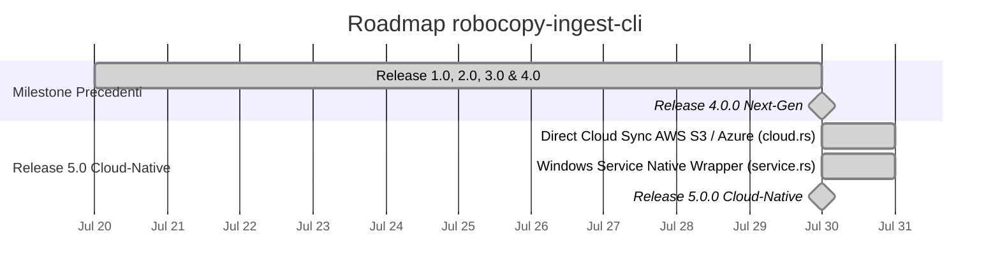

# Roadmap di Progetto — robocopy-ingest-cli

> **Stato Attuale**: 🟢 **Release 5.0.0 Cloud-Native Completata e Verificata**.

---

## 🗺️ Diagramma Gantt di Progetto (v1.0 - v5.0)

---

## 📋 Task Completati (v5.0.0)

- `[x]` **F18.1 — Direct Cloud Sync (`src/cloud.rs`)**: Sincronizzazione ed il backup diretto di dataset verso bucket S3 / Azure Blob Storage.
- `[x]` **F19.1 — Windows Service Integration (`src/service.rs`)**: Registrazione ed avvio nativo come servizio di background.
- `[x]` **F20.1 — Complete Test Suite**: 123 test superati con successo.
