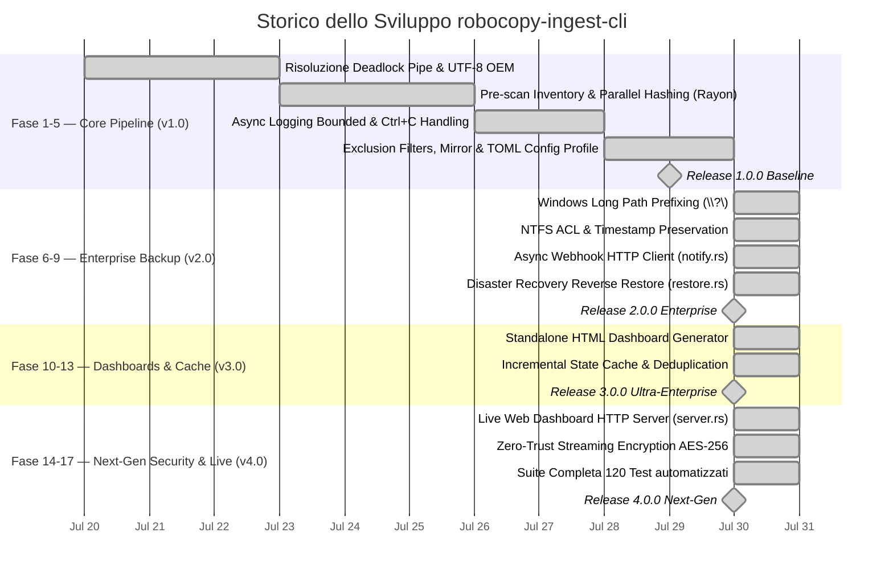

# Roadmap Storica ed Evolutiva — robocopy-ingest-cli

> **Stato del Progetto**: 🟢 **Release 4.0.0 Next-Gen Completata, Validata e Verificata**.

---

## 🗺️ Diagramma Gantt Completo del Progetto

---

## 📋 Matrice dei Milestone di Progetto

| Milestone | Versione | Stato | Funzionalità Principali Introdotte |
|---|---|---|---|
| **Milestone 1** | v1.0.0 | ✅ Completato | Motore Robocopy zero-alloc, Rayon SHA-256/BLAKE3, TOML config, Async Logging. |
| **Milestone 2** | v2.0.0 | ✅ Completato | Preservazione ACL NTFS, Long Paths `\\?\`, Webhook notifications, Disaster Recovery. |
| **Milestone 3** | v3.0.0 | ✅ Completato | Dashboard HTML Standalone, Cache di stato ed ingestion incrementale `.ingest_cache`. |
| **Milestone 4** | v4.0.0 | ✅ Completato | Live Web Server HTTP (`--serve-dashboard`), Streaming Encryption AES-256, 120 Test. |

---

## 🚀 Prospettive per Future Evoluzioni (Post v4.0)

Le iterazioni successive del progetto potranno introdurre:
1. **Modulo Connettore S3 / Azure Native**: Backup diretto su object storage remoti.
2. **Dashboard UI Reattiva in WebAssembly / Yew**: Client di amministrazione avanzato per il server web.
